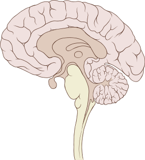

# Orientation

## 標準解剖學姿勢 (Standard Anatomic position)

- 兩手的手掌朝向觀察者 (兩手的大拇指均朝外)
- 腳趾朝向觀察者

## 切面 (The Body Plane)

- 切成左右: Median (sagittal 矢狀) plane
  - 
- 切成前後: Frontal plane
- 切成上下: Transverse plane (最常見的電腦斷層)

## 解剖構造相對位置用詞 (Directional terms)

- superior (cranial) **較往頭部** / inferior (caudal) **較往腿部**
- medial **較靠近身體中間軸**  / lateral **較遠離身體中間軸**
- anterior (ventral) **較靠近身體前方** / posterior (dorsal) **較靠近身體後方**
- superficial (external) **較靠近身體表面** / deep (internal) **較深入身體表面**
- proximal **靠近中軸 (trunk)** / distal **遠離中軸**
  - proximal: 較靠近 the point of attachment of a limb
  - body trunk: a person's body apart from the head and limbs is called Trunk. (from internet)
- lpsilateral **同一邊** / contralateral **不同邊**
- 上面均為以下均為形容詞，且介係詞均用 to

