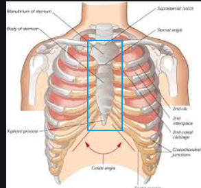
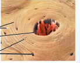
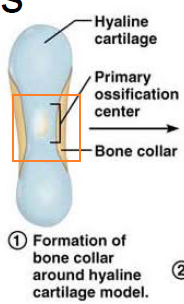

# 軟骨與硬骨組織

## 軟骨 Cartilages

### 軟骨特徵

- 胚胎較多，成人較少
- 沒有神經、沒有血管
- 60~80% 水分
- 軟骨膜 (perichondrium)
  - 緻密的結締組織
  - 阻止軟骨組織繼續擴張
  - 參與軟骨的成長、修復

### 軟骨分類

- 透明軟骨 Hyaline cartilage
  - 最常見的類型
  - 有軟骨膜 (perichondrium)
  - 和 synovial joints (滑液關節) 有關
  - 骨頭成形之前，通常先長成透明軟骨
- 彈性軟骨 Elastic cartilage
  - 有**彈性纖維 (elastic fiber)**
  - **耳朵軟骨、呼吸道**
- 纖維軟骨 Fibrocartilage
  - 有**膠原纖維 (collagen fibers)**
  - **椎間盤 Intervertebral discs、恥骨聯合 pubic symphysis**

### 軟骨的成長

- 軟骨以兩種方式成長
  - Appositional growth (外生性 / 添加性生長)
    - 軟骨膜中的軟骨母細胞 (chondroblast) 直接生成軟骨，加厚原本軟骨的厚度
    - 隨後分化成軟骨細胞 (chondrocytes)，並繼續分泌軟骨基質
    - 從青少年到成人都會發生
  - Interstitial growth (內生性 / 間質性生長)
    - 不是從軟骨膜生長，而是軟骨膜內的軟骨細胞直接分裂 (chondrocytes)
    - 像是吹氣球一樣，把軟骨變大
    - 只有在胚胎發育才會出現
- 補充說明
  - 生長期過後。軟骨停止生長，也不再有軟骨細胞分裂
  - 軟骨鈣化：老化的象徵
  - 鈣化的軟骨 ≠ 硬骨
  - 受傷的軟骨大多以何種類型進行修復
    - Fibrocartilage 纖維軟骨

## 硬骨 Bones

### 硬骨功能

- 機械功能
- 合成功能
  - 紅骨髓: 造血
  - 黃骨髓: 儲存能量
- 代謝功能
  - 儲存礦物質: 鈣質、磷
  - 能量代謝: 成骨、破骨

## 硬骨組織 Bone Tissue

- 包含以下細胞
  - 骨原細胞 Osteogenic cells
    - stem cells, differentiate into osteoblasts
  - 成骨細胞 Osteoblasts (呈立方體)
    - 分泌類骨質 osteoid
      - 尚未鈣化的骨質
      - Ground substance (GS), collagen fibers
  - 骨細胞 Osteocytes (呈星狀)
    - if no more new osteoid producing → osteocytes
  - 破骨細胞 Osteoclast
    - 由造血幹細胞分化而來
    - 吸收骨質
- 胞外基質包含
  - 由 Osteoblasts 分泌的骨基質稱為 Osteoid
  - 有機物質 organic (35%)
    - 纖維 : 膠原蛋白 (collagen)
  - 無機物質 inorganic (65%)
    - 羥磷石灰 hydroxyapatites
      - (Ca10(PO4)6(OH)2) compression

### 硬骨的 Gross Anatomy

#### 分類

- Long
  - 長度比寬度還要長
  - 幾乎所有的四肢骨骼
  - 兩端有機會變長
- Short
  - 類似立方體
  - **只有手腕、腳踝**
- Flat
  - **肩胛骨 scapula**
  - **肋骨 ribs**
  - **幾乎所有的頭骨**
  - **胸骨 (sternum)**
    - 
- Irregular
  - **脊椎骨、臀部的骨頭 (sacrum, coccyx)**
  - **某些頭骨: 蝶骨、篩骨**

#### 結構

- 所有的骨頭
  - 都含有 compact, spongy bones
  - 有血管
  - compact bone
  - spongy bone (cancellous)
    - 像針線交織在其中，此種 projections 稱作 trabeculae (骨小樑)
    - 有部分骨髓填充
- 僅限 Long Bones
  - Landmarks
    - **Diaphysis 幹骺**
      - medullary cavity (or marrow cavity)
        - 成年的時候，被脂肪填充
      - 形成關節的表面被 articular cartilage 包覆
    - **Epiphysis**  **(兩端的骨骺)**
      - Epiphyseal line ：分隔 Diaphysis, Epiphysis
  - Membrane
    - Periosteum (外側)
      - Note that the external surface of the diaphysis is covered with periosteum but that the articular surface of the epiphysis is covered with hyaline cartilage.
      - 有兩層構造
        - 外層是 irregular 結締組織
        - 內層包含成骨細胞、破骨細胞 (亂翻譯的)
      - 結締組織包含 perforating fibers
    - Endosteum (內側，接骨髓腔的那一側)
- Long Bones 以外的骨頭
  - 沒有 Diaphysis 幹骺、Epiphysis (兩端的骨骺)
  - 外膜 (Periosteum) → compact bone → spongy bone → Endosteum (內膜)
    - spongy bone 看起來像三明治被夾在兩個膜中間
    - spongy bone 的 trabeculae 之間有骨髓，但是沒有骨髓腔

#### Bone Design and Stress

- Wolff's Law
- 由於壓力的作用，骨頭表面會出現 Bone Marking。Bone Marking 可分為 : 
  - Projections that are sites of muscle and ligament attachment
  - Surfaces that form joints
  - Depression and Openings

### 骨的顯微構造 Microscopic structure of bone

- 緻密骨 Compact bone
  - 有通道
    - 可讓血管、神經、淋巴管通過
  - 骨元 Osteon
    - compact bone 的結構單位
    - 又稱作 Haversian system (哈氏管)
    - 由很多管子、一管包著另一管構成。
      - 一個 martix tube 稱作一個 lamella
      - collagen fibers in each layer run in the opposite directions
    - Resists torsion stresses (扭力)
    - 中央有通道通過，通道裡面有血管
    - 
      - 小小的凹洞稱作 Lacunae，裡面住著 osteocyte
      - 每個小凹洞都被像髮絲一樣的通道連結 (Canaliculi)
        - (上方圖片中，髮絲似乎繞成同心圓)
- 海綿骨 Spongy bone (cancellous)
  - 像針線交織在其中，此種 projections 稱作 trabeculae (骨小樑)
  - 有部分骨髓填充
  - 有內膜
  - Lamallae 和 osteocyte 不規則的被填充，以 Canaliculi 互相連結

### 骨發育與成長 Bone development and growth

- 胚胎階段
  - before 8 week
    - 只有纖維膜 (fibrous membrane) 和透明軟骨
  - after 8 week
    - 出現骨組織，開始慢慢取代纖維膜、透明軟骨
- 成骨作用 Ossification 有兩種機制
  - 膜內成骨 Intramembranous Ossification
    - 從 Fibrous membrane 發育
      - fobrous membrane 又是從 mesenchymal cells 發育
      - 在膜中出現成骨作用中心
    - 形成的骨頭叫做 membrane bones
    - 扁平骨的發育方式
  - 軟骨內骨化 Endochondral ossification
    - 取代透明軟骨
    - 叫做 endochondral bones
    - 大多數的骨頭都是這樣生成
    - 
- 產後骨發育 Bone growth (postnatal bone growth)
  - **Interstitial**
    - 生長板的軟骨組織分裂
    - 軟骨組織再被硬骨組織取代
    - 生長板構造
      - resting zone
      - proliferation zone
      - hypertrophic
      - calcification zone
      - ossification zone
  - **Appositional**
    - 使骨頭變粗
    - Periosteum (外側膜)
      - osteoblast 向外加粗骨頭
    - Endosteum (內側膜，接骨髓腔的那一側)
      - osteoclast 侵蝕，使得骨髓腔變大
- **Hormone Regulation**
  - 生長激素
  - 甲狀腺素
    - 調節骨頭物質的適當比例
  - 性激素
    - 促進青春期的生長期
    - 同時關閉生長板

### 骨重塑 Bone Remodeling

- **Controlled by two factor**
  - Hormones
  - Mechanical stress
- Bone Remodeling 可以釋放或儲存鈣質
- 鈣質在以下生理功能中，扮演重要角色
  - 神經傳遞
  - 肌肉收縮
  - 凝血 blood coagulation
  - 細胞分裂

### 骨折 Bone Fractures

骨折修復方式 Fracture Healing : 

1. 血腫 Hematoma 形成
2. 纖維軟骨性骨痂 Fibrocartilaginous callus 形成

   - 不是彈性軟骨

3. 骨性骨痂 Bony callus 形成

   - 形成海綿骨

4. 骨重塑 Bone remodeling

### 常見的 Bone Marking

- Projections
  - that are the attachment sites for muscles and ligaments.
  - tubercle, tuberosity, trochanter
  - crest, line
  - spine, process (突起)
- Surfaces
  - that form joints
  - head, facet, condyle
- Depressions and openings
  - for passage of vessels and nervers
    - foramen (孔)
    - groove (溝)
    - fissure (裂)
    - notch (切迹)
      - e.g. suprascapular notch
  - other
    - fossa (窩)
      - e.g. illiac fossa
    - meatus (道)
      - e.g. external acoustic meatus 外耳道
    - sinus (竇)
      - 有空氣的空腔
      - e.g. frontal sinus