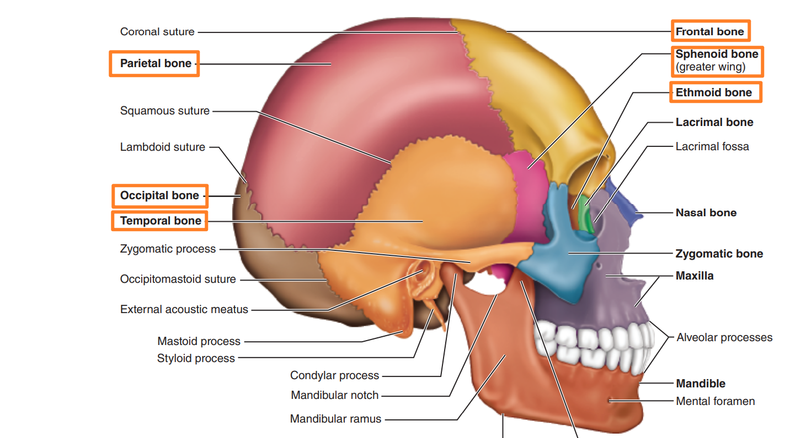
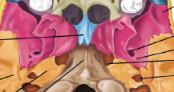
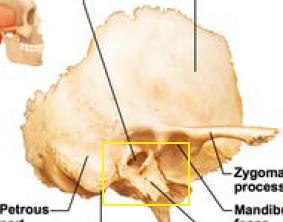

# 中軸骨

## 顱骨 The Skull

- 頂骨 Parietal Bones (*2，相鄰，頭頂)
- 額骨 Frontal Bone (*1)
- 枕骨 Occipital Bone (*1)
- 顳骨 Temporal Bones (*2，一對，太陽穴)
- 蝶骨 Sphenoid Bone (*1)
- 篩骨 Ethmoid Bone (*1)
- 顏面骨 Facial Bones (很多)

### 頂骨 Parietal Bones

沒有太重要的特徵

### 額骨 Frontal Bone

- anterior cranial fossa 顱前窩
  - 位於內側，放腦袋的
- supraorbital foramen (notch) 眶上孔
  - supraorbital nerve
    - CV V 的分支
- frontal sinuses 鼻竇
- 名詞解釋
  - foramen 形成通道的孔洞
  - fossa 窩

### 枕骨 Occipital Bone

- 
  - external occipital protuberance 枕外隆凸
  - external occipital crest 外枕脊
    - 接頂韌帶 (ligamentum nuchae)
  - occipital condyles 枕髁
    - 最下面兩個凸凸的地方
    - 與第一個脊椎骨接合
- 
  - foramen magnum 枕骨大孔
- basilar part
  - 
  - Joins the Sphenoid Bone
- posterior cranial fossa 顱後窩
  - 放腦袋的地方
- **hypoglossal canal 舌下神經道**
  - **CN XII (舌下)**

### 顳骨 Temporal Bones

- Three major part
  - Squamous (鱗狀) part
    - 
    - 上方以「鱗狀縫合」和頂骨接合
    - zygomatic processes 顴骨突
      - 和顴骨接合的位置 (下方黃色框框)
    - **mandibular fossa**
      - **TM joint (黃色框框中間明顯的凹槽)**
      - 下列何者與 mandibular fossa 形成 TM joint?
        - Condylar process
  - Tympanic (鼓膜) part
    - 
    - external acoustic meatuses 外耳道
      - 外耳道位於下列何者
        - 顳骨
  - Petrous (岩骨) part
    - 
    - 頭顱的基部
    - middle cranial fossa 顱中窩
    - 半規管、耳蝸的空腔
- Major opening
  - Junglar foramina 頸靜脈孔
    -  (從上方看)
    - internal jugular vein
    - **CN IX, X, XI (9, 10, 11)**
    - 頸靜脈孔 (Junglar foramina) 通過何物
      - CN IX, X, XI (9, 10, 11)
  - the carotid canal 頸動脈管
    -  (從下方看)
    - Internal carotid artery 內頸動脈
  - internal acoustic meatus 內耳道
    -  (從上方看)
    - CN VII (7 顏面), VIII (8 位聽)
  - the stylomastoid foramina
    -  (從下方看)
    - Facial nerve, a branch of CN VII，顏面神經

### 蝶骨 Sphenoid Bone

- 與所有頭骨均有接合 (articulates)
- major parts
  - central part
    - 
    - hypophyseal fossa of the sella turcica
      - 腦下腺位置
  - 翅膀
    - 
    - greater wings (蝴蝶上方翅膀)
      - forms part of middle cranial fossa
      - forms part of the oribit
        - 有點像半顆碗的形狀，那裏就是放眼睛的 (??
    - lesser wings (蝴蝶上方翅膀位置，又長了小翅膀)
      - forms part of the floor of the anterior cranial cossa
  - pterygoid processes (蝴蝶下方長長的翅膀位置)
    - 
    - medial plate
    - lateral plate
    - pterygoid muscles 咀嚼肌 attachment
      - close the jaw
- major opening
  - the superior orbital fissure 眶上裂
    - 不同於 supraorbital foramen (notch) 眶上孔
    - CN III (動眼), IV (滑車), V1 (眼神經, 三叉的分支), VI (外展)
  - 各種孔洞
  - 
    - 橘色: the optic canals 視神經孔
      - CN II (視神經)
    - 黃色: foamen (從前方到後方，即圖片上到下)
      - the foramen rotundum 圓孔
        - CN V2 (Maxillary Bone 上頷骨)
      - the foramen ovale 卵圓孔
        - CN V3 (Mandible (下頷骨)
      - the foramen pinosum 棘孔
        - middle meningeal artery 中腦膜動脈

### 篩骨 Ethmoid Bone

- 在 nasal bone 鼻骨 和 sphenoid bone 蝶骨 之間
- major markings
  - 
    - 上方橘色
      - **crista galli 篩骨雞冠**
        - the **falx cerebri (大腦鐮)**, a fibrous membrane, attachment
          - 分隔大腦左右半球的硬膜
    - 下方橘色
      - the cribriform plate 篩板
        - 鼻腔的屋頂
        - 前顱窩的地板
      - **cribriform foramina 篩孔**
        - **CN I (嗅神經)**
        - 下列何者會穿過 cribriform foramina
          - olfactory nerve
  - perpendicular plate of ethmoid bone (篩骨垂直板)
    - 鼻中膈形成
    - 下列何種骨沒有副鼻竇
      - frontal
      - mandibule
      - ethmoid bone
      - sphenoid
  - Ethmoidal labyrinth (篩骨迷路) with ethmoid sinuses
    - 剖開兩邊大大的那個部分，裡面有很多空腔

### 顏面骨 Facial bones

- Mandible (下頷骨*1)
- Maxillary Bones (上頷骨*2)
- Zygomatic Bone (顴骨*2)
- Palatine (顎骨*2)
- Nasal Bone (鼻骨*2)
- Lacrimal Bone (淚骨*2)
- Inferiror Nasal Choncha (下鼻甲*2)
- Vomer (鋤骨*1)
- Hyoid bone (舌骨*1)
  - 由韌帶連接懸浮，不與任何骨頭直接相關節。

#### 上頷骨 Maxillary Bones

- Alveolar processes
- palatine processes
- maxillary sinuses
- zygomatic processes (下方橘色框出來的地方)
  -  (側視圖)
- 眼睛附近的孔
- 
  - 上方框框: inferior oribital fissure
    - maxillary nerve, a branch of CN V
  - 下方框框: infraorbital foramen
    - infraoribital nerve

### 顱骨縫線 Sutures

- coronal suture (冠狀)
  - 兩頂 / 額
  - 冠狀縫位於何處
    - Parietal bones meet Frontal bone
- sagittal suture (矢狀)
  - 兩頂之間
- lambdoid suture (人狀)
  - 頂 / 枕
  - 下列何者出現於 Parietal 和 occipital 之間
    - lambdoid suture
- squamous suture (鱗狀)
  - 頂 / 顳

### 鼻腔結構 Nasal Cavity

- 
- 色彩
  - 紫色：Maxillary Bone 上頷骨
  - 橘色：Ethmoid Bone 篩骨
  - 綠色：Inferiror Nasal Choncha 下鼻甲
  - 藍綠色：Vomer 鋤骨
  - 未顯示：Palatine 顎骨
    - 就是舌頭後方將鼻腔與口腔隔開來的骨頭 (仍分成兩側)
- Nasal septum (鼻中膈)
  - perpendicular plate of ethmoid (篩骨垂直板)
  - vomer 鋤骨
  - anterior septal cartilage (鼻中隔軟骨)
- 下列何者會形成硬顎
  - Maxillary Bone 上頷骨與篩骨

### 眼眶 Oribits

- 
- 色彩：
  - 黃色：Frontal 額骨
  - 藍色：Zygomatic 顴骨
  - 紫色：Maxillary Bones 上頷骨
  - 裡面
    - 粉色：Sphenoid 蝶骨
    - 淺綠色：Lacrimal Bone 淚骨
    - 淺橘色： orbital plate of ethmoid 篩骨
      - 篩骨最外側的平面
    - 淺黃色的一點：Palatine 顎骨
- 不構成眼眶部分的是
  - 顳骨 (temporal bone)
    - 太陽穴附近那一塊

### 腦神經出入口 Cranial nerves

Opening for cranial nerves : 

- cribriform foramina 篩孔 (篩骨)
  - CN I (嗅)
- the optic canals 視神經孔 (蝶骨)
  - CN II (視)
- the superior orbital fissure 眶上裂 (蝶骨)
  - CN III (動眼), IV (滑車), V1 (眼神經, 三叉的分支), VI (外展)
- 蝶骨的 foramina
  - the foramen rotundum 圓孔
    - CN V2 (Maxillary Bone 上頷骨)
  - the foramen ovale 卵圓孔
    - CN V3 (Mandible (下頷骨)
  - the foramen pinosum 棘孔
    - middle meningeal artery 中腦膜動脈
- internal acoustic meatus 內耳道 (顳骨)
  - CN VII (7 顏面), VIII (8 位聽)
- Junglar foramina 頸靜脈孔 (顳骨)
  - CN IX, X, XI (9 舌咽, 10 迷走, 11 副)
- hypoglossal canal 舌下神經道 (枕骨)
  - CN XII (舌下)

## 脊柱 The Vertebral Column

- General Structure
  - 
- 由上至下 (頸 C→ 胸 T→ 腰 L→ 薦 S→ 尾 C)
  - 頸椎 Cervical Vertebrae (C₁~C₇)
    - The Atlas (C₁，第一頸椎)
    - The Axis (C₂)
    - Each transverse process contains a **transverse foramen (橫突孔)**
  - 胸椎 Thoracic Vertebrae (T₁~T₁₂)
  - 腰椎 Lumber Vertebrae (L₁~L₅)
  - 薦椎 Sacrum and 尾椎 coccyx
    - 也構成 Pelvis
    - 
- C→T→L→S 之間的比較
  - 

## 肋骨架 The Thoracic Cage

### 胸骨 Sternum (Breastbone)

- 
  - 由上到下
    - Manubrium
    - Body
    - xiphoid process
- 胸骨與 Clavicle 鎖骨以胸鎖關節接觸

### 肋骨 Ribs

- 男女的肋骨數量都是一樣的
- 肋骨前方不一定會跟胸骨接合，但是後方一定跟脊椎接合。
- True (1~7)
  - 直接跟胸骨以 costal cartilage 連接
- False (8~10)
  - 
  - 不直接跟胸骨相接，以韌帶接在第七根肋骨上
- Floating (11, 12)
  - 根本就不跟胸骨相接