# 側肢骨

## 肩帶 Pectoral girdle

- 特徵
  - Scapula 的位置，只由肌肉控制
  - 只有鎖骨連接到中軸骨 (axial)，肩胛骨可以很隨意的運動
  - 肩關節窩很淺，所以移動不太受到限制
- 肩胛骨 Scapula
- **鎖骨 Clavicle**
  - 2 ends
    - sternal end (胸骨端)
      - articulate with manubrium of sternum
        - sternoclavicular joint
    - **acromial end (肩峰突)**
      - articulate with acromial process of scapula
        - acromio-clavicular joint
      - 鎖骨與肩胛骨以何種構造形成關節
        - Acromion 肩峰突
  - 凹凸
    - sternal end→ acromial end (肩峰突)
      - 靠近胸骨端向前浮凸
      - 接著向內凹陷
      - 最後接合肩胛骨的部分又向前與肩胛骨接合
  - 功能
    - 將上肢接到中軸 (trunk)
      - 將力量從上肢轉移到中軸骨
    - 保護供應上肢的血管、支配上肢的神經

## 上肢 The upper limb

### 手臂 Arm (Brachium)

- Humerus 肱骨
  - 大結節、小結節 (不是 Head)
    - 旋轉肌袖附著
  - Deltoid 粗隆
    - 三角肌附著
  - Radial groove
    - posterior surface
    - Humerus 肱骨骨折時何條神經容易受損
      - 橈神經 (radial nerve)
  - 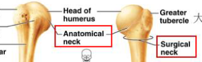
    - Head 基部
      - 解剖頸
    - 容易發生骨折之處為
      - 外科頸 surgical neck

### 前臂 Forearm (Antebrachium)

- 外勞：外橈骨 (Radius)
- Ulna 尺骨
  - Olecranon process 肘突, 鷹嘴突
- **Radius 橈骨**
  - concave
  - proximal radioulnar joint
  - radial tuberosity
    - biceps muscle
  - dital radiounlar joint
    - scaphoid, lunate

### 手 Hand

- Carpal bones 腕骨
  - 子項目
    - Proximal row, from lateral to medial：
      - scaphoid（舟狀骨）
        - 外側掌面有明顯的tubercle，**最易骨折**
      - lunate（月狀骨）
      - triquetrum（三角骨）
      - pisiform（豆狀骨），為種子骨，位於肌腱中，只與triquetrum形成關節
    - distal row, from lateral to medial：
      - trapezium（大多角骨），與拇指相接。也有明顯的tubercle
      - trapezoid（小多角骨），與食指相接
      - capitate（頭狀骨），與中指相接。為最大塊且形成最多關節的腕骨
      - hamate（鉤骨）
  - Carpal bones 腕骨遠端之一排 (proximal raw) 橈側至尺側的排列為
    - 大多角骨、小多角骨、頭狀骨、鉤狀骨
- Metacarpals 掌骨
  - 5
- Phalanges 指骨
  - 14 (因為大拇指沒有 middle)
- 下列哪一條神經受損之後，會造成手腕下垂無法伸展
  - Radial nerve

## 骨盆帶 Pelvic gridle

- 功能
  - 連接下肢與中軸，有最堅固的韌帶、關節
  - 承受上身的重量
  - 放骨盆腔的內臟
- 構造
  - 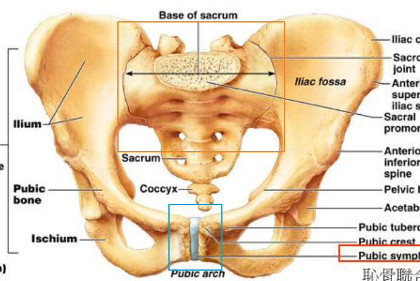
  - 兩 Hip Bones 在後方與 Sacrum (薦骨) 接合
  - 在前方與彼此以 Pubis symphysis (恥骨聯合) 接合
    - 屬於 Fibrocartilage 纖維軟骨

### Hip Bones

- 共三塊，小孩的時候是分開的，長大會結合在一起
  - Y-shaped junction
    - Acetabulum
  - 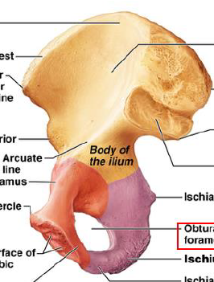
    - 黃色：Ilium 腸骨 (superior)
    - 紅色：Pubis 恥骨 (anterior)
    - 紫色：Ischium 坐骨 (posterior, inferior)

### Ilium 腸骨

- 標記
  - iliac crests
  - four spines
  - greater sciatic notch (坐骨大孔) 有下列何者經過
    - 坐骨神經 (sciatica nerve)
  - 後方有 Gluteal surface
    - 四條 Gluteal line 交會
    - Gluteal muscle (臀肌) 接合
  - 腸骨形成的 iliac fossa (放臟器的)
  - 和薦骨接合，形成 sacroiliac joint
  - Arcuate line
    - 摸的到，就是腰部突起的骨頭，會形成弧線
    - 是骨盆上方的邊界

### Ischium 坐骨

- ischial spine
  - 接合 sacrospinous ligament
- lesser sciatic notch
  - 大切跡與小切跡
  - 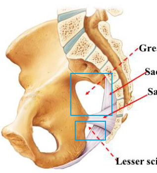
  - 有神經與血管，支配 perineum (會陰)
- ischial tuberosity 坐骨粗隆
  - 骨盆最堅固的地方
  - sacrotuberous ligament (薦椎結節韌帶)
  - hamstring muscle (腿後肌群) attachment

### Pubis 恥骨

- 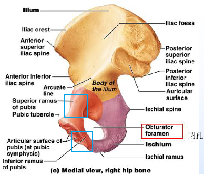
  - Superior / Inferior ramus (藍色框框處)
    - superior ramus joins to the bodies of ischium (坐骨) / ilium (腸骨)
    - inferior ramus joins to ischial ramus
    - public crest
  - Obturator foramen (閉孔, 下面那個圓形的大洞)
    - 有些神經、血管通過
    - 幾乎全部被 Firbrous membrane 覆蓋
- 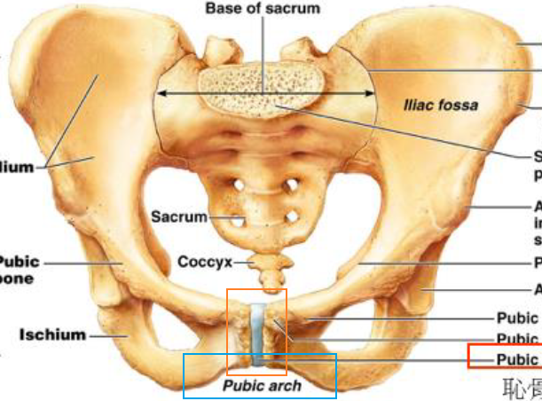
  - 橘色: Pubic tubercle
    - inguinal ligament 腹股溝靭帶附著
  - 藍色: Pubic arch
    - formed by
      - inferior pubic rami
      - ischial rami
    - 角度大小可用來區分男性、女性

### 雜項

- Pelvis = pelvic girdle + coccyx (尾骨)
  - pelvic girdle 包含 Sacrum (薦骨)
  - Hip Bones
    - 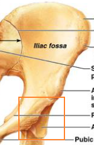
      - 橘色部分: 髖臼 (Acetabulum)
      - **與股骨 (Femur) 相接**
- **Pelvic structure and childbearing**
  - 真骨盆、假骨盆
    - 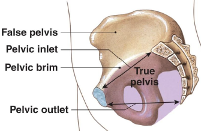
  - Pelvic brim (骨盆邊緣)
    - 真骨盆的上界
      - pelvic inlet
  - Perineum (會陰)
    - 真骨盆的下界
      - pelvic outlet
  - 男女骨盆比較
    - 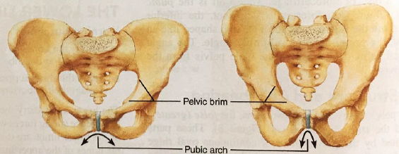
    - 女性骨盆特徵
      - 骨盆較向前傾斜
      - 骨頭較平滑，Marking 較不明顯
      - 真骨盆
        - 真骨盆決定生產的通道
        - 較淺、廣、大
      - 兩個 Acetabula 較小，也較男性遠離
      - 恥骨弓 Pubic arch 角度較大
      - 薦骨 (sacrum) 較短、寬度較寬
      - 尾骨 (coccyx) 活動性較大、較直
      - 坐骨大切跡較大、較淺
      - 腸骨窩 (iliac fossa) 較淺
      - inlet, outlet 均較寬

## 下肢 The Lower limb

### 大腿 Thigh

- femur 股骨
  - Greater trochanter (大轉子)

### 小腿 Leg

- tibia 脛骨 (medial) (tina, ti內)
  - 腳踝凸凸的那一塊
- fibula 腓骨 (lateral) (fi, 腓)
  - 不參與膝關節的形成

### 腳掌 Foot

- **Tarsus 跗骨**
  - 近端
    - 距骨(talus)
      - 跟小腿 (tibia, fibula) 接合
    - 跟骨(calcaneus)
      - 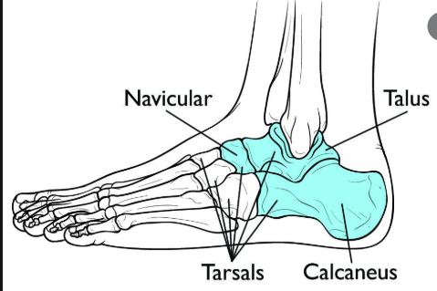
      - 形成腳跟
        - 下列何者形成腳跟
          - calcaneus 跟骨
      - 標記
        - calcaneal tuberosity 跟骨粗隆 (亂翻的
          - 和地面接觸的部分
        - sustantaculum tali 載距突
    - 舟狀骨(navicular)
  - 遠端
    - 骰子骨(cuboid)
    - 內、中、外楔狀骨(medial、intermediate、lateral cuneiform)
- Metatarsus 蹠骨
  - 腳趾最基部
- Phalanges 趾骨
  - 腳趾後兩個指節
    - 大拇指只有兩個趾骨
- **Arches of Foots**
  - 三個 arches
    - 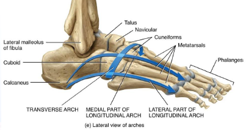
    - 藍色的線
      - Transverse arch
        - 拱頂石 (Keystone)
          - intermediate cuneiform 中楔狀骨
      - Lateral longitudinal
        - 拱頂石 (Keystone)
          - 骰子骨(cuboid)
      - Medial longitudinal
        - 拱頂石 (Keystone)
          - 距骨(talus)