# 關節

關節分類

- 依功能分類
  - immovable : synarthrosis (不動關節)
  - slightly movable : amphiarthrosis (微動關節)
  - free movable : diarthrosis (動關節)
- 依結構分類
  - 纖維關節 Fibrous joints
  - 軟骨性關節 Cartilaginous joints
  - 滑液關節 Synovial joints

## 纖維關節 Fibrous joints

- 特色
  - 沒有關節腔 joint cavity
- 子分類
  - 縫合 suture (不動)
  - 韌帶聯合關節 syndesmoses (微動)
  - 釘狀聯合關節 gomphoses (不動)

### Suture 縫合關節

- 不動關節
- 封閉的 suture 稱作 synostosis (骨性接合)
- 例子
  - **顱骨之間的連結**

### Syndesmoses 韌帶聯合關節

- 微動關節
- 韌帶的長度決定可以動多少
- 例子
  - **脛骨、腓骨之間** : anterior tibiofibular joint

### Gomphoses 釘狀聯合關節

- 不動關節
- 又稱作 peg-in-socket
- 例子
  - 齒根嵌在齒槽突 (alveolar processes) 上
    - ligament (韌帶) : periodontal ligament (牙周韌帶)

## 軟骨性關節 Cartilaginous joints

- 特色
  - 沒有關節腔 joint cavity
- 子分類
  - 軟骨結合關節 Synchondroses
  - 聯合關節 Symphyses

### Synchondroses 軟骨結合關節

- 不動
- 透明軟骨 hyaline cartilag
- 例子
  - **生長板**
  - **胸骨 (sternum) 與第一根肋骨之間的關節**

### Symphyses 聯合關節

- 微動
- 纖維軟骨 fibrocartilage
- 例子
  - **椎間盤 intervertebral disc**
    - T1, T2 沒有椎間盤，尾椎 (coccyx) 也沒有
  - **恥骨聯合 Pubis symphysis**

## 滑液關節 Synovial joints

- 特徵
  - Articular cartilage
  - Joint cavity = synovial cavity
  - Articular capsule
    - 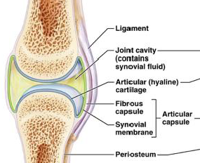
      - 把 joint cavity 圍起來
- 子分類
  - planar joint 平面關節
  - hinge joint（鉸鏈關節, 屈戍關節）
  - pivot joint（車軸關節）
  - condyloid joint（髁狀關節，橢圓關節）
  - saddle joint（鞍狀關節）
  - ball&socket joint（球窩關節）

---

### Planar joint (平面關節)

- 關節間形成平面，關節囊很小，活動尺度也很小
- 例子
  - 手掌掌骨間關節
  - 肩鎖關節
    - 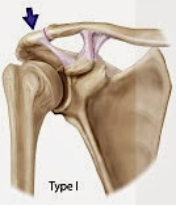

### Hinge joint (鉸鏈關節,  屈戍關節)

- **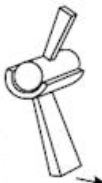**
- 例子 (膝蓋、手肘，性質很類似)
  - 膝關節
    - 股骨 femur / 脛骨 tibia
  - 肘關節 (elbow joint)
    - 肱骨 humerus / 尺骨 ulna

### Pivot joint (車軸關節)

- 例子
  - proximal radioulnar joint
    - 橈骨 radius / 尺骨 ulna 靠近中軸 (trunk) 那一端的關節
    - 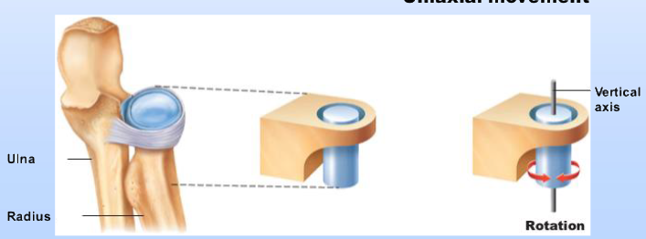
  - Joint between Atlas (C1) & Axis (C2)

### Condyloid joint (髁狀關節，橢圓關節)

- 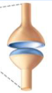
- 有兩個軸運動 (前後、左右)
- 例子
  - 手腕的旋轉關節
  - 指關節

### Saddle joint (鞍狀關節)

- 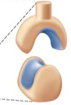
- 例子
  - 大拇指 Thumb 的 metacarpophalangeal joint

### Ball&socket joint (球窩關節)

- 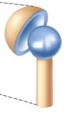
- 例子 (一個是上肢連結中軸，一個是下肢連接中軸，雖然骨盆不是中軸，但是好記就好)
  - 髖關節 (Hip joint)
    - 骨盆三骨頭 (Hip Bone) / 股骨 (femur)
  - 肩關節 (Shoulder joint)
    - Scapula / Humerus
  - 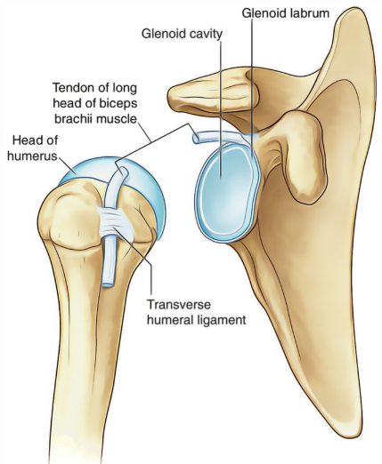

## 重要關節介紹

### Glenohumeral joint (Shoulder joint, 肩關節)

- ball&socket joint
- Glenoid Cavity 肩臼
- Glenoid labrum 肩臼旁邊圍繞的唇狀構造，為纖維軟骨
- coracohumeral ligament
- Rotator cuff muscles  旋轉肌袖
  - Supraspinatus 棘上肌
  - Infraspinatus 棘下肌
  - Teres minor  小圓肌
  - Subscapularis 肩胛下肌
  - Rotator cuff muscles (肩袖旋肌群) 可以穩固肩關節 (Stabilize shoulder joint)，避免手提重物時間關節脫臼 (dislocation of humerus)
- 鎖骨與肩胛骨以 Acromion 肩峰突 構造形成關節

### Wrist joint

- radiocarpal joint
  - 橈腕關節 (Radiocarpal joint) 由橈骨和 3 個腕骨頭構成
    - scaphoid、lunate、triquetral
- intercarpal joint
  - carpals ((近端)舟月三豆、(遠端)大小頭鈎) 互相接合的關節
- gliding movement

### Knee joint

- 最大、也最複雜的關節
- hinge joint（鉸鏈關節, 屈戍關節）
- flexion, extension 的時候會有些轉動
- 2 C-shaped fibrocartilage menisci (半月板)
  - 分別環繞 tibia 的兩個 condyles
- anterior / posterior cruciate ligament 前 / 後十字韌帶
  - 也負責維持膝關節的穩定性
  - 互相以 X 形狀交叉
  - 前十字韌帶
    - 防止脛骨向前錯動
  - 後十字韌帶
    - 防止股骨相對脛骨前後錯動
- femoropatellar joint 髕股關節
  - 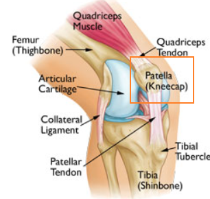
  - 髕骨，又稱為膝蓋骨，是一個股頭
  - 此種關節允許 glide

## 關節動作

- Gliding
  - 手腕、腳踝 (ankle)
- Angular movement
  - Flexion 往前
  - Extension 往後
  - ABdcution, ADduction
  - Circumduction
  - 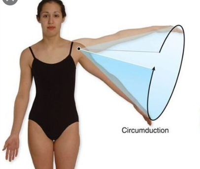
- Rotation
  - Lateral
  - Medial
- Special
  - Elevation (e.g. 提肩胛) / Depression
  - Protraction (e.g. 肩胛骨向前，以伸長手去撿橡皮擦) / Retraction
  - Supination (手掌面向前) / Pronation
  - opposition
    - 大拇指與其他手指比成 OK 的圖案
  - Inversion / eversion
    - Inversion: 把整個腳掌面向 Media
    - 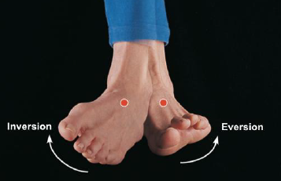
  - Dorsiflexion / plantar flexion
    - Dorsiflexion: 使腳的整個平面比平常還要高
    - 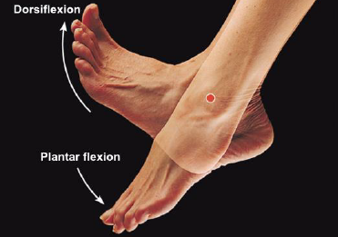

