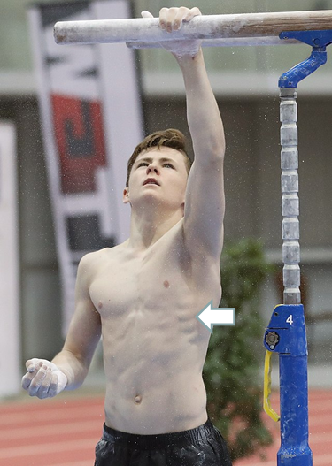
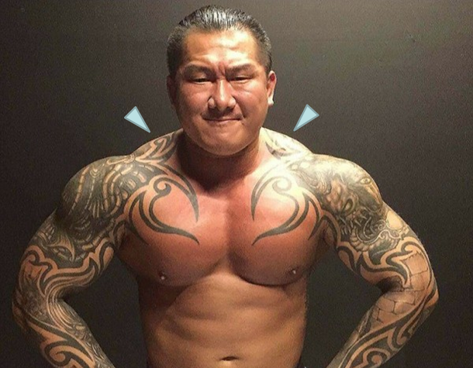
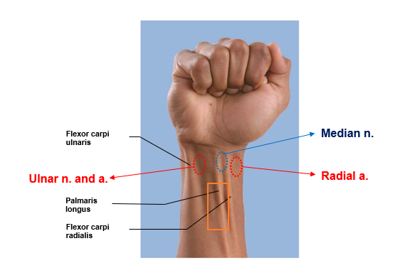
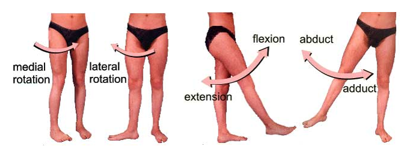
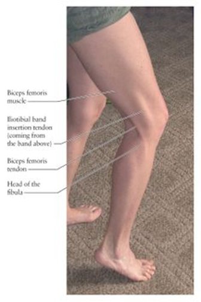
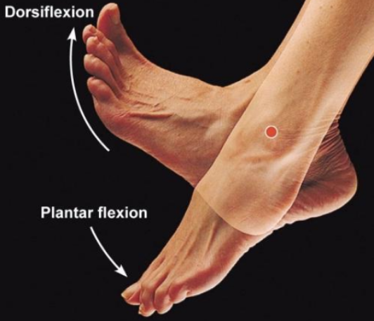
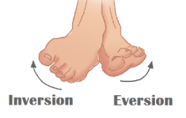
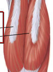

# 肌肉

- 先知道肌肉名稱與位置
- 再知道肌肉動作
- 最後知道肌肉是由哪個神經支配

## 胸部與上臂

### 由前胸控制上臂的肌肉群

- Action: move the pectoral girdle
- 胸大肌 Pectoralis major
  - 受外胸 / 內胸神經支配
- 胸小肌 Pectoralis minor
  - 受內胸神經支配
- 前鋸肌 Serratus anterior
  - 拳擊手肌
  - protracts scapula (提前)
  - 受 long thoracic nerve 支配
    - 異常會導致肩胛骨浮凸
  - 

### 由後背控制上臂的肌肉群

- Superficial
  - 斜方肌 Trapezius
    - 副神經 CN XI
    - elevates, depresses and retracts scapula (上升、下降、退後)
    - 
  - 擴背肌 Latissimus dorsi
    - 胸背神經
    - **pectoralis major+ latissimus dorsi**
      - → ADDuct humerus
- Deep
  - 提肩胛肌 Levator scapulae
    - elevates scapula (上升)
    - 背肩胛神經
  - 稜形肌 Rhomboid
    - retracts scapula (退後)
    - 背肩胛神經

### 肩關節肌群 Scapulohumeral muscles

#### Act on the glenohumeral joint

- 三角肌 Deltoid
  - **肌肉注射常用肌肉**
  - 動作 (外展、內收)
    - 全部收縮 ABduction
    - 中部收縮 abducts arm (**> 15°; assists by gravity or supraspinatus**)
      - **Supraspinatus 棘上肌與 Deltoid 三角肌 的協同運動**
    - 前後收縮 swing the limbs during walking
    - 下列何者可以使手臂外展 (arm abduction)
      - Deltoid
  - 神經
    - axillary nerve (nerve) 腋下神經
- 大圓肌 Teres major
  - adducts and medially rotates arm (內收、內旋)
  - lower subscapular nerve

#### 旋轉肌袖 Rotator cuff muscles 

- 棘上肌 Supraspinatus
  - 外展肱骨
  - Suprascapular nerve
- 棘下肌 Infraspinatus
  - 外旋肱骨
  - Suprascapular nerve
- 小圓肌 Teres minor
  - 外旋肱骨
  - axillary nerve 腋下神經
- 肩胛下肌 Subscapularis
  - primary medial rotator
  - 內旋
  - Upper and Lower scapular nerve

### 雜項

- **聽診三角區**
  - Latissimus dorsi 擴背肌
  - Trapezius 斜方肌
  - Scapula 肩胛骨
- 與肩胛骨運動相關的一些肌肉
  - Trapezius 斜方肌
  - Serratus anterior 前鋸肌
  - Teres major 大圓肌
- 整理 : 可對手臂做內收、內旋的肌肉
  - 內收 ADduction、內旋 Internal rotation
  - 必接在 intertubercular sulcus of humerus
  - 擴背肌 Latissimus dorsi
  - 大圓肌 Teres major
  - 胸大肌 Pectorails major 
  - 可做動作

## 由上臂控制前臂肌肉群

- 肱二頭肌 Biceps Brachii
  - flexion
  - supination
  - 肌皮神經
- 肱肌 Brachialis
  - flexion
  - 肌皮神經
- 肱橈肌 Brachioradialis
- 肱三頭肌 Triceps Brachii
  - 伸展前臂
  - 橈神經
- 整理
  - 何者不能彎曲前臂
    - Triceps Brachii 肱三頭肌
  - 何種動作使橈骨繞過尺骨呈現交叉
    - pronation (旋前)

## 由前臂控制手腕及手指的肌肉

- 曲肌
  - 曲肌淺層
    - 旋前圓肌 Pronator teres (正中神經支配)
    - 橈側曲腕肌 Flexor carpi radialis (尺神經支配)
    - 尺側曲腕肌 Flexor carpi ulnaris (正中神經支配)
    - 掌長肌 Palmaris longus (正中神經支配)
      - 橘色框框處
      - 
  - 曲肌中層
    - 曲指淺肌 Flexor digitorum superficalis
  - 曲肌深層
    - 曲指深肌 Flexor digitorum profundus (尺神經、正中神經支配)
    - 曲拇長肌 Flexor pollicis longus
  - 第四層
    - 旋前方肌 Pronator quadratus

## 髖部進行大腿運動的肌肉

- 大腿運動
  - 
- 髖部進行大腿運動的肌肉
  - 從前面 Anterior 跨到中間 Medial
    - 髂腰肌 Iliopsoas (腸腰肌)
    - Tensor fasciae latae
  - 大腿後方
    - 臀大肌 (伸直)、臀中肌 (外展)、臀小肌 (外展)、梨狀肌 (外展)
  - 大腿前方
    - 縫匠肌
  - 大腿中間
    - 內收長肌、內收短肌、內收大肌
    - 恥骨肌、股薄肌

### 髖關節的伸展與外展

- 臀部明顯的肌肉 (Posterior compartment)
  - 臀大肌 Gluteus maximus (伸直)
    - **最主要的髖關節伸肌**
    - 臀下神經支配
  - 臀中肌 Gluteus medius (外展)
    - **屁股打針的地方 (不會打臀大肌)**
    - **ABducts thighs**
    - 臀上神經
  - 臀小肌 Gluteus minimus (外展)
    - 臀上神經
- 梨狀肌 Piriformis (外展, as a lateral rotators)
  - 位於 Posterior compartment 的深處
  - 梨狀肌神經支配
  - 梨狀肌症候群

### 髖骨的曲肌群

- 恥骨肌 Pectineus
  - 在 Medial compartment
  - 受 Femoral nerve 支配
- 髂腰肌 Iliopsoas (腸腰肌)
  - 橫跨 Anterior, Medial compartment
  - 遠端利用 Iliopsoas tendon (腸腰肌腱) 連結於股骨的 Lesser trochanter (小粗隆)
  - 可以彎曲股骨 (Hip flexion)
  - 髂肌 Iliacus (腸骨肌)
    - 受 Femoral nerve 支配
  - 腰大肌 Psoas major
    - 受 Anterior rami of lumbar nerve 支配
    - 最主要參與 **Thigh flexion** 的肌肉
- Tensor fasciae latae
  - 橫跨 Anterior, Medial compartment
- 縫匠肌 Sartorius
  - 在 Anterior compartment
  - 受 Femoral nerve 支配
  - 可完成的動作
    - 翹腳
    - Hip flexion
    - Hip ABduction
    - Hip lateral rotation
  - 

### 大腿內收 ADduction 肌群

- **均受閉孔神經 Obturator nerve 支配**
- 均位於 Medial Compartment
  - 內收長肌 Adductor longus
  - 內收短肌 Adductor brevis
  - 內收大肌 Adductor magnus
  - 恥骨肌 Pectineus
  - 股薄肌 Gracilis

## 大腿控制膝蓋關節的肌肉

- Anterior Compartment (使膝蓋伸直)
  - 股四頭肌 Quadriceps femoris
    - 股直肌、股外側肌、股內側肌、股中間肌
- Posterior Compartment  (使膝蓋彎曲)
  - Hamstrings
    - 股二頭肌 (外)、半腱肌、半膜肌
    - 

### 大腿前方肌肉

- 使**膝蓋伸直 extension**
- 受股神經支配
- 股四頭肌 Quadriceps femoris
  - 股直肌 Rectus femoris
  - 股外側肌 Vastus lateralis (又稱外側廣肌)
    - **大腿肌肉注射區 (中間 1/3)**
  - 股內側肌 Vastus medialis (又稱內側廣肌)
  - 股中間肌 Vastus intermedius (又稱中間廣肌)

### 大腿後方肌肉

- 使**膝蓋彎曲 (flexion)**
  - Hamstrings
    - 受 **Sciatic nerve 坐骨神經** 支配
    - Biceps femoris 股二頭肌 (外)
    - Semitendinosus 半腱肌
    - Semimembranosus 半膜肌

## 小腿作用於腳踝的肌肉

- 小腿前方重要肌肉
  - 脛前肌 Tibialis anterior
  - 腓長肌 Fibularis longus
- 小腿後方重要肌肉 (小腿肚, Calf muscle)
  - 腓腸肌 Gastrocnemius
  - 比目魚肌 Soleus
- 阿基里斯腱 Calcaneal tendon

### 小腿前方肌肉

- **脛前肌 Tibialis anterior**
  - 負責腳踝的背曲 (dorsiflexion of ankle)
    - 
- 腓**長**肌 Fibularis longus (腓長肌, 不是腓腸肌)
  - Plantar flexes and everts foot
  - 

### Calf muscle

- Plantar flexes
- 腓**腸**肌 Gastrocnemius (雙頭)
  - 雙頭
- 比目魚肌 Soleus
  - 把腓腸肌切開，下方的就是比目魚肌
  - 造成蘿蔔腿

## 一些雜項

- 適合肌肉注射的地方
  - 臀中肌 Gluteus medius
  - 三角肌 Deltoid 
  - 股外側肌 Vastus lateralis
