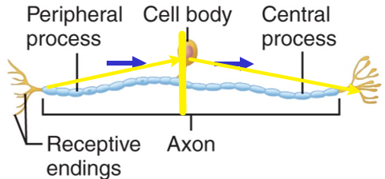

# 神經系統基本介紹

## 神經組織 Nervous Tissue

### 神經元 Neurons

#### 神經元基本構造

- 樹突 Dendrites
- 細胞本體 Cell body / soma
  - 嗜色體 Chromatophilic bodies
    - 包含 rough ER 和 Ribosomes
    - 又稱為尼氏體 nissl bodies 
  - 神經原纖維 Neurofibrils
    - 由細胞骨架 Cytoskeleton 構成
      - 主要是 neurofilaments / intermediate microfilament
- 軸突 Axon
  - 一個神經元只有一根
  - 軸丘 Axon hilock : 動作電位最常發生的地方
  - 軸突 axon = 神經纖維 nerve fiber ≠ 神經 nerve

#### 突觸 Synapses

- 最常見的突觸為 Axodendritic，也就是 Axon 和另一個樹突之間的突觸
- 但是也有 Axosomatic，這是軸突與另一個神經元的細胞本體之間的突觸

#### 神經元的分類

- 多極 Multipolar
  - CNS 中最常見的的神經元種類
  - 中間神經元 Interneurons、運動神經元 Motor neurons
- 雙極 Bipolar
  - 仍有樹突、軸突之分
  - 少見，通常是 Sensory neurons
- 偽單極 Pseudounipolar
  - 
  - Afferent ≠ Dendrites，Efferent ≠ Axon
  - 仍是兩條電線，afferent 和 efferent 部分彼此絕緣
  - 軸突 Axon
    - **Peripheral process (afferent)**
      - 直接索性把很像樹突的 afferent 部分也算進去 Axon
    - Central process (effernet)

### 支持細胞 Supporting cells (aka. 膠細胞 Neurogila)

#### 中樞神經的膠細胞

- 寡樹突膠細胞 Oligodendrocytes
  - 形成 CNS 的髓鞘 myelin sheaths
- 星狀細胞 Astrocytes
  - 幾隻手抓神經、另幾隻手抓血管
  - 形成血腦屏障
  - 是在 CNS 中最常見的膠細胞
  - 
- 室管膜細胞 Ependymal cells
  - 在腦室、腔室的內襯 Line the cavities within the brain & spinal cord.
  - 協助腦脊髓液體 cerebrospinal fluid 流動
  - 
- 微膠細胞 Microglia
  - 最小，數量也最少
  - 防禦性細胞，可以分化成巨噬細胞 Macrophage

#### 周圍神經的膠細胞

- 衛星細胞
  - 圍繞在細胞本體旁邊
- 許旺細胞
  - 形成 PNS 的髓鞘 Myelin sheaths
  - 沒有髓鞘的軸突仍有許旺細胞支持

#### 髓鞘 Myelin sheaths

- 有髓鞘的細胞，一個神經元有其專屬的許旺細胞負責維護髓鞘
  - 紫色的是許旺細胞
  - 
- 沒有獨立髓鞘的細胞，多個神經元才有一個許旺細胞負責維護其髓鞘
  - 紫色的是許旺細胞
  - 由此可見，即使沒有髓鞘，依然有跳躍式傳導的需求
  - 

## 神經的 Gross Anatomy

### CNS 的灰質與白質 Gray / White Matter in the CNS

- 在 CNS 中，細胞本體形成**灰質 (Gray matter)**。
  - 例如大腦**皮層 Cortex**，大腦的**神經核 Nucleus**。
  - 看到這些構造名稱，就要知道他裡面富含細胞本體
- 在 PNS 中，細胞本體形成**神經節 (Ganglion, ganglia)**。
  - 例如脊隨的背根神經節
- 白質主要由神經元的軸突形成

### 神經 Nerve

神經元軸突 Axon = 神經纖維 Nerve Fiber ≠ 神經 Nerve。一個神經中包含很多神經纖維。

## 神經的整合

### 反射弧 Reflex Arc

- 可包含亦可不包含 integration center
- 單突觸反射弧 Monosynaptic reflex
  - 缺少中間神經元 Interneuron
  - 舉例：膝跳反射 Knee-jerk (stretch) reflex
- 多突觸反射弧 Polysynaptic reflex
  - 有中間神經元 Interneuron
  - 舉例：Withdrawal reflex

### 神經迴路 Neuronal circuit

- 感覺訊號輸入 → 訊號整合 → 運動訊號輸出
- 可與反射弧平行進行，例如當 Withdrawal reflex 發生時，訊號會持續往上傳遞
  - Withdrawal reflex 將手立刻抽離危險物品
  - Neuronal circuit 完成訊號整合後，人才會意識到剛剛的危險處境

## 其他瑣碎重點

### 易混淆觀念

- 腦神經屬於 PNS，因此「腦神經衰弱」一詞是錯誤用法
- 鰓咽運動
  - 本質和一般體運動相同，但是胚胎發育來源來自於鰓弓，主要控制頸部、顏面。
- 本體感覺
  - 黑暗中扣釦子、黑暗中動手指

### 感覺與運動

- 體感覺
  - 一般感覺 General somatic senses
    - 遍布全身的感覺受器，例如皮膚受器
    - 本體感覺 Proprioception，亦屬於一般感覺 
      - 來自四肢肌肉與韌帶的張力訊息
  - 特殊體感覺 Special somatic senses
    - 視覺、聽覺、平衡覺...
- 臟器感覺
  - 一般臟器感覺 General visceral senses
    - 一般臟器會有的感覺，如拉扯感 stretch、痛覺、溫度
  - 特殊臟器感覺 Special visceral senses
    - 嗅覺、味覺
- 體運動
  - 一般體運動
  - 鰓咽運動
    - 和一般體運動類似，但是胚胎發育來源來自於鰓弓，主要控制頸部、顏面。
- 臟器運動: ANS

### 神經的再生

- PNS 可進行再生，詳見下圖
  - 軸突斷掉之後，許旺細胞可分泌生長因子，促進軸突再生
- CNS 不可進行再生
  - 寡樹突膠細胞並沒有上述許旺細胞之特性
  - 中樞神經的軸突無法再生 (目前科學家正在努力研究中，詳見補充資料)
    - [中樞神經再生露曙光　人工合成八醣體可修復脊神經](http://www.genomics.sinica.edu.tw/index.php/tw/news/lastest-news/587-2019-05-05-10-41-08)

