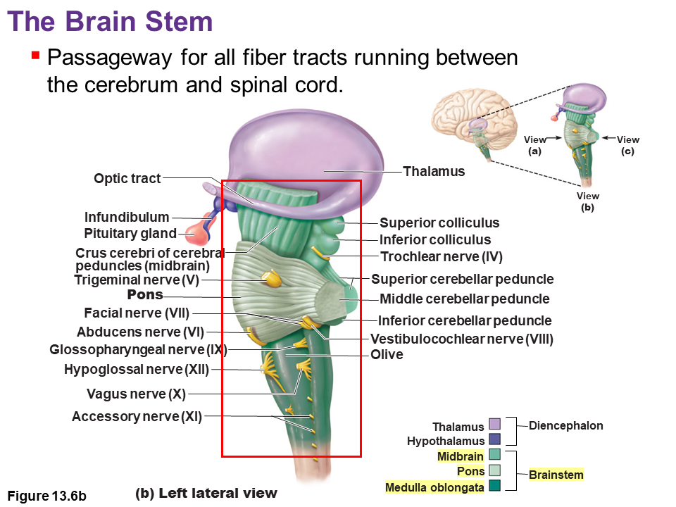
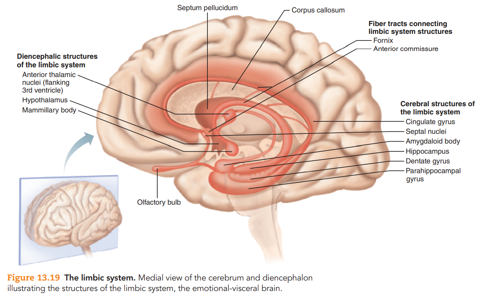

# 中樞神經系統

## 腦 Brain

### 腦室 Ventricular system

- 內部有腦脊髓液 Cerebrospinal fluid
  - 與血清內容相近，不含血液、不含細菌
- 腔壁由室管膜膠細胞構成 Ependymal cells
- 與脊椎的 Central canal 相連
- 第四腦室位置在腦幹、中腦的背側 Dorsal

### 腦幹 Brain stem

所有傳遞到脊髓的訊息，都會經過腦幹

#### 延腦 Medulla oblongata

延腦是腦幹最下方的部分，腦幹延伸形成脊髓 (經過 Foramen magnum 後稱脊髓)。

延腦是身體最重要的反射中心，也是生命中樞。下圖為從腹側往腦幹看。

以下列出延腦重要的解剖學構造

- 延髓的背側為第四腦室
- 延腦外部解剖構造
  - **錐體 Pyramid**
    - 腹面最明顯的那兩條
    - 由錐體路徑 Pyramidal tracts 組成
      - 錐體路徑發源於小腦的椎體狀神經元
      - 大多數的體運動都會經過錐體路徑
    - 在錐體下方有**錐體交叉 Decussation of pyramids**
      - 約有 70~90% 的 Pyramidal fibers 會經由此交叉到另外一邊
      - 錐體交叉使得大腦右邊主要控制左邊身體、左邊主要控制右邊身體
  - 橄欖 Olive
    - 包含 Inferior olivary nucleus，屬於一種 Relay nuclei
    - 可以在訊息進入小腦之前，預先處理訊息
  - 下小腦腳 Inferior cerebellar peduncles
    - 延髓的訊息經由此處進入小腦
- 延腦內部解剖構造
  - Nucleus fasiculatus / Nucleus cuneatus
    - 主要處理要進入小腦的一般體感覺、本體感覺訊號
  - 延髓的核心主要由鬆散的 cluster of brain nuclei 組成，稱為 Reticular Formation
    - 包含心臟中樞、血管舒縮 (vasomotor) 中樞、延髓呼吸中樞

#### 橋腦 Pons

- 橋腦連接小腦的左右兩邊，做為橋樑
- 橋腦與小腦以第四腦室相隔 (第四腦室、小腦在橋腦的背側)
- 橋腦的訊息由 Middle cerebellar peduncles 進入小腦

#### 中腦 Midbrain

介於間腦與橋腦之間，是腦幹最上面的部分。

- 最重要的構造為大腦導水管 Cerebral aqueduct，即下圖中最明顯的孔洞。
  - 此孔洞靠向背側 Dorsal 的方向形成四疊體 Tectum 的結構
  - 此孔洞靠向腹側 Ventral 的方向形成左右一對大腦腳 Cerebral peduncles 的結構。
- **四疊體 Tectum**
  - Superior colliculi (較圓一些)
    - 視覺反射 : 天空中出現陰影，你沒有意識的轉過頭看
  - Inferior colliculi (較橢圓一些)
    - 聽覺反射 : 有巨響，你沒有意識的轉過去看
- **大腦腳 Cerebral peduncles**
  - 包含錐體路徑 Pyramidal tracts 神經束
- **黑質 Substantia Nigra**
  - 與大腦基底核 Basal nuclei 連接，會釋放抑制訊號給 Basal nuclei
  - 帕金森氏症源自於黑質的退化，屬於一種神經退化性疾病 (確切原因未知)
    - 黑質退化，將使得上述抑制訊號消失
- Superior cerebellar peduncles 連結中腦與小腦

### 小腦 Cerebellum

- 主要負責運動協調、Motor skill learning 等肢體相關的事情
- 抱在腦幹的部分稱作小腦腳 Cerebellar Peduncles，腦幹的訊息由此進入小腦
- 小腦也有分左右半球，每個球有三葉 : anterior, posterior, flocculonodular lobe

### 間腦 Diencephalon

間腦 ≠ 中腦

下圖整個淡紫色的地方是視丘，前面粉紅色的地方視腦垂腺，粉紅色前面一點點是下視丘

這張圖看起來視丘反而很小，是因為視丘被切割成左右，此大腦切面會擋住右側視丘

視丘、下視丘都是由非常多的神經核所構成

#### 視丘 Thalamus

- Interthalamic adhesion 連接左右丘腦
- 大腦基部的神經元，準備要發射投射到大腦各處，就在丘腦
- 感覺中繼站

#### 上視丘 Epithalamus

- 包含松果體 Pineal body，分泌褪黑激素 melatonin，控制生理時鐘 circadian rhythm 

#### 下視丘 Hypothalamus

- 調控內分泌
- 自律神經系統的中心，自律神經訊號不須到達大腦皮質處理

### 大腦 Cerebrum

- 腦葉以骨頭命名
  - 各腦葉以 Sulcus 分隔
  - 左右半球以 Longitudinal fissure 分隔
- Sulcus / Fissure (較深的 Sulcus)
  - 大腦表面具有腦裂 Fissure，可增加灰質表面積
  - 
- 腦島 Insula
  - 藏在 Lateral sulcus 深處
  - 味覺皮質、一般臟器感覺皮層在此處
  - 

#### 大腦皮質

- 大腦皮質具有分工的特性。
  - **中央溝前面是運動皮質、後面是感覺皮質**
  - 運動皮質會形成 Motor Plans，並交由前額葉決定出最佳的 Motor Plan
- 大腦左右兩球的結構差異不大，但功能偏側化 Lateralization
  - 左半球：理性、語言
  - 右半球：感性、情緒、視覺、詮釋面部表情、藝術

#### 大腦白質

主要由三種神經纖維構成

- 連合纖維 Commissural fibers (負責聯絡左右半球)
  - 胼胝體 Corpus callosum 為連接左右半球最主要的結構
- 聯合纖維 Association fibers (負責聯絡同半球，不同腦區的動作)
- 投射纖維 Projection fibers (從大腦較 caudal 的部分投射到較 rostral 的部分)

#### 大腦深處的神經核

- 注意，nuclei 是複數，nucleus 是單數
- 基底核 Basal nuclei
  - 亦稱為 Basal ganglia，但 ganglia 通常不可用於 CNS 神經核命名
  - 基底核的範圍並不明確，所以不用特別在乎到底基底核包含哪些神經核
  - 此為一系列神經核的集合，慣例上通常包含以下神經核
    - 尾核 Caudate nucleus
    - 殼核 Putamen
    - 蒼白球 Globus pallidus
  - 尾核、殼核又稱為紋狀體 Striatum
  - 此部分功能發生問題，會導致運動困難 Dyskinesia，例如：
    - 帕金森氏症 Parkinson’s disease
    - 亨丁頓舞蹈症 Huntington’s disease
  - 
  - 
- Basal Forebrain Nuclei
  - 此為一系列神經結構的集合，但範圍並不明確
  - 慣例上包含以下重要神經結構
    - Septal nuclei
    - Diagonal band (of Broca)
    - Horizontal band (of Broca)
    - Basal nucleus (of Meynert)

#### 邊緣系統 The Limbic System

- 腦穹窿 fornix 將邊緣系統各部分連結起來
- 邊緣系統一般認為與情緒、行為、記憶相關連
- 位於大腦的組成部分
  - cingulate gyrus (扣帶迴, 和情緒相關)
  - septal nuclei
  - part of the amygdaloid body (大致等於杏仁核, 和情緒相關)
  - Hippocampal formation (包含海馬體 hippocampus)
- 位於間腦的組成成分
  - anterior thalamic nuclei
  - hypothalamus

#### 網狀結構 Reticular Formation

- Reticular Formation System 簡稱 RAS
- RAS 的 ascending pathway 通常被認為與清醒有關
- RAS 的 descending pathway 通常被認為與疼痛控制、肌肉控制、內臟控制有關
- RAS neurons 位於延髓，可被感覺刺激
- RAS neurons 的訊號可經由視丘，利用 Projection Fibers 將刺激傳送到大腦皮質

#### 大腦的保護

- 血腦屏障 Blood-Brain Barrier

  - 特殊部分沒有 BBB，例如嘔吐中樞
- 顱骨下方，有三層腦膜 Meninges
  - 硬腦膜 Dura mater。硬腦膜又可分為兩層
    - Periosteal layer 跟顱骨黏在一起；Meningeal layer 跟腦部黏在一起
      - Meningeal laye = True covering of the brain
    - 上述兩層一般會黏合在一起，除非在部分區域形成 dural venous sinuses
      - 兩腦膜之間只在這些 sinuses 的區域分離
      - 分離形成的空腔，即為 sinuses，可收集血液
      - 這些血液會合到 internal jugular veins
      - 腦中最大的 dural venous sinus 為 superior sagittal sinus
        - 下圖中央藍色血液填充形成三角形的部分
  - 蛛網膜 Arachnoid mater
    - 蛛網膜下腔 Subarachnoid space 填充 CSF
  - 軟腦膜 Pia mater

#### 腦脊髓液 Cerebrospinal Fluid, CSF

1. CSF 在腦室當中由脈絡叢 Choroid plexus 製造，並在腦室之間流動

   - 此部分微血管通透性較高，而 Ependymal cells 可發揮選擇物質通過的角色

   - 

2. CSF 被 Lateral, Median aperture 注入到蛛網膜下腔
   - 有一小部份進入脊隨中

3. CSF 在蛛網膜下腔流動

4. CSF 經由 arachnoid granulations 被收集到 dural venous sinuses

## 脊椎 The Spinal Cord

- 脊神經數量
  - C8、T12、L5、S5
    - C 的上端較大，為了支配上肢、器官運動
    - T 的下段變大，為了支配下肢運動
    - 只有 7 個 C 脊椎骨，但是有 8 條脊神經 (兩端種樹問題)
  - 
- L 部分脊神經
  - L 段的神經節在 T 段中
  - L2 之後都是神經束 (cauda equina, 馬尾)，交界處稱作髓圓錐 (conus medullarirs)
  - L 段特殊解剖構造
    - 髓圓錐 Conus medullaris、馬尾 Cauda equina、終絲 Fillum terminale
  - L 部分尾端可用於腰椎穿刺 Lumbar puncture、硬脊膜麻醉 epidural anesthesia
    - 
- 脊椎解剖
  - 
  - 白質在外，灰質在內
  - 保護也和大腦相同 : 硬腦膜、蛛網膜、軟腦膜
- 脊神經的傳輸方向
  - 背入腹出，另外有背根神經節
    - 偽單極神經元較多
    - 內臟的 VS, VM，較靠近蝴蝶中央
    - 
  - Ascending / Descending
    - 

## CNS 之間的聯繫路徑

### Ascending Pathway

都會換邊

- Dorsal column-medial lemniseal pathway: 在延髓的內側蹄系換邊
  - 一般體感覺在腦幹之前，會在延髓的內側蹄系 medial lemniscus tract 換邊
- Spinothalamic pathway: 在 L 區就換邊
  - 疼痛、熱覺在進入脊隨神經束之前，就已經左右交換了

### Descending Pathway

- Pyramidal pathways (錐體路徑) (會換邊)
- rubrospinal tract (不會換邊，經過 red nucleus)

