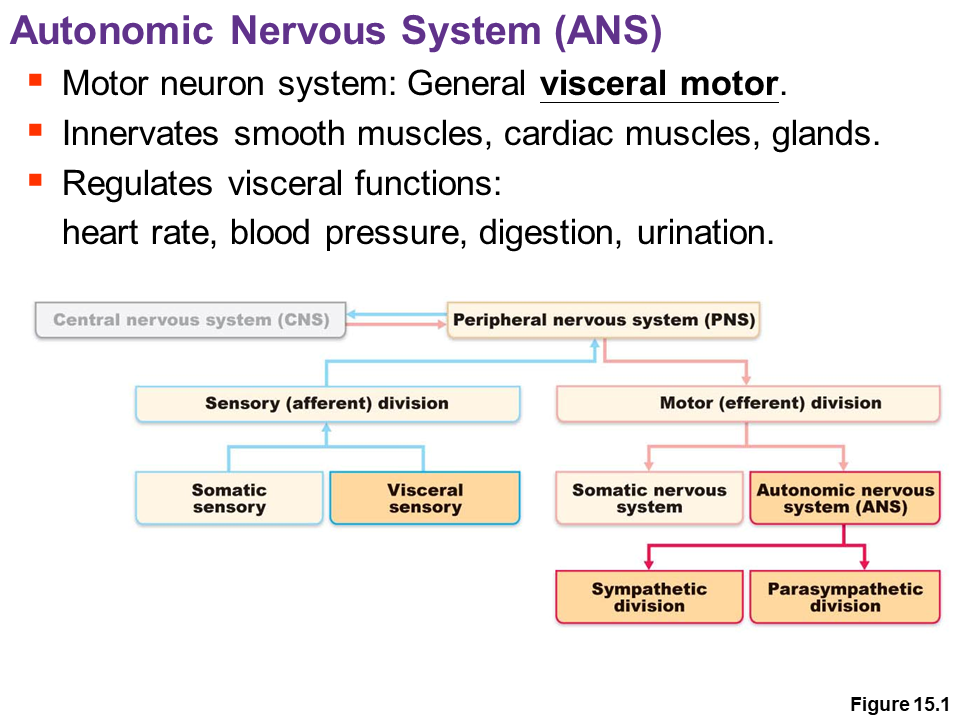
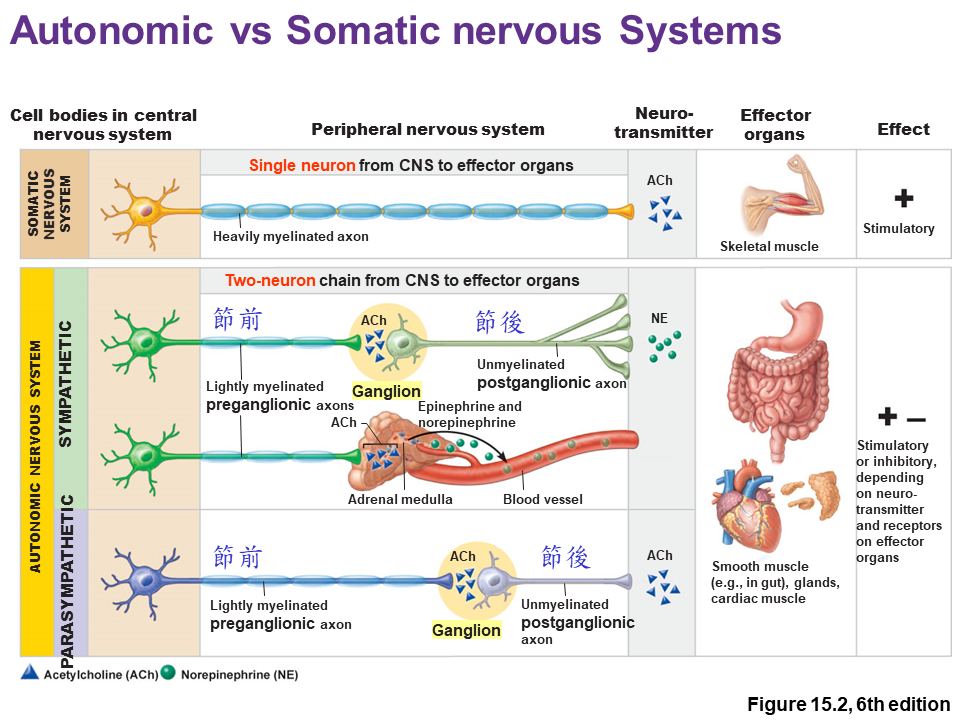
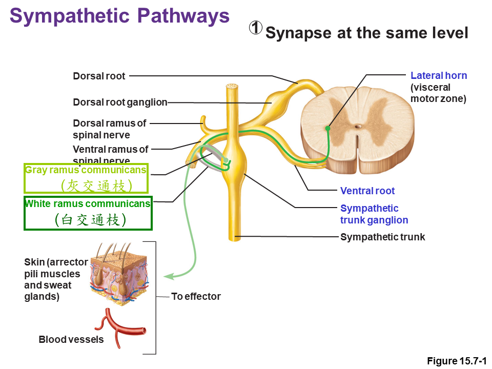
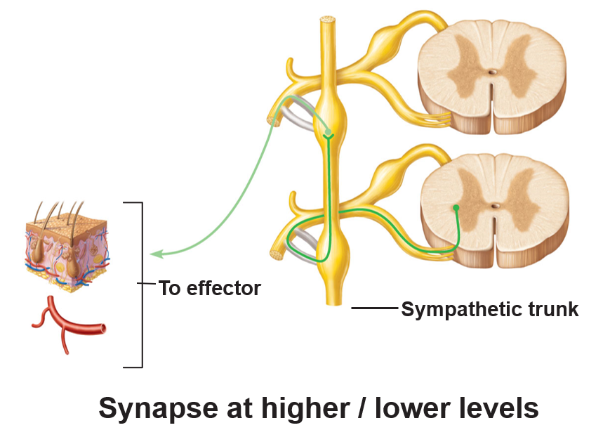
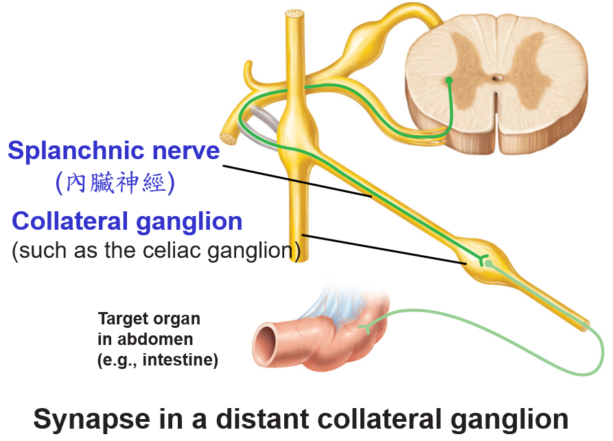
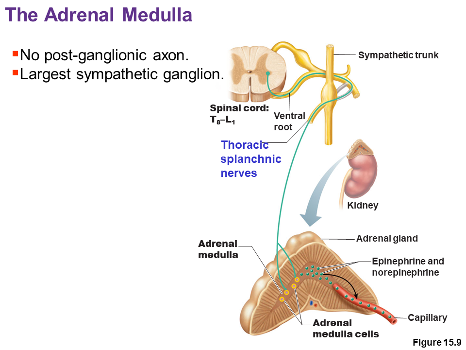
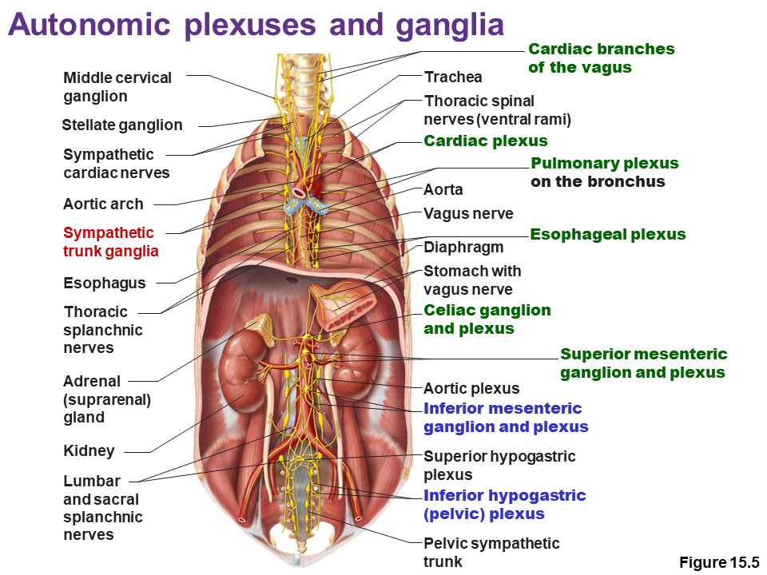
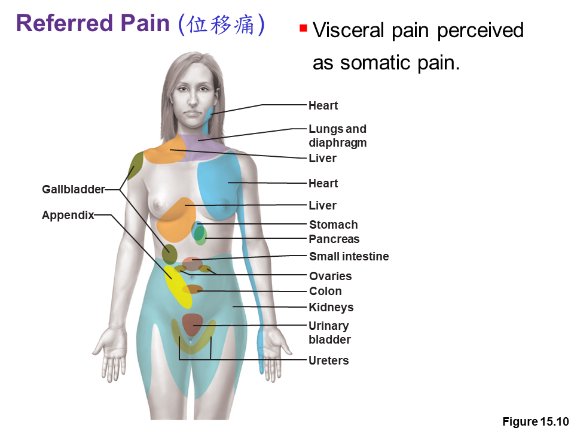

# 自律神經系統與臟器感覺

- 感覺可分為體感覺、臟器感覺；運動可分為體運動、自律神經運動
- 自律神經運動由自律神經所控制
- 自律神經必為運動神經元
- ANS 中樞位於下視丘

## 體運動、ANS 的比較

## 副交感神經

- 同時來自於腦神經、脊神經
  - 腦神經 CN III、CN VII、CN IX、CN X (注意不只包含迷走神經)
  - 脊神經 S2~S4
- 相對於交感神經，副交感神經的節前神經元通常在臟器內部才接棒
  - 第一棒跑比較遠，通常經由 Autonomic plexuses 和交感神經一起走
  - 靠近頭頸部的地方，有專門接棒的神經節
    - 如 Cillary / Pterygopalatine / Submandibular / Otic ganglion

## 交感神經

- 支配 fight or flight 反應
- 由 T1~L2 所構成 (T1~T12, L1~L2)，但是可以延伸到全身
- 第一棒 (節前) 跑比較近，第二棒 (節後) 跑比較遠
  - 第一棒交棒給第二棒時，釋放乙醯膽鹼 ACh
  - 第二棒交棒給動器時，釋放去甲基腎上腺素 NE
  - 例外: 腎上腺髓質
    - 第一棒跑非常遠，第二棒直接就是髓質的細胞分泌 NE (不用跑步)

### 交感神經構造

- 交感神經 Sympathetic Nerves 為自主運動神經，由脊神經發源
- 節前神經元位於脊隨灰質內
- 節後神經元位於交感神經節 Sympathetic trunk ganglion
- 交感神經幹由兩個 rami communicants 與 Ventral ramus 的基部相連
  - 節前神經元從灰質出發
  - 節前神經元纖維經由灰交通支 Gray ramus communicans 到交感神經節
    - 白交通支需要跑的距離很近，沒有髓鞘，呈現灰色
  - 節後神經元從交感神經節出發
  - 節前神經元纖維經由白交通支 White ramus communicans 到 Ventral rami
    - 白交通支需要跑的距離較遠，故有髓鞘 myelin，呈現白色

### 交感神經路徑

#### 在同一節交棒

1. 節前神經元纖維經由灰交通支進入交感神經幹
2. 在同一個神經節，交棒節後神經元
3. 節後神經元纖維經由白交通支抵達動器

#### 在不同節交棒

1. 節前神經元纖維經由灰交通支進入交感神經幹
2. 節前神經元纖維**經由交感神經幹**抵達另一個神經節
3. 然後在另一個神經節，交棒給位於另一個神經節的節後神經元
4. 節後神經元纖維經由白交通支抵達動器

#### 經由內臟神經在遠處交棒

常見於交感神經支配消化器官

1. 節前神經元纖維經由灰交通支進入交感神經幹
2. 節前神經元纖維經直接穿出交感神經幹
3. 節前神經元纖維經由內臟神經 Splanchnic nerve 抵達側神經節
   - 側神經節 Collateral ganglion 通常位於要支配的內臟附近
4. 節前神經元纖維在側神經節交棒
5. 節前神經元纖維抵達支配的器官

#### 腎上腺交棒方式

- 沒有節後神經元
- 節前神經元，直接交棒給腎上腺髓質分泌腎上腺素的細胞

## 自律神經叢 Autonomic plexuses 

所有的自律神經叢，都同時包含交感、副交感神經

## 臟器的感覺、運動的協調

### 臟器的感覺

- 感覺拉扯、溫度、化學訊號、irritation 等
- 臟器的疼痛，會被 perceived 成體感覺的痛，但是有位移痛的現象 Referred Pain

### 內臟反射

- 感覺 → 整合 → 運動
- 常見的內臟反射 : 排尿、排便、Baroreceptor reflex

