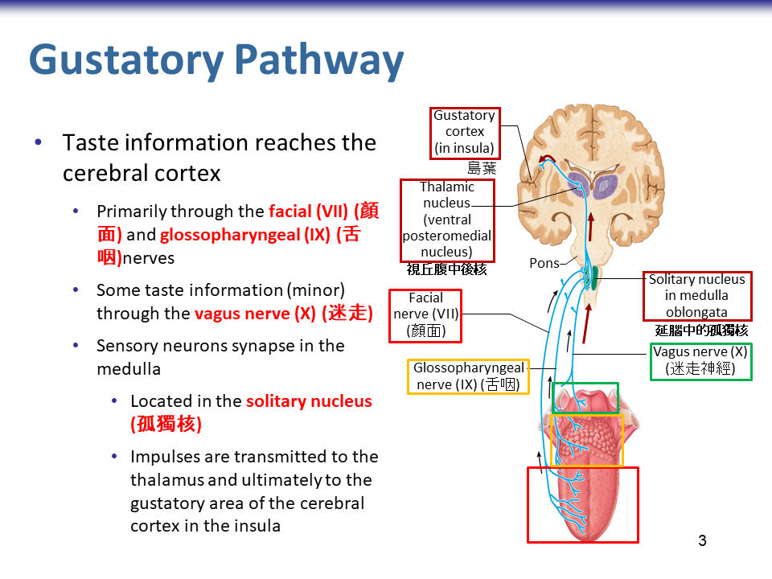

# 特殊感覺受器 Special Sense

## 化學感覺受器 - 味覺、嗅覺

嗅覺、味覺是化學感覺受器，可經常更新感覺細胞 (其他特殊感覺都不行)。

### 味覺 Gustation

- 特性
  - 五種感覺
    - 甜 sweet, 酸 sour, 苦 bitter, 鹹 salty, 鮮 umami
  - 可再生，透過基底細胞置換之
- 乳突 papillae 下方藏有味蕾，味蕾裡面有味細胞
  - 蕈狀 Fungiform 、谷狀 (Vallate, V 字形)、葉狀 Foliate
- 味覺傳遞路徑 (兩條主要，一條次要)
     - 感覺神經: CN VII (前半部，最多)、CN IX (較後方)、CN X (極少)
  - 中途站: 延腦孤獨核 Solitary nucleus

### 嗅覺 Olfaction

- 嗅覺受器特性
  - 嗅球本身即為神經元、感覺神經元
  - 氣味分子須為可溶性分子
  - 可再生，可由嗅球幹細胞再生
- 嗅覺受器組成細胞
  - 嗅覺上皮 : 纖毛柱狀上皮細胞
  - 嗅覺神經元，鑲嵌在嗅覺上皮細胞之間
    - 樹突形成「嗅纖毛」，上有化學受體
  - 其他: 嗅覺幹細胞、支持細胞
- 嗅覺路徑
  - 嗅纖毛 (位於嗅覺上皮) → 僧帽細胞 Mitral cells (於嗅球 Olfaction bulb) 
  - 透過嗅覺路徑傳至: 邊緣系統、嗅覺皮質 (不經過視丘)

## 眼睛與視覺 Vision

光受器是人類最重要的感覺受器，有 70% 的感覺受器是視覺受器，有 40% 的大腦神經皮質神經元都涉及處理視覺訊號。

視覺路徑是經由外側膝狀體 (Lateral geniculate nucleus, LGN)。(口訣 : 室外)

### Accessory Structures of the Eye

#### 淚腺相關

- 淚腺 Lacrimal gland
- 鼻淚管 Inferior meatus of nasal cavity

#### 結膜 Conjunctiva

- 

#### Extrinsic Eye Muscles

- 四大直肌
  - 外直肌：外旋
  - 內直肌：內旋
  - 上直肌：上升、往內側轉
  - 下直肌：下降、往內側轉
- 兩大斜肌
  - 上：上升、往外側轉、收縮，順時針
  - 下：下降、往外側轉、收縮，逆時針
- 神經支配
  - 外直肌 (側直肌)：CN VI (外旋)
  - 上斜肌：CN IV (滑車)
  - 其餘是由 CN III 支配 (動眼)
- 鬥雞眼: 中直肌收縮

### 眼球解剖

光線進入順序: 角膜、水狀液、瞳孔、虹膜、晶體、玻璃狀液、視網膜

#### 纖維層

- 鞏膜 (Sclera, 白色)
- 角膜 (Cornea, 透明)

#### 血管層

- 脈絡膜 (Choroid)
  - 脈絡膜供應視網膜必要養分、氧氣
  - 脈絡膜分有黑色素細胞，可以吸收多餘光線，避免光線重複反射
- 與睫狀體 (Ciliary body) 相連
  - 睫狀體控制晶體曲率半徑
- 虹膜 (Iris) 的基底與睫狀體基底相連
  - 是眼睛有顏色的地方
  - 中央的開口即為瞳孔 Pupil
  - 當明亮光線閃爍時，瞳孔會縮小，此為瞳孔反射
  - 瞳孔括約肌、擴瞳肌控制瞳孔大小
    - 瞳孔括約肌 sphincter pupillae (收縮，瞳孔變小)
    - 擴瞳肌 Dilator pupillae (收縮，瞳孔變大)
  - 瞳孔大小由交感、副交感神經支配
    - 

#### 內層

- 視網膜 Retina
  - Pigmented layer (含有黑色素細胞、提供養分的細胞、較外層)
  - Neural Layer (含有光受器、較內層)
- 視神經 Optic nerve
- 視網膜解剖重要構造
  - 黃斑 Macula lutea (視錐細胞較多的地方)
    - 中間為中央窩 Fovea centralis ，視覺最敏銳
  - 視盤 Optic disc (沒有視細胞，為盲點)
- 視網膜的血管供應
  - 內側 2/3 由視盤發出的中央動靜脈供應血液
  - 外側 1/3 由脈絡膜供應血液

#### Photoreceptor 光受器

- 光受器
  - 視桿細胞 Rod cells (黑白)
  - 視錐細胞 Cone cells (彩色)
- 訊號傳遞方式
  - 光受器 → 雙極細胞 Bipolar cells → 神經節細胞 Ganglion cells
  - 訊號方向與光線方向相反
  - 
- 側抑制 Lateral Inhibition 使成像更犀利
  - 水平細胞 Horizontal cells、無軸突細胞 Amacrine cell
- 光受器構造
  - Outer segment 含有感光色素
    - 視細胞會一直更新 Outer segment
  - 光線 → Outer segment → Inner segment → Outer fiber → 細胞本體
  - 細胞本體 → Inner fiber → 與雙極細胞形成突觸

#### 眼球前側構造

- 水狀液 Aqueous humor
  - 區分為兩室，前室與後室以瞳孔相連
  - 靜脈竇阻塞，導致水分流不出去，眼壓過高，是青光眼可能的致病原因
- 玻璃狀液 Vitreous humor
  - 有規則排列的膠原蛋白

### 光線的對焦、成像

- 折射媒介
  - 角膜、晶體、液體 (水狀液、玻璃狀液)
- 晶體曲率半徑的控制 (Accommodation)
  - 看近物，副交感活躍
    - 睫狀肌 ciliary muscle 收縮，懸韌帶 ciliary zonule 變鬆，晶體變胖
  - 看遠物，交感活躍
    - 睫狀肌 ciliary muscle 舒張，懸韌帶 ciliary zonule 變緊，晶體變瘦

### 視覺路徑

視野所見 → 視網膜 → 視神經 → 視交叉 → 視束 → 外側膝狀核 → 視輻射束 → 視覺皮質
- 視交叉 (optic chiasma)
- 視束 (optic tract)
- **外側膝狀體 (lateral geniculate nucleus, LGN)**
- 視輻射束 (optic radiation)
- 視覺皮質 (visual cortex)
  - 視野傳遞時，小小的角度差和時間差，會在皮質作詮釋，造成 3D 感覺
  - 視覺神經纖維終止於視覺皮質

## 耳道、聽覺與平衡覺

### 耳道構造

#### 外耳

#### 中耳

- Temporal bone
- 鼓室、鄧骨肌、聽小骨 (順序 MIS)、耳咽管 (歐氏管)、卵圓窗與內耳相連
- 鼓膜張肌 (收縮可使鼓膜不易震動, 可保護鼓膜)

#### 內耳

- 骨迷路
  - 與膜迷路中間的空縣，填充外淋巴，是腦脊隨液的一部份
  - 內含膜迷路 (封閉構造)
  - 內淋巴: 與外淋巴不相連
- 耳蝸
  - 蝸軸，若耳蝸同心圓在紙面上，則蝸軸在圓心處出入紙面
  - 聽覺受器
  - 前庭管、骨管充滿外淋巴
  - 耳蝸道 (cochlear duct) 充滿內淋巴
    - 此內淋巴由血管紋分泌
    - 不同頻率的聲音，在不同部位的耳蝸管被接收

### 聽覺

#### 聽覺路徑

- 延腦 Medulla
  - Cochlear nuclei
  - 上橄欖核 Superior olivary nucleus (pons-medulla junction)
  - 外側丘系 Lateral lemniscus
- 中腦 Midbrain
  - 下丘 Inferior colliculus
- 大腦 Cerebrum
  - 視丘內側膝狀核 Medial geniculate nucleus of thalamus
  - 顳葉皮質 Primary auditory cortex in temporal lobe

### 平衡覺

#### 前庭受器

- 囊黃斑、球囊黃斑
  - 囊黃斑：水平位置
  - 球囊黃斑：垂直位置（記：球會往下掉）
- 壺腹嵴: 內有毛細胞感受淋巴流動

#### 前庭路徑

- 延腦、小腦前庭核，通常不會到大腦皮質
- 不傳遞到皮質，而是傳到中下的腦區
