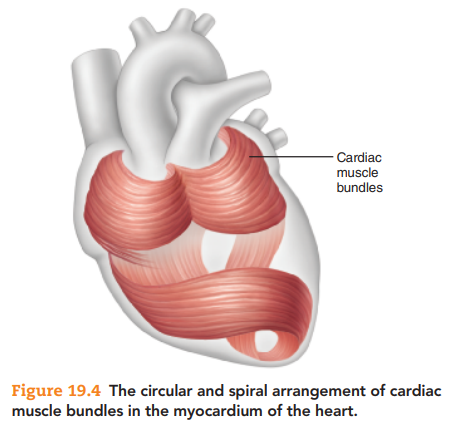
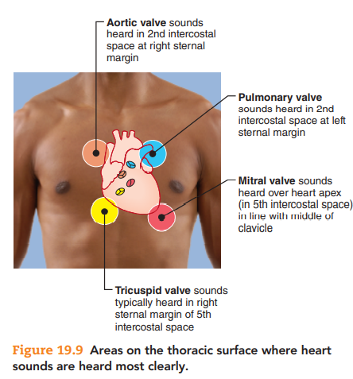
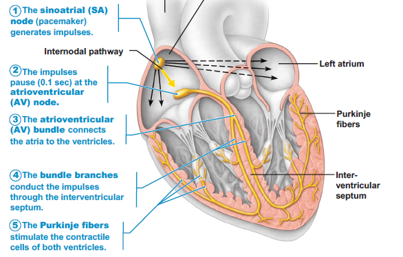

# 心臟

## 心臟結構 Structure of the Heart

### Sulcus

- 冠狀溝 Coronary sulcus
- 室間前溝 Anterior interventricular sulcus (分隔兩心室)
- 室間後溝 posterior interventricular sulcus (分隔兩心室)

### Coverings

心包膜 Pericardium 包覆住心臟，可保護心臟，且與 Heart Wall 相連接。

以下為由外到內的順序：

- 纖維性心包膜 Fibrous pericardium
- 漿液性心包膜 Serous pericardium
  - 壁層 Parietal layer of serous pericardium
  - 壁層與臟層之間夾著圍心腔 Pericardial cavity
  - 臟層 Visceral layer of serous pericardium
    - 即 Heart Wall 的外心層 Epicardium
    - 與心臟內層不可分離

### Layers of the Heart Wall

- 外心層 Epicardium
  - 即臟層 Visceral layer of serous pericardium
- 心肌層 Myocardium
  - 由心肌 Cardiac muscles 和結締組織組成
  - 結締組織形成心臟的骨架，以 circularly and spirally arranged 形成 bundles
  - Surrounding the cardiac muscle cells in the myocardium are connective tissues that bind these cells together into elongated, circularly and spirally arranged networks called **bundles**. These bundles function to squeeze blood through the heart in the proper directions: inferiorly through the atria and superiorly through the ventricles. The connective tissues of the myocardium form the cardiac skeleton, which reinforces the myocardium internally and anchors the cardiac muscle fibers. 
  - 
- 內心層 Endocardium
  - 由薄薄一層 Connective layer 以及單層鱗狀上皮組織構成。
  - 包覆整個心房、心室內部，同時也包覆心臟瓣膜。

### Heart chambers

#### 心房 Atria

- 右心房
  - 上腔靜脈、下腔靜脈流入右心房
    - 上腔靜脈 Superior vena cava (SVC)
    - 下腔靜脈 Inferior vena cava (IVC)
  - 其他解剖學特徵
    - 梳狀肌 Pectinate muscles
    - 終脊 Crista terminalis
    - 卵圓窩 Fossa ovalis
      - 胚胎發育時的卵圓孔 foramen ovale 閉合後形成的痕跡
- 左心房
  - 4 個肺靜脈 Pulmonary veins 流入左心房
  - Makes up most of heart's posterior surface

#### 心室 Ventricles

- 左心室構成心尖 Apex of the heart
- 左心室與右心室都有以下構造
  - 肉柱 Trabeculae carneae
  - 乳頭肌 Papillary muscles
  - 腱索 Chordae tendineae

## 心臟瓣膜 Heart Valves

- Endocardium
- papillary muscle: 固定瓣膜
- 被動開啟，不需耗能
- 房室瓣 Atrioventricular valves
  - 左二右三
  - 二尖瓣 mitral valve (僧帽瓣)
  - 三尖瓣 tricuspid valve
- 半月瓣 Semilunar valves
  - 主動脈瓣 Aortic valve
  - 肺動脈瓣 Pulmonary valve
- Heart sounds
  - Lup : 房室辦關閉，聲音低沉、時間長
  - Dup : 半月辦關閉，聲音高、時間短
  - 聽見心音的地方
    - 

## 心臟的傳導組織 Conducting System

- 
- 竇房結 SA node
- 房室結 AV node (停頓 0.1 秒鐘)
- 房室束 AV bundle
- 房室束分支 Bundle branches (分岔成左右)
- 柏金氏纖維 Purkinje fiber (分別從左右往上)

## 心臟的神經支配 Innervation

- 交感神經支配整個心臟
  - 延腦 Cardioacceleratory center → 脊隨 → Thoracic ganglia
- 副交感神只支配心房，主要是 SA node
  - 延腦 Cardioinhibitory center →  迷走神經 Vagus nerve 作為副交感神經
  - M receptor: Acetylcholine

## 心臟的血流供應 Blood Supply to the Heart

心臟裡面的血液，不會供應心肌任何的氧氣、養分。需要有額外的血管供應心臟氧氣、養分。

### 冠狀動脈 Coronary Arteries

- 在房室舒張期，冠狀動脈會流入最多的血液
  - 半月瓣會擋住冠狀動脈入口
- 左冠狀動脈
  - 室間前支 Anterior intervenetricular branch，供應左右心室血液
  - 迴旋支 Circumflex branch 沿著沿著左心室邊緣而上，供應左心房、左心室血液
- 右冠狀動脈
  - 竇房支 Nodal branch，供應竇房結血液
  - 邊緣支 Marginal branch，供應右心室血液
  - 後室間動脈 Posterior interventricular branch，供應左右心室血液

### 心臟靜脈 Cardiac Veins

- 冠狀竇 Coronary sinus
  - 大部分心臟靜脈血液都會注入冠狀竇，有些則不會
  - 介於下腔靜脈 (Inferior vena cava) 與房室間開口 (Atrioventricular orifice) 之間
  - 注入冠狀竇的幾個重要血管
    - 心大靜脈 Great cardiac vein
    - 心中靜脈 Middle cardiac vein
    - 心小靜脈 Small cardiac vein
    - 斜靜脈 Oblique vein
- 心前靜脈 Anterior cardiac vein，直接注入右心房，非常特別

## 心肌組織

心肌組織的顯微構造

- 心肌是分岔的細胞，分岔的地方會連結到附近的心肌細胞。
  - 這樣心肌之間就可以形成緊密的網路，讓收縮訊號快速傳遞
- 間盤 intercalated discs 連結相鄰細胞之 Sarcolemma
  - Gap junctions 可使電訊號快速傳遞
  - Fasciae adherens 可傳遞收縮力量到相鄰細胞
    - Desmosome-like junctions
  - Desmosomes
    - 緊密連結不同細胞，使得細胞不會因為強力的收縮而被分開
    -  by binding intermediate filaments
- 肌內膜 Endomysium 是結締組織，協助肌肉之間的連結
  - 同時亦包含血管和神經
- 心肌有極低的再生能力
  - 有些心肌會 remodeling，可能是部分心臟疾病的致病機制

## 心臟疾病

心臟疾病繁多，分類方式也繁多，以下只是簡單介紹而已

- 血管相關的心臟病
  - 冠狀動脈疾病 Coronary Artery disease
    - 原因很多，其一為動脈粥樣硬化 Atherosclerosis
    - 臨床表徵、急性症狀
      - 心絞痛 Angina pectoris
      - 心肌梗塞 Myocardial infraction (= Heart attack)
      - Silent ischemia
  - 肺動脈高血壓 Pulmonary arterial hypertension
    - 肺部微小動脈阻塞，造成周邊阻力上升，心臟必須要更費力跳動
    - 肌肉會疲倦，最終可能導致心臟衰竭
    - Enlarged right ventricle
- 心臟結構相關的心臟病
  - 瓣膜相關疾病 Heart Valve Disease
  - 心包膜相關疾病 Pericardial Disease
  - 心肌相關疾病 Cardiomyopathy
- 心臟衰竭 Heart failure (Congestive heart failure)
  - 進展性的心臟衰弱
  - 心臟的輸出量不足以應付身體的需氧量
- 傳導性心臟疾病 Heart Arrythmias (心律不整)
  - 如心房顫動 Atrial fibrillation
- 心臟疾病的治療手段
  - 檢查
    - 心電圖 Electrocardiogram (ECG, EKG)
      - 動態心電圖 Holter monitor (24 小時心電圖)
      - 運動心電圖 Exercise Electrocardiogram
    - 心臟超音波 Echocardiography
    - 血管攝影 Angiography
    - 心導管檢查 Cardiac catheterization
    - 心臟電氣生理學檢查 Electrophysiologic study
  - 藥物
    - 詳見藥理學...
  - 植入裝置
    - Pacemakers
    - Cardiac resynchronisation therapy (CRT) devices
    - Implantable cardioverter defibrillators (ICDs)
    - CRT-Ds
  - 手術
    - 導管電氣燒灼術 Catheter ablation
      - 利用 radiofrequency energy 
      - 通常用於治療傳導性疾病，尤其是 AFib
    - 動脈血管手術 Angioplasty
      - 常見的為 Percutaneous transluminal coronary angioplasty
      - 如支架放置 Stent Placement、氣球擴張
    - 冠狀動脈搭橋 (繞道) 手術 Coronary artery bypass surgery
    - 心臟瓣膜手術 Heart valve surgery
      - 瓣膜脫垂 Valve Prolapse 
    - 通常用於晚期心臟衰竭患者
      - 植入左心室輔助裝置 Left Ventricular Assist Device (LVAD)
      - 心臟移植 Heart transplant
  - 體外膜氧合 Extracorporeal Membrane Oxygenation (ECMO, 葉克膜)
    - 用於急性心肺衰竭患者使用
  - 電擊去顫 Defibrillation