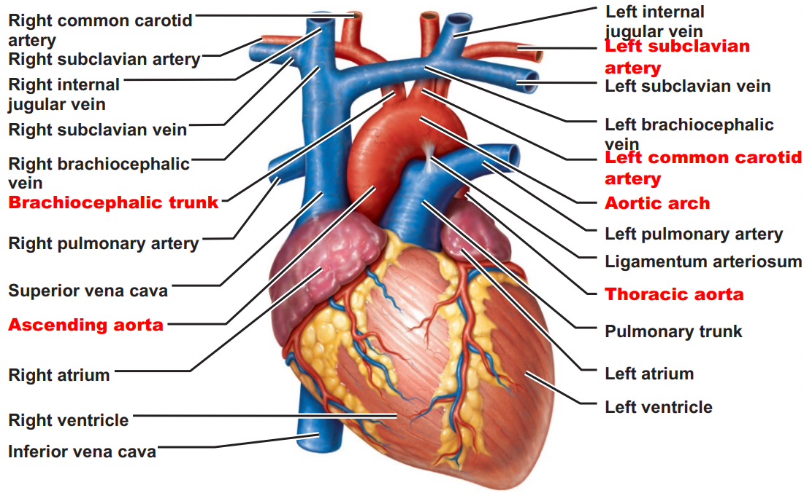
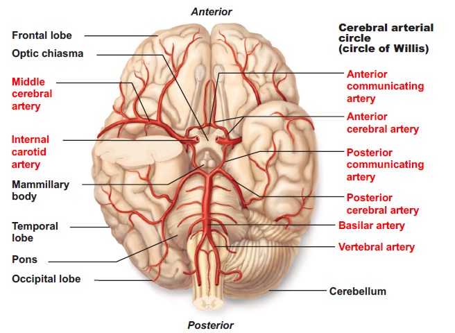
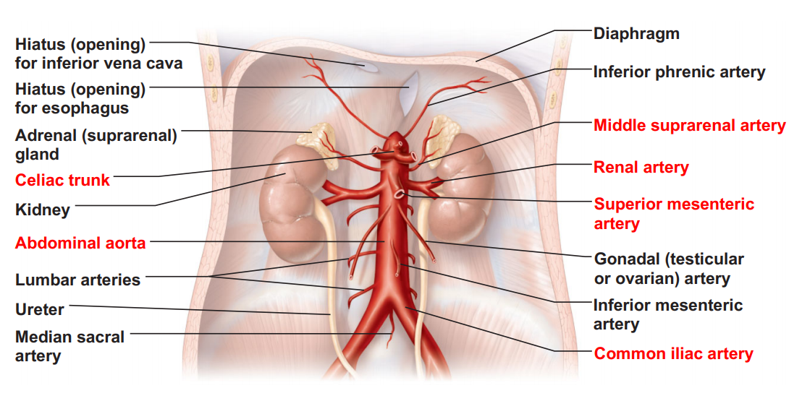

# 血管

## 血管的基本特性

### 血管的結構

除了微血管外，血管由血管壁圍繞血管腔 (lumen) 構成。血管壁有三層，稱為 Tunics。

- 內層 Tunica intima
  - 扁平的上皮細胞 + 一些支持的結締組織
  - 微血管只有內層
- 中間層 **Tunica media**
  - 決定管腔大小、形狀 (M)
  - 中間層是動脈與靜脈最不同的結構，主要是平滑肌的差異
  - 主要由平滑肌構成，可伸縮與舒張
    - Contraction → vasoconstriction、Relaxation → vasodilation
- 外層 Tunica adventitia
  - 結締組織層

### 血管的類型

#### 動脈 Arteries

- 大動脈 Large elastic arteries (conducting arteries)
  - 中間層有許多由彈性纖維 (elastic fibers) 構成的**彈性層**
  - 由於具有彈性，因此此種動脈本身的管壁並不會對血管造成太大的血壓變化
- 中動脈 Medium muscular arteries (distributing arteries)
  - 除了 Aorta 之外，大多屬於中動脈
  - **中間層較厚**，含有**大量平滑肌**，以及較少數結締組織、彈性纖維
    - 可伸縮或舒張 (大動脈較缺乏此能力)
  - 中動脈的中膜和外膜交界處有**明顯的外彈性膜 (external elastic lamina)**
- 小動脈 Small arteries & arterioles
  - 通常不會被命名
  - Arterioles
    - 決定血管張力 Tonus

#### 微血管 Capillaries

- 微血管床 Capillary Bed
  - 微血管前括約肌 Precapillary sphincters 控制血液進出組織
  - 氧氣與養分的交換，主要是透過淨水壓 hydrostatic pressure
- 一些特別的微血管
  - 微血管較少或沒有的地方
    - 微血管較少的地方 : 肌腱 Tendons & 韌帶 Ligaments
    - 沒有微血管的地方 : 上皮 Epithelia & 軟骨 cartilage
  - 動靜脈吻合 Arteriolovenular anastomoses (AV shunts)
    - Anastomoses : 血管吻合 (血管互相連通)
    - 小動脈與小靜脈直接相連，缺乏微血管網
    - 皮膚很常見，可以保留一些體溫
  - 門脈系統 Potal Venous System
    - 靜脈兩端皆連接微血管
    - 肝門脈系統 Hepatic portal system
      - 肝門靜脈、肝動脈共同進入肝臟
        - 胃腸的靜脈直輸肝臟，無腸靜脈
      - 肝靜脈是肝臟血液唯一出路
    - 下視丘-腦垂腺前葉門脈系統 Hypophyseal portal system
  - 低通透性的血管
    - Blood-brain barrier
    - Blood-testis barrier
  - 血竇 Sinusoids
    - 一種特殊的微血管構造，通常有孔洞。
    - 半徑大、路線曲折
    - 於骨髓 Bone marrow & 脾臟 Spleen 可見

#### 靜脈 Venous Vessels

- 微靜脈 Venules
  - 極微小的靜脈，功能與微血管類似。較大的微靜脈才有明顯的三層構造。
  - 一個區域通常只有一條動脈流過，但通常會有兩條靜脈收集微血管的血液
    - 有時候多條靜脈會 anastomoses，形成靜脈叢 Venous plexuses
- 中靜脈 Medium veins
  - Accompany medium arteries
  - 瓣膜 flap valves
- 大靜脈 Large veins
  - Well-developed tunica adventitia
  - 含有大量的縱走**平滑肌** (longitudinal smooth muscles)
- 備註
  - **靜脈 (80%) 遠比動脈 (20%) 多**
  - 越大的靜脈，平滑肌越多
  - **Accompanying veins**
    - 大動脈、中動脈都位於較深處的地方，且都會被靜脈包圍
      - 可以協助體溫在兩血管之間交換
    - 然而，有些靜脈並沒有動脈 accompany，且非常接近皮膚表層
      - 這些靜脈很適合用來抽血、注射或插入導管
    - Arteriovenous pump
      - 當被環繞的動脈伸縮時，會對 accompanying veins 造成壓力，提供血液回到心臟的動力
  - Musculovenous type of venous pump
    - 肌肉擠壓提供血液回到心臟的動力

## 身體各部分的血管

血流順序

- 血流順序
  - 大動脈 →  **小動脈 arterioles**
  - 微血管床 capillary bed
  - **小靜脈 venules** → 大靜脈
- 身體有兩個 Circuits (Circulation)
  - Pulmonary / Systemic
  - Pulmonary 就不贅述了

### 體循環動脈 Systemic Arteries

#### 主動脈 Aorta

Ascending Aorta → Aortic Arch → Descending Aorta

- 上行大動脈 Ascending Aorta 分別從左右分支出左右冠狀動脈
- 主動脈弓 Aortic Arch 分支出頭臂動脈幹、左總頸動脈、左鎖骨下動脈
  1. **頭臂動脈幹 Brachiocephalic trunk**
     - 上升至頸部，分支出右總頸動脈、右鎖骨下動脈，Brachiocephalic trunk 結束。
       - 右總頸動脈 Right common carotid artery
       - 右鎖骨下動脈 Right subclavian artery
     - 注意，右側上肢血液均來自於 Brachiocephalic trunk
  2. 左總頸動脈 Left common carotid artery
  3. 左鎖骨下動脈 Left subclavian artery
- 下行大動脈 Descending Aorta，分支出胸部、腹部兩大動脈。**主動脈結束。**
  1. 胸部大動脈 Thoracic aorta
  2. 腹部大動脈 Abdominal aorta

#### 頭頸部的動脈 Arteries of Head and Neck

##### 左右總頸動脈 Common carotid arteries

左右總頸動脈 Common carotid arteries 分別分支出內頸動脈、外頸動脈。總頸動脈結束

- 左右內頸動脈 Internal carotid artery 分別分支出眼、前大腦、中大腦動脈。內頸動脈結束
  - 眼動脈 Ophthalmic artery
  - 前大腦動脈 Anterior cerebral arteries
  - 中大腦動脈 Middle cerebral arteries
  - 前大腦動脈 + 中大腦動脈約佔大腦 80% 血液
- 左右外頸動脈 External carotid artery 分別分支出以下動脈。外頸動脈結束。
  1. 上甲狀腺動脈 Superior thyroid artery
  2. 舌動脈 Lingual artery
  3. 顏面動脈 Facial artery
  4. 枕動脈 Occipital artery
  5. 後耳動脈 Posterior auricular artery
  6. 淺顳動脈 Superficial temporal artery
  7. 上頷動脈 Maxillary artery

##### 左右鎖骨下動脈 Subclavian arteries

鎖骨下動脈 Subclavian arteries 分支出椎動脈、甲狀腺動脈幹、肋頸動脈幹、內胸動脈。

最終，左右鎖骨下動脈進入 Axilla，改稱為腋動脈 Axillary artery

- 椎動脈 Vertebral artery
- 甲狀腺動脈幹 Thyrocervical trunk
- 肋頸動脈幹 Costocervical trunk
- 內胸動脈 Internal thoracic artery

##### 左右椎動脈 Vertebral arteries

- 左右椎動脈起源自左右鎖骨下動脈
- 椎動脈在脊椎分支出去的同時往上，由 foramen magnum 進入腦部
- 最後左右椎動脈會合形成一條基底動脈 Basilar artery，左右椎動脈結束
- 基底動脈 Basilar artery 由左右左右椎動脈末端會合形成
  - 分支出小動脈到小腦、橋腦、內耳的同時沿著腦幹往上
  - 最後分支出左右的後大腦動脈，基底動脈結束。

##### 腦部的 Communicating artery

- Circle of Willis 將不同血管之間的血液供應連結起來，包含以下成員
  - 一條 Anterior Communicating artery
  - 左右各一條 Posterior communicating arteries
- **Anterior Communicating artery**
  - 只有一條，連結左右的 Anterior cerebral arteries
- **Posterior communicating arteries**
  - 左右各一條
  - 分別將左右的後大腦動脈連接到對應的中大腦動脈
    - 後大腦動脈 Posterior cerebral arteries
    - 中大腦動脈 middle cerebral arteries

#### 上肢的動脈 Arteries of the Upper Limbs

- 腋動脈 Axillary artery
  - 左右鎖骨下動脈分支後進入 Axilla，改稱為腋動脈 Axillary artery
  - 腋動脈 Axillary artery 分支的同時，往手臂前進，分支出以下分支
    - Thoracoacromial artery
    - Lateral thoracic artery
    - Subscapular artery
    - Anterior and posterior circumflex humeral arteries
  - 最後腋動脈 Axillary artery 進入手臂，改稱為肱動脈 Brachial artery
- 肱動脈 Brachial artery
  - 腋動脈 Axillary artery 進入手臂，改稱為肱動脈 Brachial artery
  - 分支的同時，往前臂前進，最終分支出尺動脈 (內側)、橈動脈 (外側)，腋動脈結束。
    - 尺動脈 Ulnar artery
    - 橈動脈 Radial artery

#### 腹部的動脈

腹部的動脈均由 Abdomial Aorta 分岔出去

腹部大動脈結束在分岔成左右 Common iliac artery 的時候。

##### 消化道相關的動脈

- **Celiac trunk**
  - 很短一段，分枝成左胃動脈、脾動脈、肝總動脈後結束。
    - **左胃動脈 Left gastric artery**
    - **脾動脈 Splenic artery**
      - 分支給胰臟、胃臟 (最主要的分支)，最後一小分支進入脾臟
      - **胃網膜左動脈 Left gastroepiploic artery**
        - 胃部較大曲率半徑的弧線左側的血管
    - **肝總動脈 Common hepatic artery**
      - 分支出肝動脈本體 (上升)、胃十二指腸動脈 (下降) 後結束。
      - 肝動脈本體 hepatic artery proper
        - 在進入肝臟前，會分支成左右兩個分支
        - 通常亦分支出右胃動脈 Right gastric artery
      - 胃十二指腸動脈 Gastroduodenal artery，分支出以下兩個動脈後結束
        - 上胰十二指腸動脈 Superior pancreaticoduodenal artery
        - **胃網膜右動脈 Right gastroepiploic artery**
- **上腸繫膜動脈 Superior mesenteric artery**
- **下腸繫膜動脈 Inferior mesenteric artery**

##### 其他重要腹部動脈

- (左右)中腎上腺動脈 Middle suprarenal artery
- (左右)腎動脈 Renal arteries 
- 腹部大動脈最後分岔出 **(左右)總髂動脈 Common iliac artery**，並在此結束。

#### 骨盆與下肢的動脈 Arteries of the Pelvis and Lower Limbs

骨盆與下肢的動脈均來自於總髂動脈 Common iliac artery，由腹部大動脈分岔而成。

- 總髂動脈 Common iliac artery 分岔出內胯動脈與外胯動脈後結束。
  - 內胯動脈 **Internal iliac artery** (供應骨盆內器官) 分支出多個分支後結束
    - 臀動脈 Gluteal arteries
    - 閉孔動脈 Obturator artery (主要供應肌肉)
    - 下膀胱動脈 Inferior vesical artery
    - 陰道靜脈 Vaginal artery
    - 陰部動脈 Internal pudendal artery (主要供應會陰 Perineum)
  - 外胯動脈 External iliac artery
    - 分支出細小的分支於腹腔
    - 最終進入腹股溝韌帶，在此處的中間，我們改稱其為股動脈 Femoral artery
      - 分支出 Deep arteries of thigh
      - 分支並延續，成為膕動脈 Popliteal artery 進入膝蓋
  - 股動脈 Femoral artery 來自於外胯動脈，主要供應腿部血液
    - 分支出 Deep arteries of thigh
    - 延續後，成為膕動脈 Popliteal artery 進入膝蓋
      - 進入膝蓋後，膕動脈分支成前、後脛動脈
    - 後脛動脈 Posterior tibial artery 最重要的分支為腓動脈 Fibular artery

### 體循環靜脈 Systemic Veins

有了動脈的基礎，靜脈就相對簡單。accompanying veins 和動脈的名稱相似。

有三個靜脈注入右心房，分別為 : 上大靜脈、下大靜脈、冠狀竇

#### 上大靜脈 Superior vena cava

- 由左右兩條 brachiocephalic veins 會合形成
  - 一條 Brachiocephalic veins 由 Internal jugular vein 和 Subclavian vein 會合形成
- 腦部的靜脈多數會合到 dural venous sinuses

#### 下大靜脈 Inferior vena cava

- 由左右兩條 Common iliac veins 會合形成
  - Common iliac veins 由 Internal & External iliac veins 會合形成
- 肝靜脈 Hepatic veins 匯入下大靜脈
  - (比較) 肝門靜脈 Hepatic portal vein 進入肝臟
- 消化道的靜脈匯入肝門靜脈，而不是進入下大靜脈
  - 胃靜脈 Gastric veins
  - 胃網膜右靜脈 Right Gastroepiploic veins
  - 脾靜脈 Splenic vein
  - 腸繫膜靜脈 Inferior / Superior mesenteric veins
- 一些重要的下肢靜脈
  - **大隱靜脈 Great saphenous veins**  (Deep)
    - 走在大腿前內側的表層靜脈為大隱靜脈
  - **小隱靜脈 Small saphenous veins** (Superficial, Lateral)
    -  小隱靜脈位於小腿後側，常被用來作為架橋血管

## 血管疾病

- 靜脈曲張 Varicose Veins
  - 靜脈壁彈性喪失
  - 瓣膜、幫浦機制失效，導致血液堆積，使得管腔變大
- 動脈硬化 Arteriosclerosis
  - 如動脈粥樣硬化 Atherosclerosis
    - 膽固醇的堆積
    - 粥樣斑塊 Atheromatous plaque (atheroma)
- 血栓 Thrombosis
- 缺血 Infarction 

