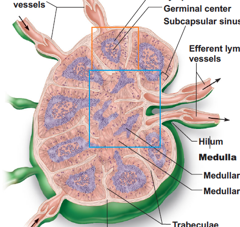
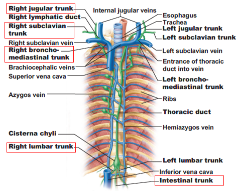
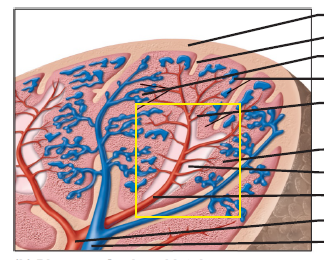

# 淋巴與免疫系統

## 淋巴系統

### 淋巴的收集

- 淋巴 Lymph
- 微淋巴管 → 淋巴管 → 淋巴結 → 淋巴幹 → 淋巴總管
  - 微淋巴管 Lymphatic Capillaries : 盲端、有瓣膜
    - 乳糜管 Lacteals、乳糜 Chyle
  - 淋巴管 Collecting Lymphatic Vessels
  - 淋巴結 Lymph node
  - 淋巴幹 Lymph trunks (共五個)
  - 淋巴總管 Lymph ducts (胸管、右淋巴總管)

### 淋巴管 Lymphatic Vessels

- 像網路一樣，隨處可見。骨頭、牙齒、骨髓、大腦沒有淋巴管。
- Superfical / Deep Lymphatic vessels
  - Superfical
    - travel with superficial veins
    - more numerous than veins in **subcutaneous tissue** (皮下組織)
  - Deep
    - travel with deep arteries
    - receive drainage of superficial vessels & internal organs
    - also compressed by accompany arteries
- 附註
  - 淋巴管往往難以在大體解剖中看到
  - 淋巴的流動可考慮 Starling hypothesis

### 淋巴結 Lymph node

- 有分進入的淋巴管、出去的淋巴管
- 橘色一球一球，有點像腎乳突的部分屬於 Cortex 皮質
- 藍色的地方，接出去的淋巴管，屬於 Medulla 髓質

### 淋巴幹 Lymph trunks 

共有 5 種淋巴幹，只有腸幹 Intestinal trunk 是 unpaired。

- 頸靜脈幹 Junglar trunk (左右各一)
- 鎖骨下幹 Subclavian trunk (左右各一)
- 氣管縱隔幹 Bronchomediastinal trunk (左右各一)
- 腰幹 Lumbar trunk (左右各一)
- 腸幹 Intestinal trunk (只有一個)

### 淋巴總管 Lymph Ducts

- 胸管 Thoracic duct
  - 由腰幹、腸幹會合而成，在 L1、L2 左右的位置
  - 會合處形成乳糜池 (Cisterna chyli, Chyle cistern)
  - 內部淋巴液注入左鎖骨下靜脈、左內頸靜脈 (left internal jugular vein)
  - 常與左頸靜脈幹、左鎖骨下幹、左氣管縱隔幹連結
    - 當全部連結時，胸管會收集左上頭頸、左上肢、整個下肢的淋巴液
  - Left venous angle
    - 頸內靜脈、鎖骨下靜脈會合形成 brachiocephalic vein
    - 胸管在此處附近注入體循環血液
- 右淋巴總管 Right lymphatic duct
  - 由右頸靜脈幹、右鎖骨下幹、右氣管縱隔幹會合形成
  - 約有 20% 的人，上述三個淋巴幹會形成右淋巴總管
    - 其餘的人，上述三個淋巴幹會獨立將淋巴液注入到頸部動脈

## 免疫系統 Immune System

### 淋巴組織 Lymphoid Tissue

- 淋巴器官必有淋巴組織
- 消化、排泄、呼吸、生殖系統的黏膜層亦有淋巴組織
  - 有部分特化形成黏膜層淋巴組織
    - 黏膜層淋巴組織 Mucosa-associated lymphoid tissue (MALT)
  - 消化道中的淋巴組織具有特殊的 M 細胞

### 淋巴器官 Lymphoid Organs

#### 初級 Primary

##### 骨髓 Bone marrow

##### 胸腺 Thymus

- T 細胞只能在胸腺成熟
- 不屬於淋巴細胞的其他細胞，由上皮組織分化而成
- 有皮質、髓質
  - 髓質有胸腺小體 (Hassall’s body, thymic corpuscle)
  - 與 T 細胞發育可能有關

#### 次級 Secondary

##### 淋巴結 Lymph nodes

##### 脾臟 Spleen

- 最大的淋巴器官
- 功能
  - 吞噬血液中的抗原，如細菌
  - 摧毀老舊的紅血球、白血球、血小板
- 白髓質 White pulp
  - 沒有紅血球
  - 進行免疫反應的地方
- 紅髓質 Red pulp
  - 圍繞在 White pulp 旁邊
  - 有 venous sinuses, splenic cords
    - 負責摧毀老舊的紅血球

##### 其他小器官

- Tonsils (扁桃體)
- Aggregated lymphoid nodules (在小腸)
- Appendix 闌尾