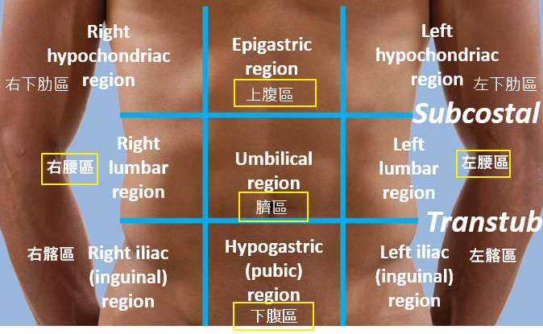
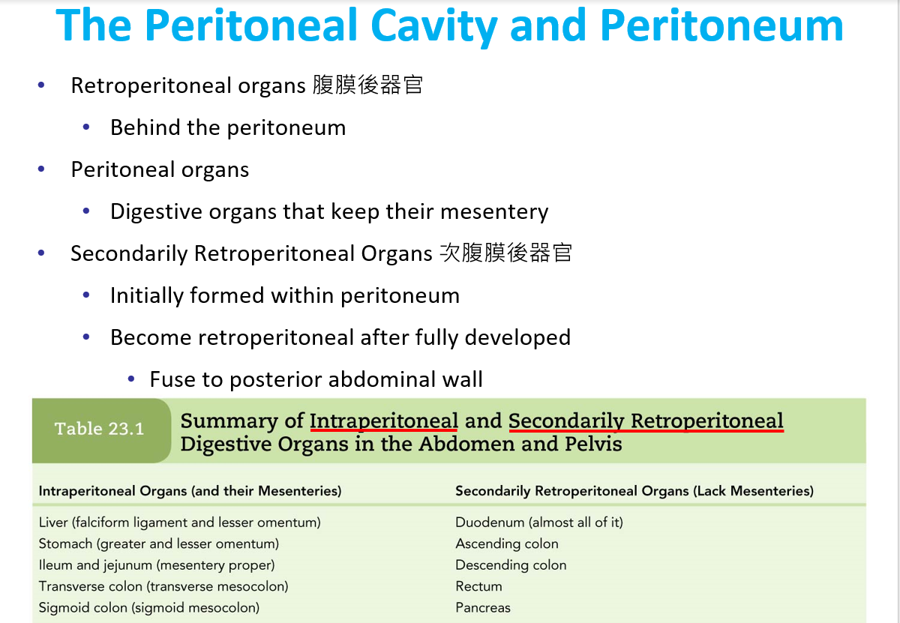
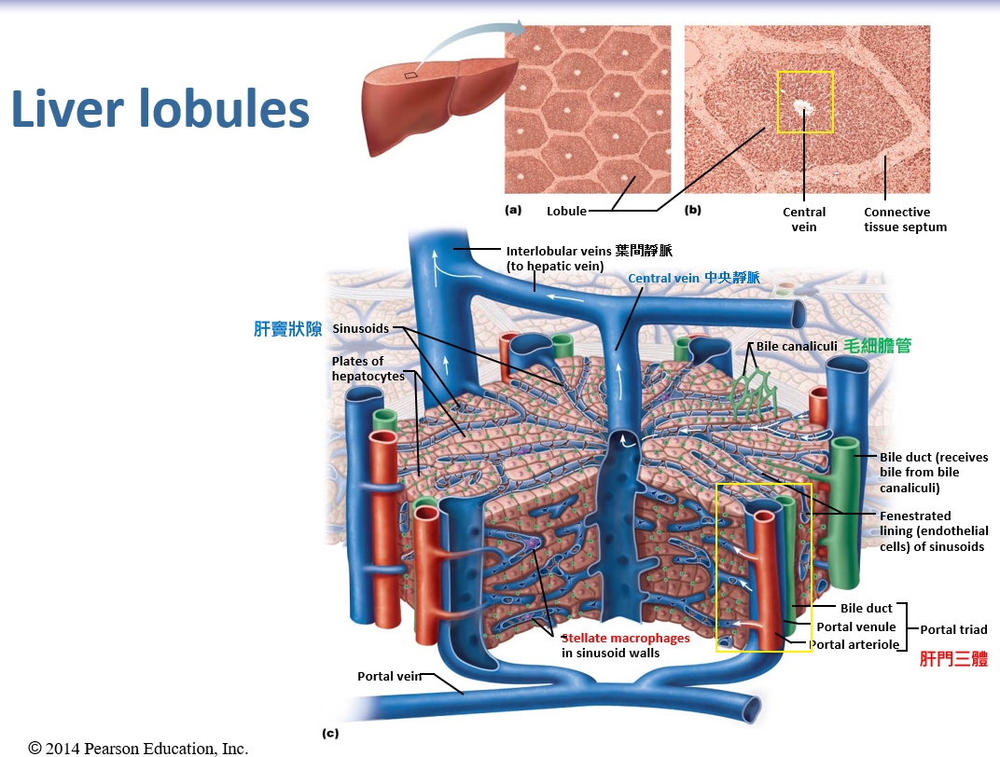

# 消化系統

## 消化系統解剖基本概述

- 腹部表層九分區
  - 上到下: 兩條鎖骨中線
  - 左到右: 肋骨下平面、節間平面
  - 
- 次腹膜後器官
  - 次後腹膜器官: 胰臟、十二指腸、升降結腸、直腸
  - 後腹膜器官: 大血管、腎臟
- 繫膜
  - 臟腹膜、壁腹膜之間 → 腹膜腔
  - 腹繫膜 (使器官往 Ventral 方向固定): 鐮狀 (Falciform ligament) (肝臟)、小網膜 (Lesser omentum) (胃小彎)
  - 背繫膜: 大網膜 (胃大彎)、橫狀、乙狀腸繫膜、腸繫膜
    - 腸繫膜: 小腸外圍，有神經血管
  - 

## 消化道基本概述

- 消化道基本構造: 黏膜、黏膜下層、外肌層 (外縱內環) 、漿膜層
  - mucosa: epithelium, lamina propria, 包含淋巴組織, muscularis mucosa (運動幅度較小)
  - submucosa: second connective-tissue layer, 腺體可能延伸到此處, blood vessels, submucosal plexus
  - muscularis externa: circular muscle, myenteric plexus, longitudinal muscle, 外縱內環
  - serosa: thin connective-tissue layer, 雙層膜, 漿膜層
  - 雙層膜之間，通過了神經、血管
- ENS: 黏膜下層 (submucosal plexus)、外縱內環中間 (myenteric plexus)
  - 大部分為自律神經，但是也有一些體感覺神經
  - 神經非常多
- 平滑肌收縮: dense bodies、中間絲、微囊、僅少數被支配
  - 中間絲交錯，交錯點形成 dense bodies，在交錯點發生收縮
  - 沒有這麼多鈣離子通道
    - 透過微囊捕捉游離的鈣離子
  - Gap Junction
  - 自律神經支配平滑肌群的部分肌肉，但不是全部
    - 有些肌肉會透過 Gap Junction 傳訊，讓整個單位的肌肉一起收縮
    - 例外
      - 虹膜：每一個肌肉細胞都有神經支配
      - 每一個豎毛肌都有神經支配
- 運動 distallly → 往排遺方向

## 消化道

- 口: 嘴唇 (口輪?肌)、臉頰 (頰肌)
  - 唇繫帶: 嘴唇、牙齦
  - 舌頭: 舌外在肌、舌內在肌
    - 舌繫帶
  - 牙齒:
    - 乳牙 (20)、恆牙 (32)
    - 上下齒槽神經 (均為 CN V)、上下齒槽動脈
    - Crown (琺瑯質、牙本質小管)、Neck、Root
  - 唾腺: 三對
    - CN IX: 腮腺
    - CN VII: Submandibular glands, Sublimgual glands
- 食道: 前 1/3 為骨骼肌，中間 1/3 為兩者混合，後 1/3 為平滑肌
- 胃部
  - 胃底、Body
  - 黏液細胞、壁細胞 (鹽酸)、主細胞 (胃蛋白酶原)
  - 平滑肌三層
    - 外縱中環內斜肌
  - 皺褶
  - 雙重保護
    - 黏液防止鹽酸侵襲
    - 胃蛋白酶分泌時，以不活化形式分泌，使胃部不會自己消化自己
- 小腸: 十二指腸、空腸 (無括約肌)、迴腸
  - superior mesenteric artery
  - 十二指腸→空腸→迴腸
  - 杯狀細胞
  - 腸隱窩: 腸線
- 大腸: 盲腸、升橫降結腸、乙狀結腸、直腸
  - 沒有絨毛、單層柱狀上皮細胞
  - 結腸帶: 增厚的縱狀肌肉，並不是囊狀的，除了直腸以外的結腸都有
- 血液供應
  - 小腸 (上腸繫膜動脈)、大腸的前半段 (上腸繫膜動脈)、大腸的後半段 (下腸繫膜動脈
- 括約肌位置: 胃、十二指腸、主胰管、迴腸、空腸 (無括約肌)

## 附屬器官

- 胰臟: 注入十二指腸、消化液由腺泡細胞製造
  - Jaundice 黃疸
  - Disorders: CF: 胰臟 (被黏液阻塞)
- 肝臟
  - 肝門: 總肝管、肝門靜脈、肝動脈 (無肝靜脈，換句話說，肝門只有進入的血管)
  - 肝門三體: 膽管、肝門靜脈、肝動脈
  - 膽囊位置: 膽囊旁邊為「右葉」、「方葉」
  - 以很多長得很像六方體的肝小體 (Lobules) 構成
    - 肝門靜脈、肝動脈→肝竇→中央靜脈→肝靜脈
    - 

-

括約肌位置: 胃、十二指腸、主胰管、迴腸、空腸 (無括約肌)