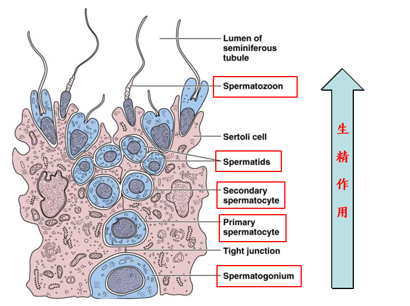

# 生殖系統

## 概論與外部構造

### 常見名詞解釋

- 主要生殖器官：產生配子的器官 (卵巢、睪丸)
  - 其他都稱做附屬生殖器官
- 會陰：由範圍界定
  - 前方止於恥骨聯合、後方止於尾椎、側方止於坐骨粗隆、下方止於體表
  - 男性的會陰不包含陰莖

- 女性外部構造
  - 前庭（必考）: 被小陰唇包圍的範圍
  - 三個開口: 尿道→陰道→肛門 (ventral → dosal)
  - 大陰脣 → 陰囊
  - 小陰唇頂端 → 陰蒂 (陰莖海綿體，會勃起)

## 男性生殖系統

### 睪丸 Testes

- 包覆於陰囊 Scrotum 中
- 由鞘膜 tunica vaginalis、白膜 tunica albuginea 構成
  - 鞘膜由腹膜衍生而來
  - 睪丸在白膜中，被分割成很多小葉
- 小葉中有細精管 Seminiferous tubule
  - 不屬於小葉的部分則為間質細胞，如 Leydig cell 分泌睪固酮 (由 LH 調控)
  - 小葉中主要有 Myoid cells、Sertoli Cells、部分支持組織
    - Myoid cells 主要負責韻律收縮 (細精管外層)
    - Sertoli Cells 負責滋養精子、調控精子生成 (細精管內側)
      - 其他重要功能：形成 BTB (Blood Testis Barrier)、分泌睪丸液
- 睪丸溫控 (睪丸溫度需比體溫低一些)
  - 肉膜肌: 陰囊內層、平滑肌、冷就收縮
  - 提睪肌: 睪丸外襯、骨骼肌、熱時舒張、冷就收縮
  - 蔓狀靜脈叢

### 副睪 Epididymis

- 功能為儲存精子
- 由偽多層上皮細胞構成
- 分成頭中尾三段，只有尾段 Caudae 的精子可體內受精
  - 精子儲存在尾段
  - 有 capacitation ，這樣精子才可破壞透明帶

### 精索 Spermatic cord

- 輸精管
- 睪丸動脈
- 蔓狀靜脈叢 Pampiniform venous plexus
  - 攀藤在動脈上，冷卻動脈血液
- 自主神經纖維
- 精索由 in inguinal canal 進入腹腔，進入腹腔後的段落稱為 Deep inguinal ring
  - 疝氣 : in inguinal canal 沒有閉鎖完全

### 尿道 Urethra

- 攝護腺尿道
- 中間尿道
- 海綿體尿道

### 精液分泌腺體 Accessory Glands

分泌精液 semen

#### 儲精囊 Seminal glands (左右各一)

- 射精管 Ejaculatory duct 連接儲精囊和尿道
- 分泌最多液體 (60%)
- 包含以下物質
  - 果糖 Frutose、胺基酸、檸檬酸鹽等滋養精子
  - 促進精子有動力的物質
  - 前列腺素 Prostaglandins
  - 局部抑制女性免疫系統的物質 (精液是外來物)
  - 可以液化 semen
  - 內含經 UV 照射可顯現黃色的物質，可用於犯罪鑑識

#### 前列腺 Prostate (一個)

- 檸檬酸鹽等物質滋養精子
- 前列腺特異抗原 (Prostate-specific antigen, PSA) 可用於檢測攝護腺癌

#### 尿道球腺 Bulbo-urethral glands (左右各一)

- 快要射精前進入尿道
- 中和尿道的酸性、潤滑

### 陰莖 Penis 

- 包皮 Prepuce、龜頭 Glans penis
- 有三個勃起構造
  - 尿道海綿體 corpus spongiosum (單一)
  - 陰莖海綿體 coropora cavernosa (左右各一)
- 勃起時仰角較大 (並非水平)，可阻止靜脈血液回流，維持勃起
- 生理反應
  - Erection (勃起, 副交感神經)
  - Ejaculation (射精, 交感神經)
- 威而鋼 PDE-5 inhibitor
  - 並不是比較敏感，而是比較持久

### 精子生成 Spermatogenesis

注意圖片每種細胞的數量 → 對應到減數分裂的各階段

- 尚未完成的精細胞，被 Sertoli Cells 包圍
- 精子結構
  - 頭部 : 細胞核、Acrosome (炸藥，破壞卵的透明膜)
  - 中間有 Midpiece : 大量規則排列的粒線體
  - 尾部
- 精子分化，形成尾巴
  - 極化現象
  - 高基氏體形成 Acrosome，包覆在核膜上
  - 中心粒作為微管組成中心，拉長形成鞭毛，此時粒線體開始圍繞在微管旁邊
  - 細胞質被排除
- FSH + LH 調控成精作用，作用於 Sertoli cells

## 女性生殖系統

### 卵巢 Ovaries

- 由韌帶固定位置
  - 卵巢繫膜 Mesovarium (闊韌帶 Broad ligament )
  - 懸韌帶 Suspensory ligament → 骨盆腔腔壁
  - 卵巢韌帶 Ovarian ligament → 子宮
- 有卵巢動脈供應血流
- 卵巢解剖
  - 白膜：覆蓋在卵巢最表面的纖維膜
    - 由生質上皮 (geminal epithelium) 構成
    - 多數卵巢癌為生殖上皮的惡性腫瘤
  - 皮質：濾泡
  - 髓質：鬆散結締組織，內有神經、血管、淋巴

### 輸卵管 Uterine Tubes

- 繖部 Fimbriae 捕捉剛排出來的卵
- → 漏斗部 → 壺腹部 → 峽部

### 子宮 Uterus

- 子宮相對位置
  - 子宮向前傾斜
  - 直腸前方、膀胱後方 (子宮會壓迫膀胱)
- 子宮部位
  - Funds, body, isthmus, cervix (子宮頸)
  - 最後接 vagina (不屬於子宮)
- 支撐子宮的結構
  - mesometrium (外側固定子宮)
  - cardinal ligament (外側固定子宮頸、陰道)
  - 圓韌帶 (固定子宮到身體前側)
- 子宮血管
  - uterine, arcuate (弓狀), radial, straight (basal layer), spiral (functional layer)
- 子宮肌膜
  - 外膜、肌膜、內膜
  - 內膜具有兩層：基底層、功能層 (功能層會隨著月經排除，基底層不會)

### 女性外部生殖器

- 外部生殖器明顯構造：大陰唇、小陰唇、陰道開口、尿道開口、陰蒂
- 陰蒂：和男性的陰莖同源，有龜頭狀構造、陰莖海綿體 (會勃起)
- 前庭球：尿道海綿體
- 貝氏腺

### 卵巢與子宮週期

詳見生理學