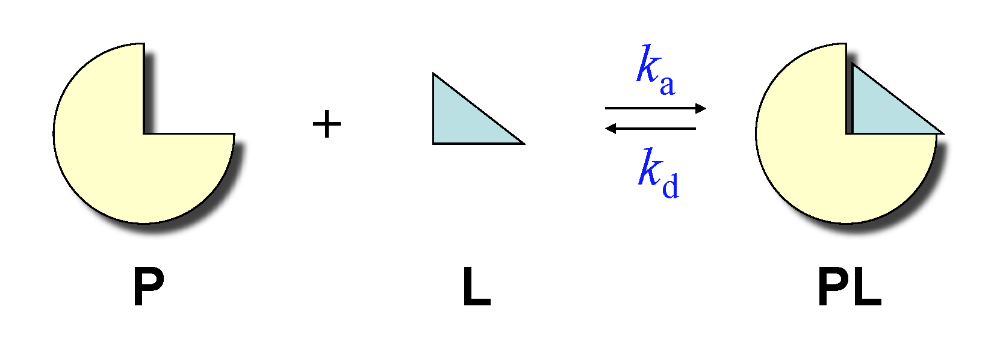
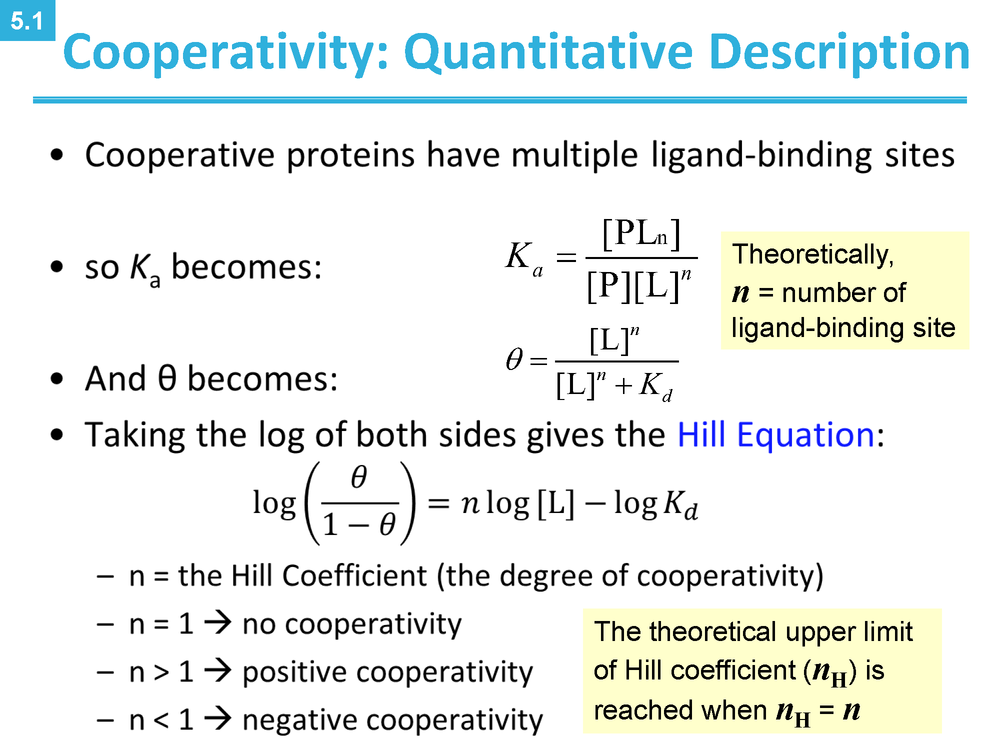

# **章節學習指引**

- 先分析 Heme 的結構，再來分析 myoglobin 的親和性，最後分析 hemoglobin 的結構
  - heme 是 myoglobin 上面最重要的結構
  - myoglobin 很像是血紅素上的某個 subunit
    - 我們不需要清楚知道 myoglobin 的結構，因為重要的結構都在 heme 上面
- 我們只需要知道 我們如何利用 myoglobin 的解離曲線近似 hemoglobin 的解離曲線
- 血紅素的結構會稍微講一下

* * *

# **Heme 結構**

- b, d : Fe2+ 有六個配位基，立體方向如圖 d 所式。
  - 
- Fe2+ 有六個配位基，分別與
  - 四個氮原子
  - 一個 O2
    - His F8 (proximal)，調控 O2 Binding
    - His E7 (distal) 不用配位與 Fe2+ 相連，以氫鍵調控 O2 binding
      - 會透過氫鍵維持 O2 的結合
      - 避免 affinity 過高的 CO 與 heme 結合而失去功能
        - CO 與 O2 大小太像，很容易跟 Heme 結合
          - 看筆記最下方有補充
      - 此現象稱為 steric effects (空間位阻效應)。
  - 以及一個來自球蛋白的 proximal histidine (His F8) 的氮原子形成配位共價鍵。
  - 

* * *

# **Myoglobin 的解離曲線推導**

- Ka, Kd (大寫才是平衡常數，小寫只是某種常數)
  - 
  - 
- Ka, Kd 與 the fraction of occupied binding sites (*θ *)
  - 
- Kd
  - 
- 重要關係式 (可由 theta 與 Kd 關係式推得)
  - 
- 記得，濃度可換成分壓換算
  - 

 (pO2 是變數，P50 是常數)

- 由公式可知
  - 相同PO2時，Kd越小則YO2越大，Mb與O2結合越緊密。
  - 當Kd=PO2時，YO2=0.5，即Kd=P50(MbO250%saturation時的氧氣分壓)
- 公式
  - 結合曲線為雙曲線

* * *

# **Hemoglobin 的解離曲線受到 Cooperativity 的影響**

## **以 Myoglobin 解離曲線近似血紅素解離**

- 無論高親合 (高 Kb) 或是低親合都不對
- 下圖圖解
  - Y_50 可以對應到 Kb 數值，可以想成是 affinity
  - efficient in binding:
    - y 軸數值
  - efficient in unloading:
    - 圖上的 ∆Y_O2 差值
- 

## **事實上，Hemoglobin 的解離曲線是 sigmoid curve**

## **The Change of Hemoglobin's Affinity**

- 

## **T state 與 R state**

- 沒有氧氣，T state 比較穩定
  - 因為有很多的 noncolvent interactions 交互作用
    - Ion pair between His HC3、Asp FG1
- 氧氣結合，R state 比較穩定
  - O2 和 Fe2+ 結合，破壞 T state 的 交互作用
  - R state 中間空洞比較小，所以可以夾緊 O2
- 
- 
- 
- 
  - 

## **Cooperativity Allosteric Protein (重要)**

### **定量分析**

- 利用 Hill Eq. 可以得到直線，我們可用這個直線去推導一些血紅素的重要性質
- 由實驗值可知道，其實血紅素通常只會載三個氧氣

        - ???

## **The Models of Conformational Transition**

- MWC (concerted) model
  - 所有的 subunit 不是全部都在 R，就是在 S state
- KNF (sequential) model
  - 一個 subunit 跟氧氣結合，會讓其他 subunit 變得更容易結合
  - 四個 subunit 可以分別為不同的構型
- 

* * *

# **Biological Inquery: 為什麼一氧化碳這麼毒**

