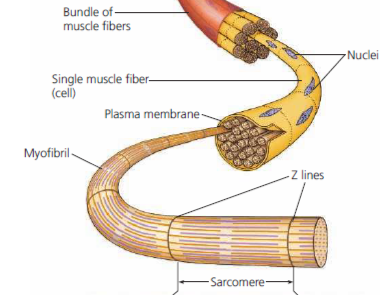
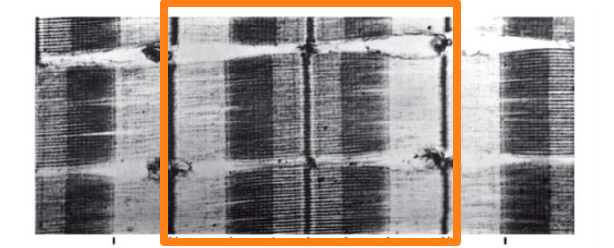
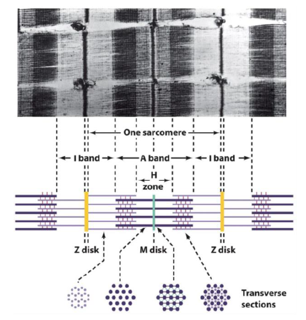
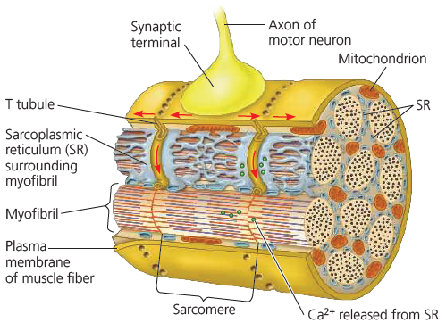
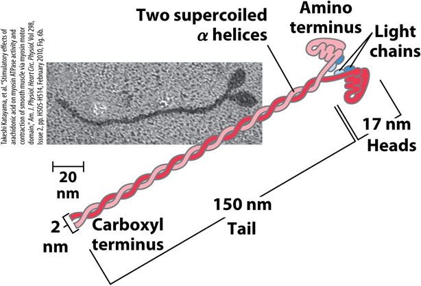
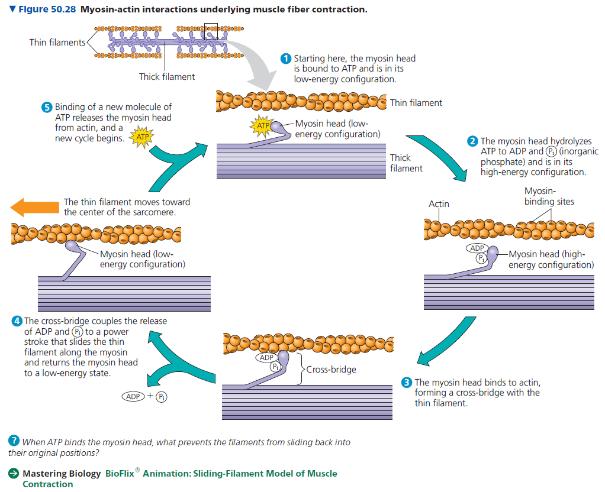
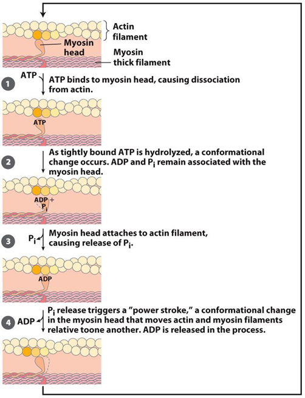
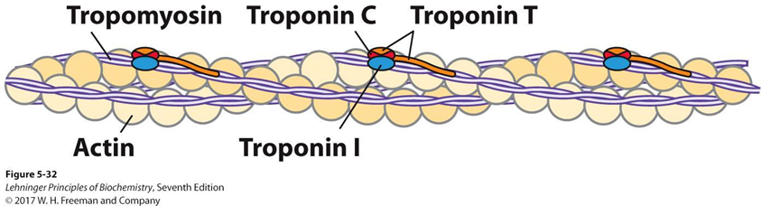
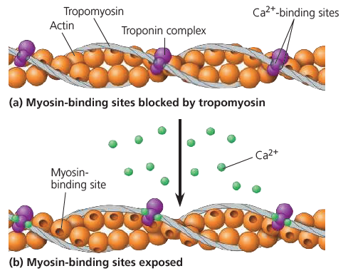
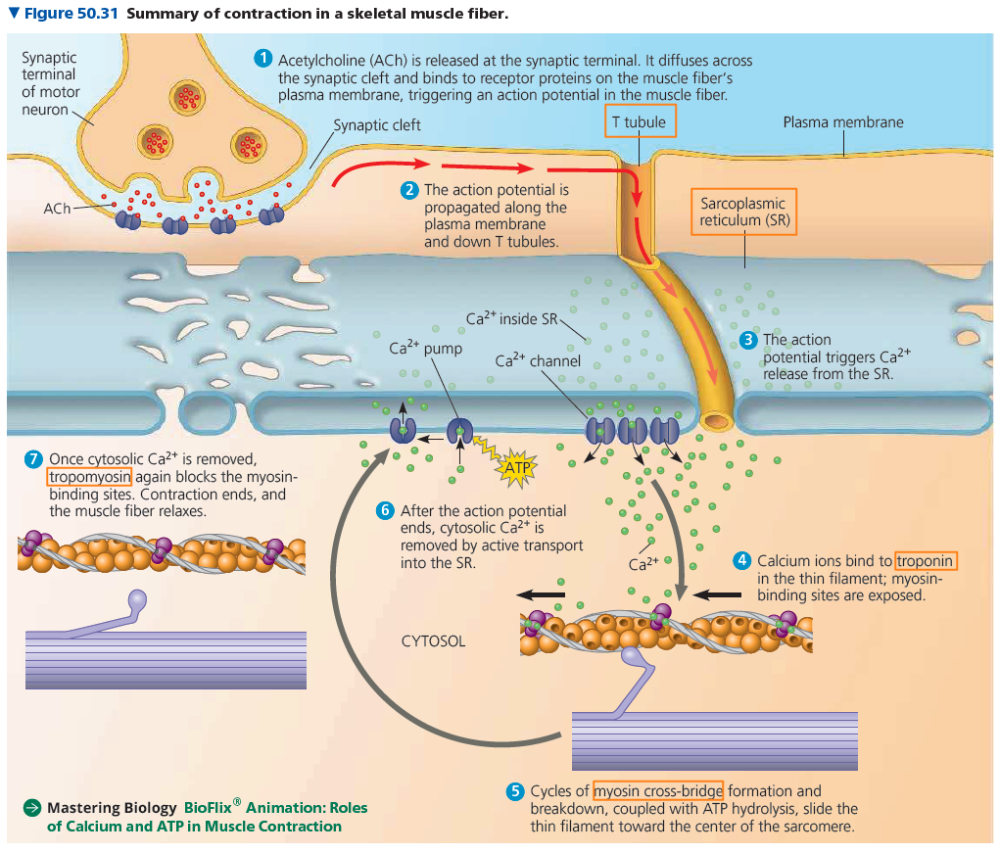

# Anatomy & Microscopy of Muscle Fibers

## 巨觀結構

## 微觀結構多看幾遍吧... (把這些 band, disk 都背起來)

- Sarcomere 始於 Z Disk，亦終於 Z Disk
  - 
- Disk: filament 接合處，M Disk 接 myosin，Z Disk 接 Actin
- A band 又稱為不變區，I band 又稱為變動區 (I 變，我變，我 bang!)
- H Zone 看圖

## 肌肉細胞構造

* * *

# Myosin, Actin

- Myosin

  - heavy chain

    - two supercoiled alpha helica

  - light chain

    - 2 light chain in one alpha helica, 2 in another, total 4

    -

  - 

- Actin

  - Subunit: Globular protein

* * *

# The Mechanism of Muscle Contraction

## Actomyosin Cycle: The mechanism behind slide model

- 普生課本比較好懂
  - 
- 生化課本講的稍微細一點
  - 

## Regulation

- 在 actin 上面有 Troponin，上面有 Ca2+ binding sites
- Ca2+ 接合後，會改變 tropomyosin + troponin complex 構型
- 此構型改變後，actin 上面的 myosin-head binding sites 暴露，因此 myosin head 可接合

-

- 
- 

* * *

普生整理圖 (12e, p 1128)
