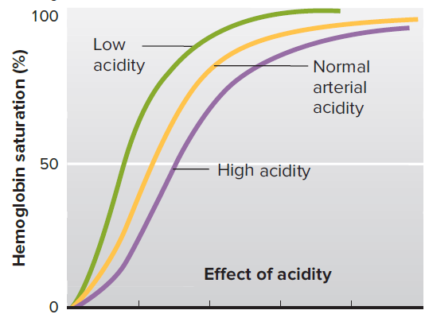
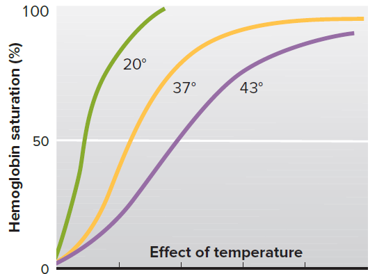
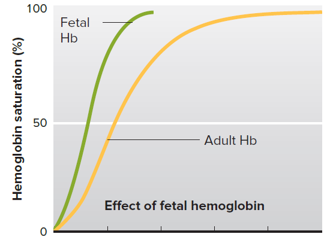
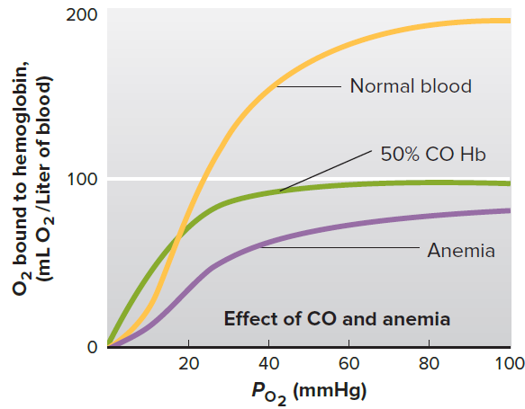
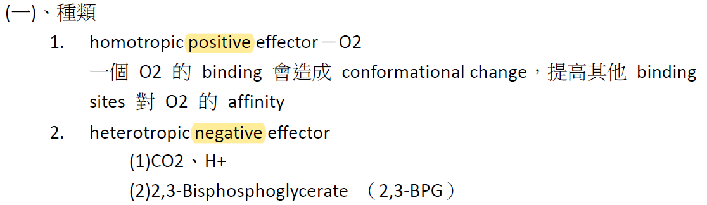
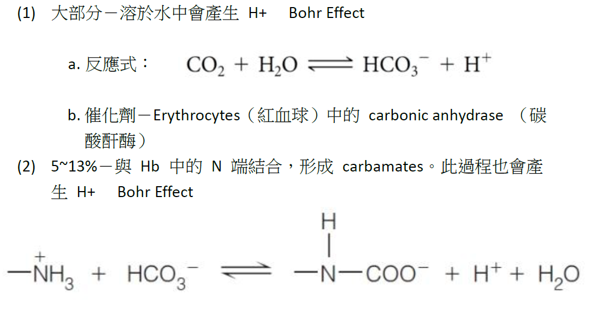
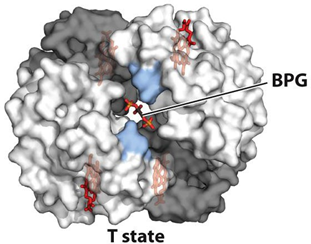
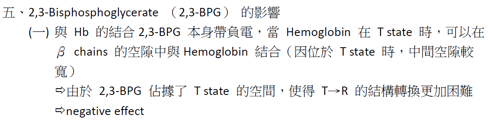
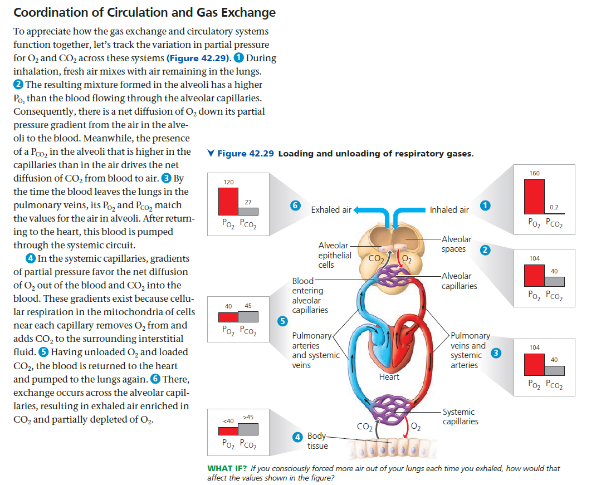
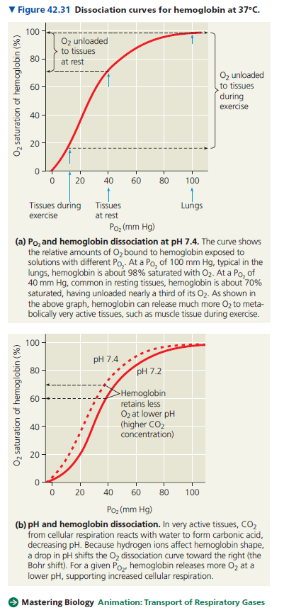

# 血紅素解離曲線

## 血紅素親和力改變的定性分析

|                                                              |                                                              |                                                              |
| ------------------------------------------------------------ | ------------------------------------------------------------ | ------------------------------------------------------------ |
|  |  |  |
|  |  |                                                              |

## 血紅素解離曲線變化

- 雙曲線 y=0.5 的時候，其 x=Kd，Kd 是解離常數的倒數
  - 因此 y=0.5 之 x 值越大，Affinity 就越低 (之前課程所說的曲線右移)
- Hb 解離並不遵守雙曲線，因此用 y=0.5 判斷 Hb 整體行為意義不大
  - 但是仍可用此規則「y=0.5 之 x 值越大，Affinity 就越低」

* * *

# Hb 的 Allosteric effect

## CO2、H+、2,3-BPG

- Bohr effect: H+ 會降低 Hb 與氧氣的親和力
  - 
- CO2 之 Bohr
  - 
- BPG 之 Binding Sites
  - 
- 

* * *

## 基因型對於血紅素親和力的影響 (胚胎、鐮刀型)

- ### 基因突變的類型

分壓

* * *

P50 的時候 P = Kd 因此可以由 x 軸的大小判斷親和力變大或變小，往右移動 → 變小

* * *

# Supplemental Resources

## CRISRP-Cas 9 to Cure Sickle Cell Anemia

- Case Report
  - 設計高辨識性的 Target DNA seq.，並 PCR
  - 把 Cas9 跟 PCR 後產物加進去
  - injection to stem cell
    - stem cell try to repair double helix break
    - we hope that the cell use homologus repair
      - so we prepared the cured DNA in advance
      - and then we will inject it to the stem cell
  - whole genome seq.
  - prolifation
  - 骨髓移殖
- in vitro
  - 設計具有以下核酸 seq 的慢病毒，並嵌入至慢病毒的核酸
    - 高辨識性的 Target DNA seq.
    - 與上述 DNA 很像，但是修正某些部分的 DNA seq. (Cured DNA seq.)
  - 慢病毒載體感染體細胞
    - 體細胞轉錄出 Target DNA seq. 之 mRNA
    - Cas9 與此 mRNA 結合，具有辨識此 Target DNA seq. 的能力
  - Knock out，體細胞尋找類似片段修復雙股斷裂處 (也就是 Cured DNA seq.)