# 酵素反應的例子

- Chymotrypsin is a serine protease with a well-understood mechanism, featuring general acid-base catalysis, covalent catalysis, and transition-state stabilization.
- Hexokinase provides an excellent example of induced fit as a means of using substrate binding energy.
- The enolase reaction proceeds via metal ion catalysis.
- Lysozyme makes use of covalent catalysis and general acid catalysis as it promotes two successive nucleophilic displacement reactions.
- Understanding enzyme mechanism allows the development of drugs to inhibit enzyme action.

* * *

## 酵素反應的例子

### Chymotrypsin

- 結構
  - 水解催化三劍客 Ser, His, Asp
  - 以 Phe 作為 Hydrophobic pocket
  - 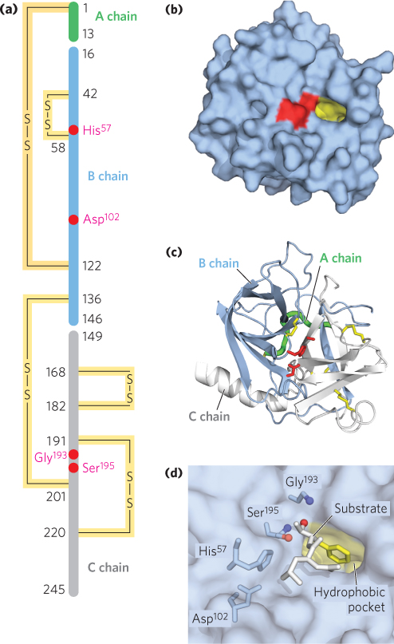
- 特性
  - 他喜歡切有苯環的胺基酸之 N 端
  - Acyl-enzyme intermediate
  - 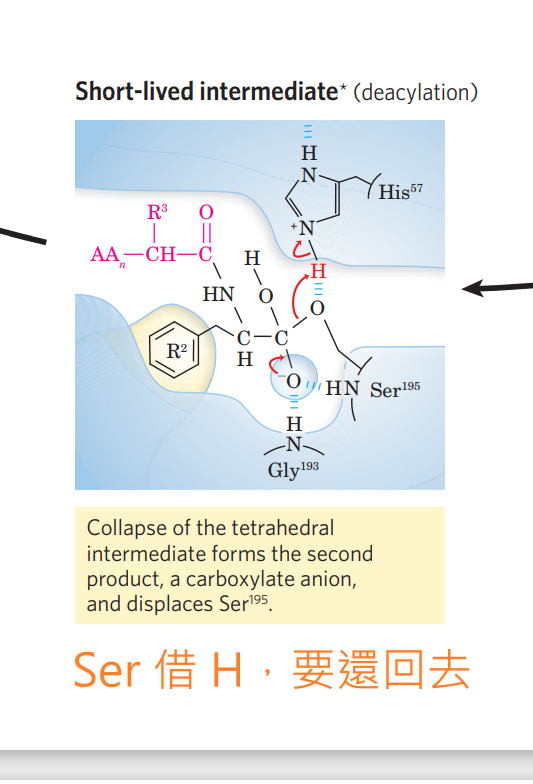
- Mechanism (PDF 版本的比較好)
- Pre-steady state kinetic evidence for an acyl-enzyme intermediate
  - 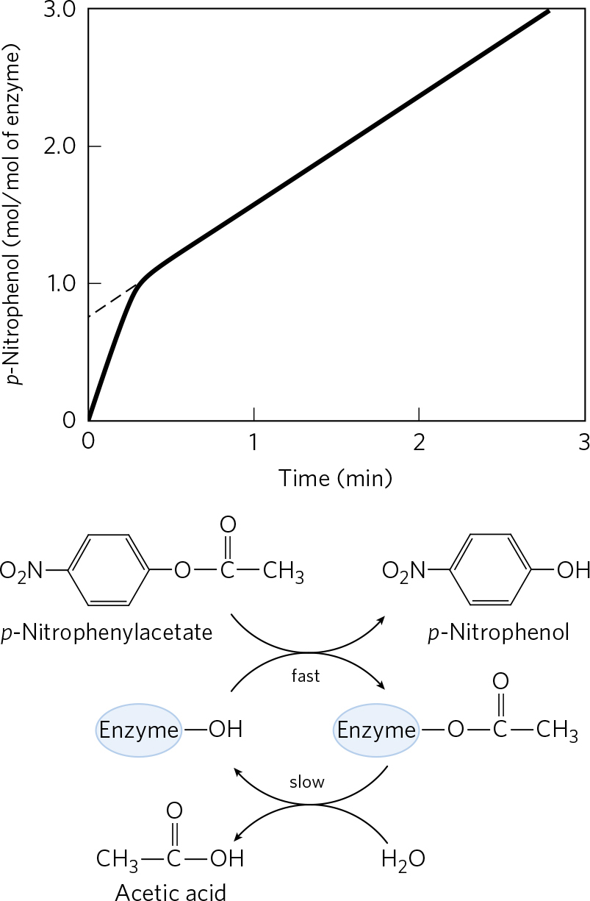
- pH Dependence
  - 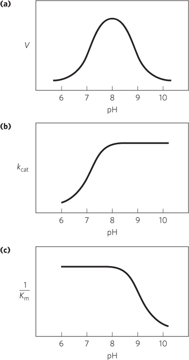
- 上個共筆的內容
  - 功能：用來催化多肽鏈肽鍵的水解反應
    - 課外補充：Chymotrypsin 即「胰凝乳蛋白酶」，為 Serine Protease（絲氯酸蛋白酶）的一種，在胰臟中被合成。
  - 結構
    - 分子蛋白質
    - Serine Protease 的作用是斷裂大分子蛋白質中的肽鍵，使之成為小分子蛋白質，在活化中心都會有 nucleophile serine。以 Chymotrypsin 為例，在活化中心參與反應的胺基酸有 Ser195, His57, Asp102，稱為催化三連體 (catalytic triad)。
    - 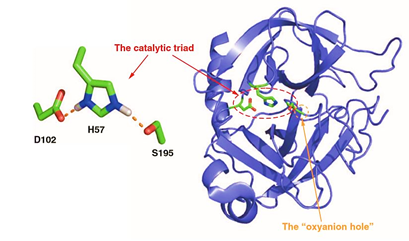
  - 特殊構造
    - Oxyanion hole：
      - 位於酵素的活化中心，穩定和酵素殘基發生反應後 transition state 四面體 (SP3) 結構。穩定過渡態降低了反應所必要的活化能，而促進了催化。科學家利用過渡態類似物 transition state analog 模擬反應的過渡，例如硼酸過渡態類似物中，缺電子來形成八隅體的硼原子與 Ser195 形成共價鍵，使原本平面的硼酸 (SP2) 變成四面體硼酸脂 (SP3)，並使硼酸中的一個氧原子定位於 Oxyanion hole 氧陰離子空穴。
      - 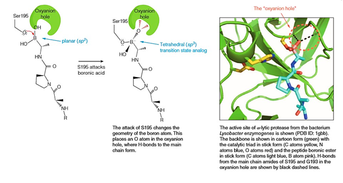
    - Specificities pocket：
      - 靠近 N-terminal 的殘基上的側鏈會與活化中心的殘基上的側鏈會與活化中心 specificities pocket 的構型符合，代表著 serine protease 會辨識特定位置的鍵結，具有酶的專一性。Chymotrypsin 的 specificities pocket 內有 small glycine residues，並且可容納龐大的非極性側鏈，比較喜歡分解肽鍵中靠近 N-terminal 的殘基上的側鏈為 F、W、Y、L 者。
  - 反應機制（脫褲子放屁）
    - Serine 上的氧行親核反應，與碳形成共價鍵結。
    - 脫離 Serine 的質子接到 Histidine 的 N 上（原本此反應不易進行，但因為帶負電的 Aspartic acid 使鄰近的 Histidine 可以獲得質子）。
    - Histidine 上的質子接到 peptide 上的 N，造成肽鍵斷裂。
    - 水分子上的孤對電子打到與 Serine 的氧鍵結的碳上，使得 Serine 與碳的鍵結斷裂。
    - 水分子裂解後的質子和 Histidine 57 的氮連接後斷裂接到 Serine 的氧上，讓酵素恢復成反應前的狀態。
    - 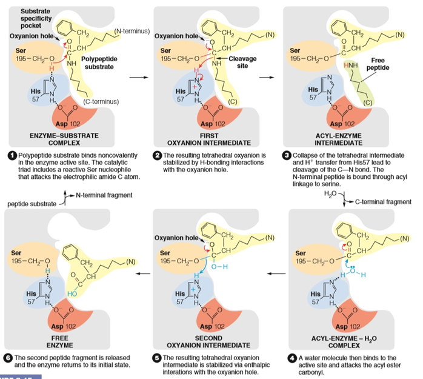

* * *

### Protease 反應機制

- **Protease 反應機制**
- **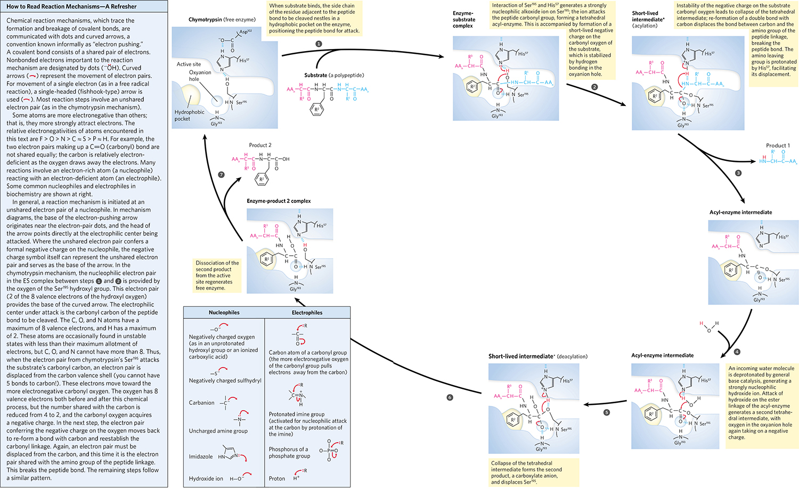**
- **HIV proteae**
  - **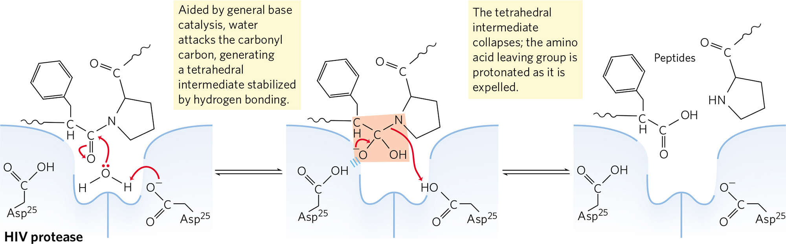**

### Hexkinase

- 反應簡圖
  - 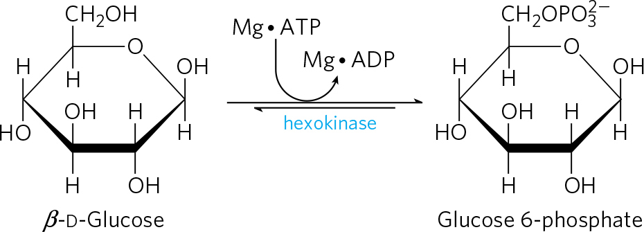
- Induced fit
  - 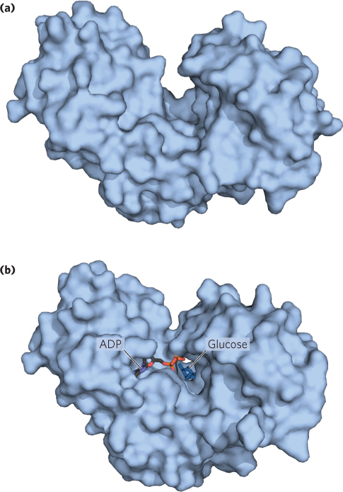
- 例子
  - 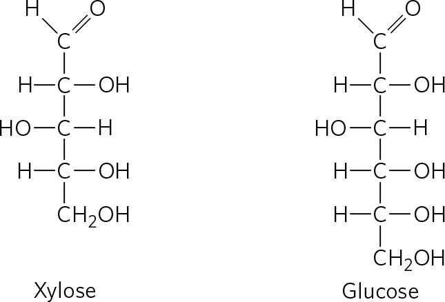

* * *

## Enolase

**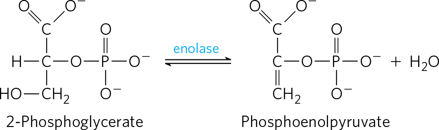**

**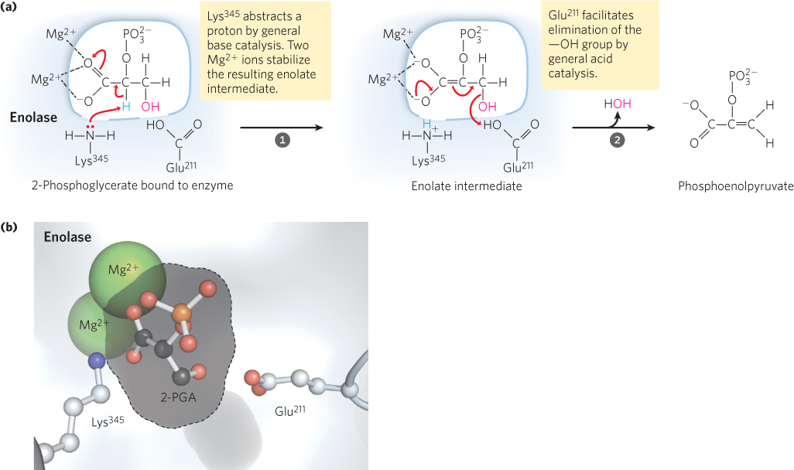**
**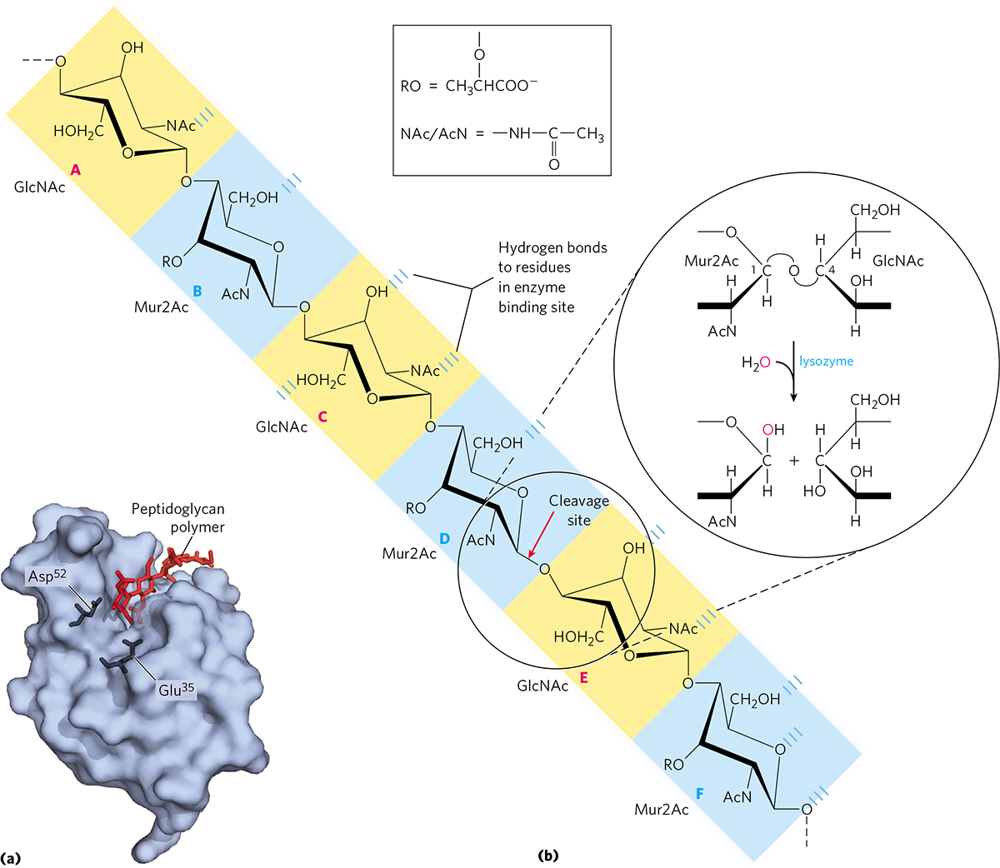**

* * *

### Lysozyme 溶菌酶

**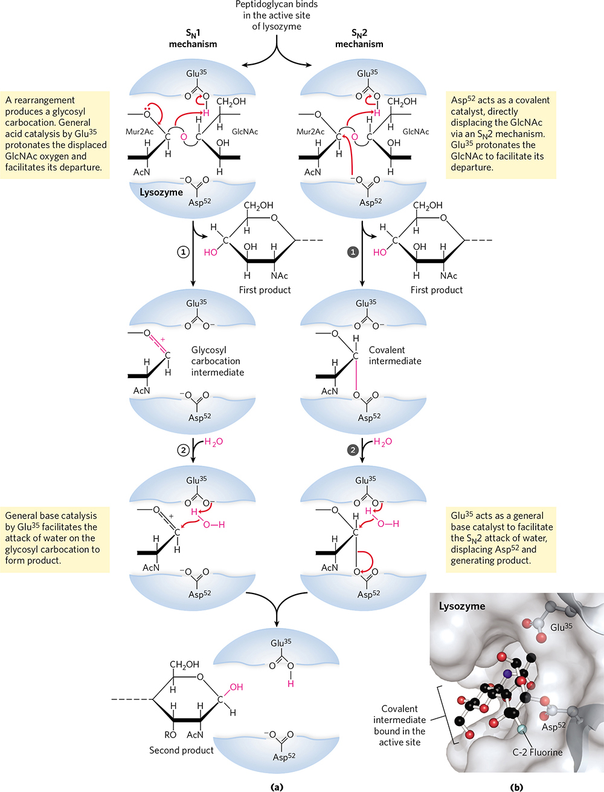**

* * *

### Antibiotic

**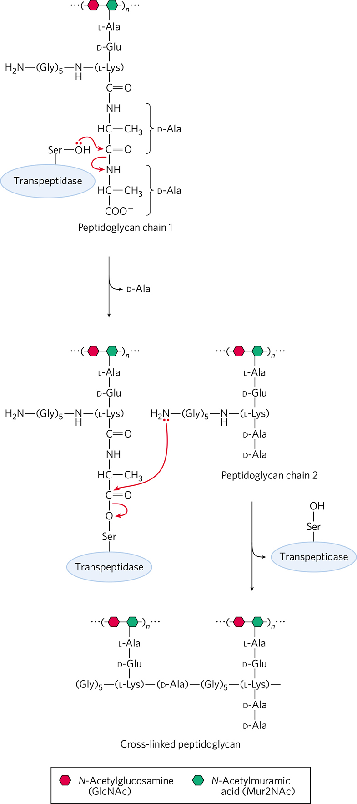**
**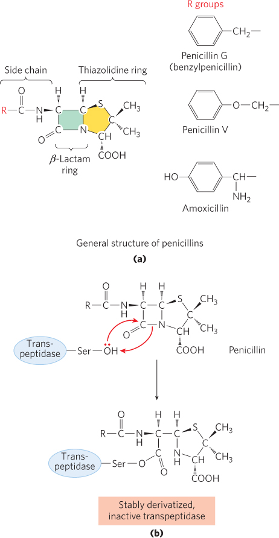**
**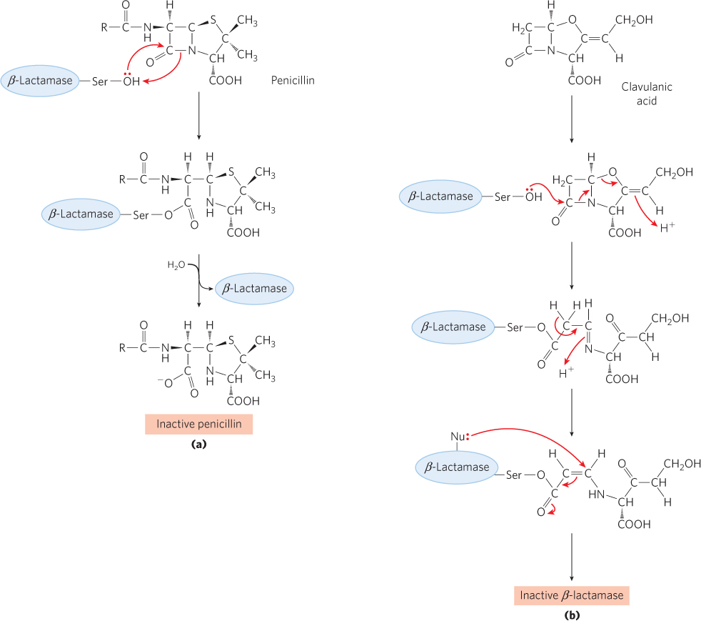**

* * *

### Lysozyme 溶菌酶

- 功用：透過水解破壞細菌細胞壁的多醣組織，其存在於唾液、眼淚、鼻涕、蛋白中，亦常添加於食品中做為防腐劑。
- 活化中心：溶菌酶會在活化中心（active site）切斷肽聚糖（peptidoglycan）的 N-acetylmuramic acid (NAM) 和 N-acetylglucosamine (NAG) 間的 CO 鍵（介於圖一 D 跟 E 之間)【補充：要進行水解的 NAM 原為椅型（chair form），但進到活化中心後會變成半椅型（half-chair form）】

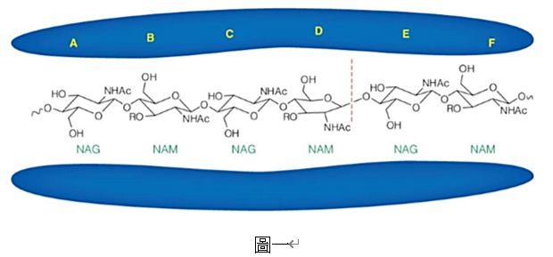

溶菌酶的兩種催化反應步驟（2 Proposed Mechanisms）
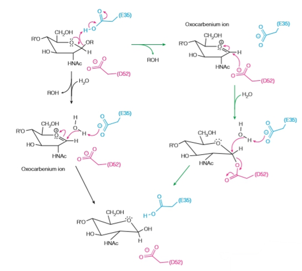

- 兩種路徑都是酸鹼催化反應。
- 圖二中，D52 為 Aspartate，E35 為 Glutamate，兩者為酵素上的兩個胺基酸側鏈。
- 路徑一：用 D52 穩定 O＋
  - 加酸性 E35，電荷移動後，E35 失去 H 而帶負電
  - 帶負電的 D52 與受質上的碳形成共價鍵，穩定受質上的 O＋
  - 水分子解離，H＋使帶負電的 E35 恢復原本狀態，OH－攻擊受質上的碳使 D52 脫離
- 路徑二：用 H2O 穩定 O＋
  - E35 當酸使 glycosidic bond（糖苷鍵）斷裂，及 oxocarbenium ion 的形成（D52 利用靜電感應穩定此離子）
  - E35 當鹼使水去質子，OH－攻擊受質上的碳（D52 不會參與反應）

如何驗證上述機制的正確性
(補充，取自 112 共筆和原文書，但老師課堂上使用下方 pH 觀點驗證催化機制)

- kinetic isotope effect (動力學同位素效應，KIE)
  - 當反應物中的一個原子被其同位素之一取代時，化學反應的反應速率的變化。形式上，它是涉及輕 (kL) 和重 (kH) 同位素取代的反應物兩者反應速率常數的比率 【KIE=KL/KH】。動力學同位素效應的研究有助於闡明某些化學反應的反應機制
- mutagenesis
  - 將 E35 和 D52 換成 nonionizing residue 像是 Q,N,A 等胺基酸（這些 mutants 叫 E35Q 和 D52N），實驗發現 E35Q 和 D52N 的催化活性會不到原本的 0.1% （<0.1%  of  wild-type  activity），顯示兩個殘基 (residue) 在催化過程中扮演重要角色。﹝註﹞變異的胺基酸命名法則為 [wild-type amino acid][wild-type residue number][mutant amino acid]，如果用 glutamine 換掉 glutamic acid 就會寫成 E35Q

以活性與 pH 關係確認催化機制

1. E35 的 pKa=6.2，D52 的 pKa=3.7，為使 E35 和 D52 各自發揮作用，pH 須維持在 5 左右
   1. 解釋：在 pH4~6 之間，E35 和 D52 正好處在欲解離與不解離的臨界狀態
   2. ( -COOH ⇌ -COO－ + H＋ )，故反應最好

2. 透過改變 pH 值發現在 pH4~6 時反應最佳，因為此 pH 值恰好是 D52 與 E35 解離 H + 和接受 H + 的適合區段，因此證實 D52 跟 E35 的確有參與催化反應

圖三
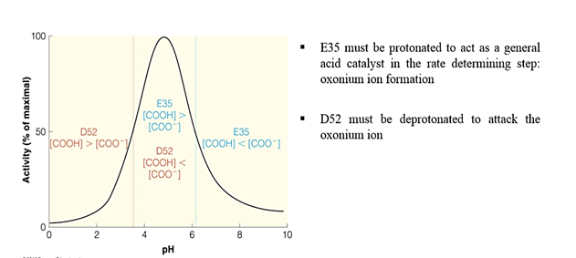

依左圖，溶菌酶要達到最高效率，pH約在4~6之間。因為在此狀態下，E35 才能被質子化，D52被去質子化，導致 E35可以當酸 ，D52可以interact且穩定oxocarbenium ion

圖三解釋

- E35 比 D52 多一個 CH2，因為 CH2 會推電子，故 - COOH 的 O 上有較多電子雲，比較會抓 H+，因此 E35 的 H 較不易解離；反之，D52 的電子雲較少，–COOH 的 O 會拉電子，造成 H 較容易解離。
- E35 在鹼性環境下才能解離較多，D52 在酸性環境下即可解離
- 因此在 pH4~6 時，E35〔COOH〕>〔COO－〕，D52〔COOH〕<〔COO－〕，符合圖二預測反應步驟中 E35 不帶電而 D52 帶負電，證實此途徑是合理存在。

* * *

### 輔因子 (Cofactor)

- 輔因子 (Cofactor)
  - 分類（參自 110 共筆，但我們的課本沒有嚴格區分 coenzyme 和 cofactor 的差別）
  - 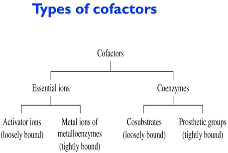
  - 協助酵素進行其功能，不是每個酵素都需要輔因子
- 輔酶 (coenzyme)
  - 小分子有機化合物
  - 維他命 (vitamin) 是輔酶的先驅物（以 vitamin B complex 為最大宗），須從外界攝取
  - 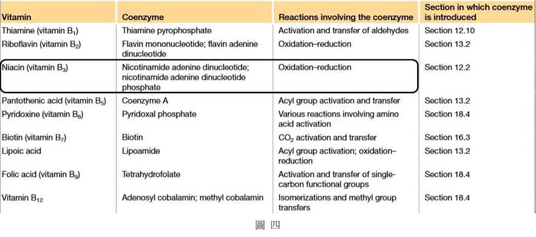
- 舉例：{m NAD}^++2e^-+H^+ightleftarrowsNADH （圖四圈起來的那個）
  - 在氧化還原反應中可以接受或提供電子。
  - {m NAD}^+ 可作為氧化劑 (oxidizing agent)，因 N 帶正電使苯環缺電子。
  - NADH 可作為還原劑 (reducing agent)。
    - 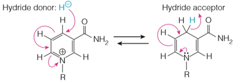
    - R 是代替下面的一大坨東西
  - {m NAD}^+ 作為氧化劑的典型反應為將醇轉化為醛
    - {m NAD}^+ 拔走 C 上 H－
    - C 缺電子，從 O 得，與之形成 CO 雙鍵，O 再使其上 H 斷開，得電子
    - 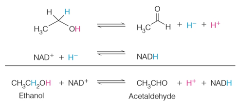
- Metal ions
  - 許多酶含有一種或多種金屬離子，通常由胺基酸側鏈共價鍵鍵結，有時會接到像血基質 (heme) 這樣的輔基 (prosthetic group) 中。
    - 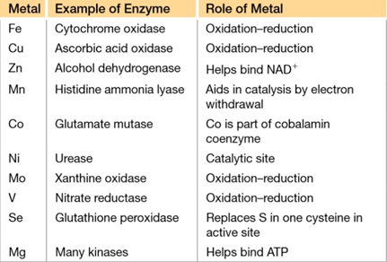
  - 舉例：{m Zn}^{2+} 利用靜電力穩定氧陰離子的過渡狀態並可定位水的方向叫他過來
  - 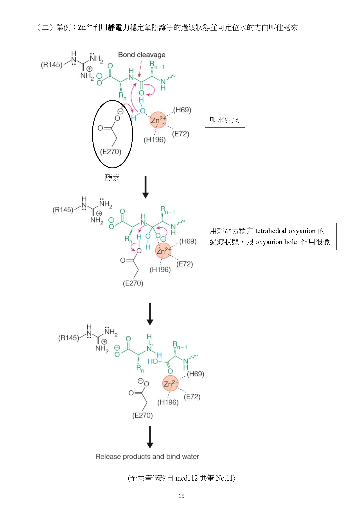