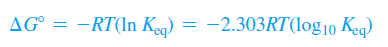
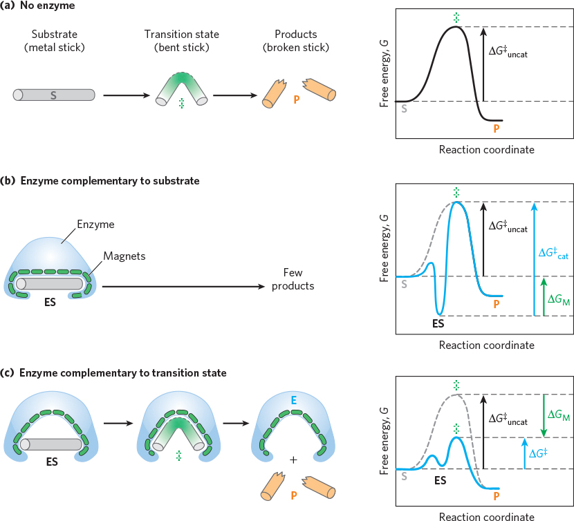
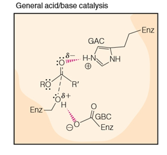

## 酵素的簡介

- 酵素生化研究的核心
- 大部分的酵素是球狀蛋白 Globular protein
  - 有些 RNA 可做催化酵素
- 有些酵素需要額外的化學成分
  - 輔因子 Cofactor
    - 無機離子
  - 輔酶 Coenzyme
    - 運輸特定官能基、原子
    - 複雜有機物或金屬有機離子
      - 大多源自於維生素
    - 本身亦可參與催化，但也可以當作其他酵素的催化劑
  - Holoenzyme
    - 輔基 Prosthetic group
      - 與輔酶不同，輔基基本上一定一直黏在蛋白質上
    - 脫輔酶 Apoenzyme (apoprotein)
      - 不含輔基
- 酵素運作的特性
- 酵素命名
  - 現代命名: 受質、反應型態命名 (-ase)
    - 受質: urease
    - 反應型態: polymerase
  - 早期命名  (-in, -zyme)
    - 以廣泛功能命名: pepsin, lysozyme
    - 以來源命名: trypsin
  - 統一命名方式
    - 系統性名稱 (不用記啦)
    - E.C. 編號 (類別名稱 → 亞類 → 受體 1 → 受體 2)
- 酵素類別與國際編號

  1. 氧化還原酶 Oxidoreductases：催化氧化還原反應，所有反應中最常見
  2. 轉移酶 Transferases：催化受質上某些官能基的轉移
  3. 水解酶 Hydrolases：催化受質水解反應
  4. 裂解酶 Lyases：催化從雙鍵移除或加上某些基團的反應，把化合物一個變兩個
  5. 異構酶 Isomerases：催化同分異構物的相互轉化
  6. 連接酶 Ligases：催化促進化合物間鍵結的形成

## 酵素的運作原理

### 熱力學、反應速率

- 細胞內不利化學反應，即使熱力學允許，但 Kinetic 太慢
  - 細胞內環境溫和、有效碰撞比率小
  - 活化能 Activation energy 太高
    - 生物反應常形成不穩定的中間物
      - 有些甚至有帶電 (e.g primary carbocation)
    - 可推論 transition state 的活化能一定非常高
- 酵素如何催化
  - 使受質 (sub.) 待在活性中心 Active site
  - Active site 有 amino acid 可結合 sub. to 催化
  - ES complex : 定義酵素動力學
- 熱力學
  - 酵素不影響 Gibbs Energy, Enthalpy
    - 酵素無法使不會發生的反應發生
      - 不會發生的反應: thermodynamic unfavorable
      - Delta Gibbs Energy > 0
  - 酵素用於改變反應途徑或降低活化能，因此會提升反應速率 (Kinetic)
    - 改變反應途徑
      - 速率定律公式改變
    - 降低活化能，可提高速率常數，或者讓速率決定步驟改變
      - 速率決定步驟: 最高活化能的那個
      - 
  - 酵素不影響平衡常數 (不影響熱力學)，只影響 Kinetic
    - 

### 酵素如何優化過渡狀態

- 酵素受質結合模型 Enzyme-Substrate Binding
  - Lock-and-Key
    - 酵素與受質幾何互補，酵素的結構始終保持原樣
  - Induced Fit
    - 與受質作用期間，酵素產生 Conformational change
    - 受質也產生 Conformational change，distort 成最終的過渡狀態
    - 酵素並不是與受質完全幾何互補，而是與過渡態互補
      - 受質、酵素間的最佳作用力，僅發生在過渡態
      - 這樣 ES 轉成 EP 的活化能太高
        - 如果是與過渡態互補，則可同時滿足 ES、EP 結構
          - 雖然和 ES 的緊密程度，沒有 Lock and Key 這麼好
        - 
- Binding Energy 造成了酵素的專一性
  - 來自於正確 E, S 構型，帶來的大量弱作用力
    - 降低 Enthalpy
      - 降低跟不重要分子形成的氫鍵、電子重新分布
      - Distorting S, and making some functional group closer.
    - 降低反應時的 Entropy
      - 反應前的 Entropy 一定很高，因此降低反應時的 Entropy
        - Delta Entropy 就會巨高
        - 

## 常見的酵素催化過程

- General Acid-Base Catalysis
  - 有些反應在有機化學的角度下是不可能存在的，但是在酵素環境可以
    - 
- 共價催化
  - 很像是有基的 acid-catalyted hydration
- [Under Construction]

受質定位、穩定 trans state、調節 REDOX (因為金屬有很多不同OX態)

* * *

酵素動力學

- 定量描述
- 確定 S 結合順序
- 了解催化機制
- 了解調控
  - 尋找有效 antagonist

- 不要用速率定律公式！
- 最好測量初始速率，因為其濃度容易知道。
- [S] 對 V_0 的影響
  - V_0 = V_max，酵素飽和 → 酵素具有飽和性
  - 
- 1/2 Vmax = Km
- 穩態假設
  - [ES] 為定值，正逆反應速率相同 E + S → ES，速率為常數
- 速率限制步驟:
  - ES → E + S

單受質方程式: MM eq. E + S [(k1)→(k-1)] ES (k2) → E+P
k2 = kcat
vmax=k

kcat 轉換數: 轉換受質 / 秒
Km : 受值對酵素親和力，反相關

- 酵素的專一性
  - 同時考量
    - 速度快慢
    - 親和力高低
  - 測試酵素能力，可將受質變的很少 [s] << K_m
- MM eq. 倒數，可對 1/[V_0]、1/[S] 作圖
- 動力學
  - 雙受質只有三種情形
    - ordered
      - 雙倒數作圖，相交
      - S2 大 Vmax1 大
    - random
      - 和下方圖 a 相同，但是交點交在 y 軸上
      - S2 與 Vmax1 無關 → random 交於 y 軸上
    - ping-pong
      - 雙倒數作圖，平行
    - 雙受質的動力學分析
      - S2 濃度恆定，改變 S1 濃度生成直線

這兩張圖 (雙受質) 跟後面的競爭型 (單受質) 是完全沒有關係的。

* * *

# 酵素的活性受到 pH 影響

肝細胞 glucose 6-phosphatase 最適合 7.8，肝在 7.2
胃部 pepsin

* * *

**酵素催化的機制 (Mechanisms for Achieving Rate Acceleration)**

- General Acid/Base Catalysis (GABC)  酸鹼催化：
  - GABC 為 proton transfer 的反應。此酸鹼指的並非強酸強鹼。注意下圖中框起的 GAC（即 General Acid Catalysis），若酵素中的一個 amino acid residue 提供 H + 給帶負電的原子，此 residue 為一 general acid；而 GBC 就代表該 residue 將 H + 從帶正電的原子上移除，為一 general base。GABC 可視為氫離子轉移的特殊靜電穩定結合。
  - 
  - ※補充：Histidine 是極為常見的 GABC，因其 pKa 值約等於 6，使其容易在生理 pH 下接受或提供 H+。
- Covalent Catalysis  共價催化：
  - 改變反應途徑去產生比 Transition state 能量更低的 Intermediate state. 讓兩個較低的活化能取代單一 (原本) 較高的活化能。
  - 
- Electrostatic Stabilization 靜電穩定：
  - 酵素與受質透過 noncovalent bonds (H-bonds, charge-charge interaction 等) 的靜電吸引力結合。
  - 
- Proximity and Orientation Effect 鄰近定向效應：
  - 酵素使受質們相互靠近，並形成有利於反應進行的排列方向。
  - 自由能方程式 ∆G=∆H-T∆S
  - 上課舉例說明：
    - 
    - 圖 A：受質 A 和 B 原本亂度為 10000，鍵結導致的亂度變化量為 - 9000
    - 圖 B：受質 A 和 B 利用酵素先讓它們靠近，故一開始的亂度就不高，鍵結導致的亂度變化量只有 - 990。
    - 根據方程式可知∆S 越大，∆G 會越小，趨向自發反應。
  - 結論：酵素可利用鄰近定向受質讓亂度變化變小，更利反應進行。
    - 
- Metal Ion Catalysis 金屬離子催化（參照共筆 p.16）：
  - 超過 1/3 的酵素在其 active site 中都含有金屬離子（此類酵素稱為 Metalloenzymes），金屬離子可促進酵素的 active site 形成 OH－（在許多水解反應作為 nucleophile）或穩定負電荷來降低過渡狀態的能量。
- Preferential stabilization of the transition state:
  - 酵素傾向與過渡狀態或類似的受質型態結合 (下降幅度較大)，降低活化能。
  - 
- Protein conformational change (Distortion)
  - 酵素的構型改變（即 Induced fit）
  - 結論：酵素穩定過渡狀態時 (transition state)，才能促進酵素催化的機制 (mechanism for achieving rate enhancement)