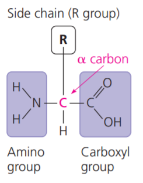

# 生物巨分子與脂類

## 本章重點

- 一般詞彙
    - 聚合物 Polymers / 單體 Monomers
    - 合成 Synthesis: Dehydration 脫水 reaction
    - 分解 Breakdown: Hydrolysis 水解 / Disassemble
- 巨分子 Macromolecule
    - Carbonhydrate 碳水化合物 / Protein 蛋白質 / Nucleic acid 核酸
- 脂類 Lipid 不屬於巨分子

## 碳水化合物 Carbohydrate

- 醣苷鍵 Glycosidic linkage
- 單醣 Monosaccharides
    - 五碳醣 Pentose
        - 醛醣 Aldoses : 核醣 riboses
    - 六碳醣 Hexoses
        - 醛醣 Aldoses : 葡萄糖 Glucose、半乳糖 Galactose
        - 酮醣 Ketoses : 果糖 Fructose
- 雙醣 Disaccharides : 麥芽糖 Maltose、蔗糖 Sucrose、乳糖 Lactose
- 多醣 Polysaccharides
    - 儲存性多醣 : 澱粉 Starch、肝醣 Glycogen
    - 結構性多醣 : 纖維素 Cellulose、幾丁質 Chitin (以葡萄糖胺構成)

## 多肽與蛋白質 Polypeptides and Proteins

- 肽鍵 Peptide bond
- 胺基酸結構 Amino acid
    - 下圖為 L form 胺基酸 (生物中的胺基酸) 常見的畫法有下面兩種
      - 
      - 
    - backbone, side chains
- 蛋白質會變性 (Denaturation)

### 蛋白質結構

- 一級 Primary structure
    - 胺基酸的排列方式 (具有方向性)
- 二級 Secondary structure
    - 來自於 Backbone 的交互作用 (COO^-^ 或 NH~3~^+^)
    - α 螺旋 (α helix), β 摺板 (β pleated sheet)
    - 
- 三級 Tertiary structure
    - 形成具有催化或其他功能的構型 Conformation
    - 由 Side chain 交互作用引起
        - 氫鍵 Hydrogen bond
        - 雙硫鍵 Disulfide bridge
    - 疏水性作用 Hydrophobic interaction
        - 沒有極性官能基團的胺基酸 (如 Ala, Val, Leu, Ile, Pro) 會形成 Hydrophobic interaction，通常會包覆在 Protein 內部 (inner core)。
        - 另一部分，蛋白質的外部通常是親水的胺基酸。
    - 
- 四級 Quaternary structure
    - **兩條以上**的多肽鏈 association of two or more polypeptides
    - 不是每個蛋白質都有四級結構 only some of the proteins have quaternary structures
    - 血紅素有四個多肽鏈 e.g. Hemoglobin (Hb) have four subunits.
    - 

## 核酸 Nucleic Acids

- 單體 Monomers: 核苷酸 Nucleotides
    - 含氮鹼基 Nitrogenous bases : 嘌呤 purines (普林)、嘧啶 pyrimidines
    - 五碳醣骨架 Sugar: 去氧核醣 deoxyribose、核醣 ribose
- 結構 Structure: 反平行 Antiparallel

## 脂類 Lipids

- 三酸甘油酯 triacylglycerols (fats or oils)
    - 甘油 glycerol + 三個脂肪酸 three fatty acids
- 磷酯質 phospholipids
    - 甘油 glycerol + 磷酸基 phosphate group + 兩個脂肪酸 two fatty acids
    - 磷酯膜 Phospholipid bilayer
- 類固醇 Steroids
    - 四個融合在一起的環 Four fused rings
    - e.g. 膽固醇 Cholesterol
    - 