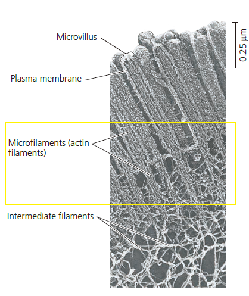
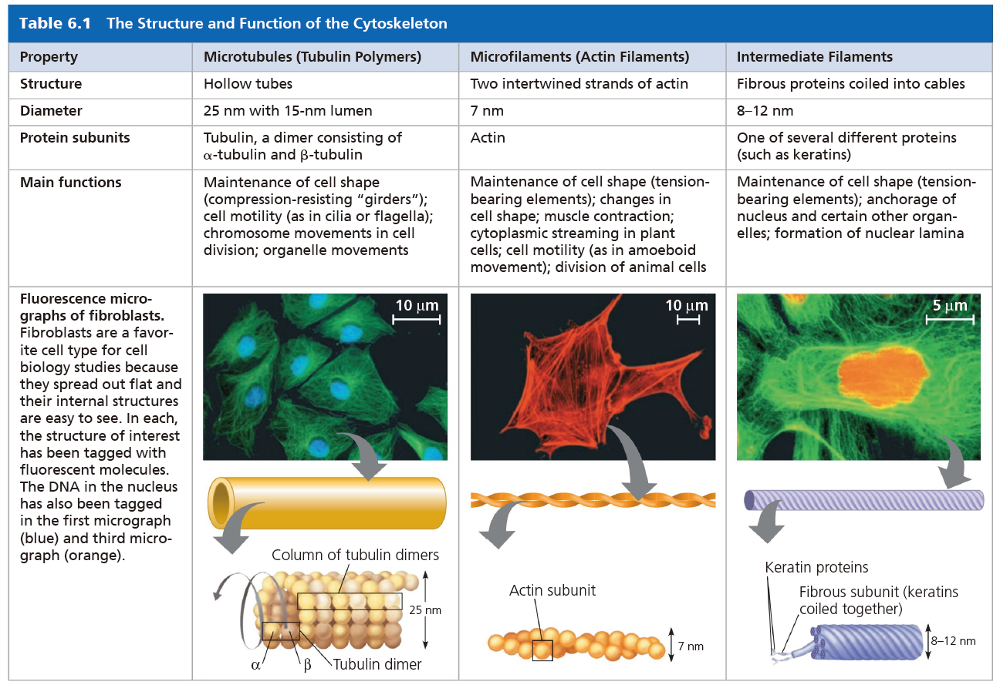
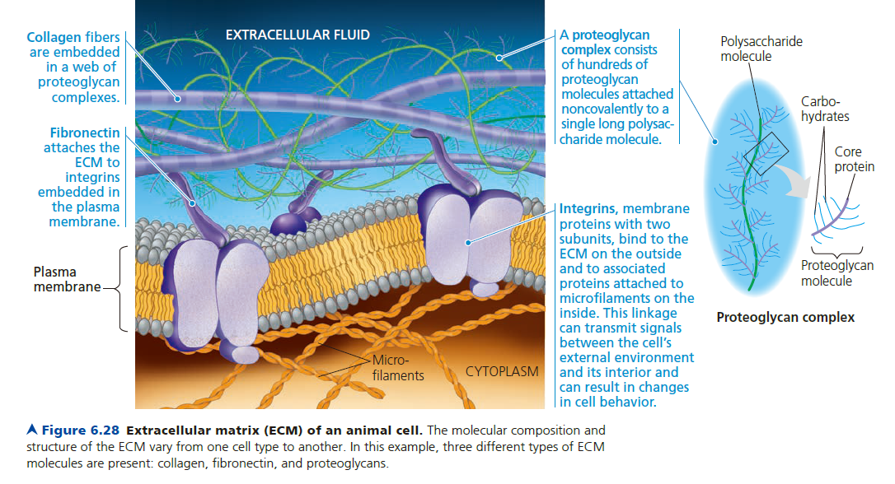
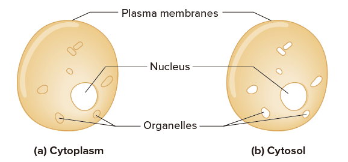

# 細胞的結構與功能

## 1. 真核生物細胞構造

- 遺傳資訊的儲存場所 : 細胞核 Nucleus (包含核仁 Nucleolus)
- 核醣體 Ribosomes 負責將 mRNA 資訊轉換為蛋白質
- 內膜系統 Endomembrane system 控制蛋白質運輸與細胞代謝
  - 核膜 Nuclear envelope
  - 內質網 Endoplasmic reticulum
  - 高基氏體 Golgi apparatus
  - 細胞膜 Cellular membrane
  - 囊泡 Vesicle、溶體 Lysosome、液泡 Vacuoles
- 細胞能量發電廠 : 粒線體 Mitochondria、葉綠體 Chloroplast
- 細胞骨架相關
  - 微管 Microtubule、微絲 Microfilament (Actin filaments)、中間絲 Intermediate filament
  - 鞭毛 Flagellum (微管)、中心粒 Centrosome (微管)、微絨毛 Microvilli (微絲)
- 細胞連接
  - 植物: 原生質絲 Plasmodesmata
  - 動物細胞連結 : 橋粒 Desmosome、緊密連接 Tight junction、間隙連接 Gap junction
- 其他無法分類
  - 過氧化體 Peroxisome

## 2. 細胞核 Nucleus

- 核膜 Nuclear envelope
  - 除了核孔外，內側被 "Nuclear lamina" 圍繞，形成核膜的形狀
- 核孔 Nuclear pores
  - 核孔複合體 Pore complex (一種蛋白質，控制蛋白質、RNA 進出)
- 核仁 Nucleolus
  - 染色時容易見到
  - 含有合成 rRNA 的必要基因，也是核醣體次單元的合成區域
- 染色質 Chromatin
  - 行分裂的時候，會濃縮成染色體 Chromosome

## 3. 核糖體 Ribosomes

- 不屬於胞器 Organelle
- 分為 Free ribosomes, Bound ribosomes (on rough ER)

## 4. 內膜系統 Endomembrane System

### 內質網 Endoplasmic reticulum

#### 平滑內質網 Smooth ER

- 功能在不同細胞具有多樣性。主要是**酯類合成、醣類代謝、藥物解毒、鈣離子儲存**
  - 酯類合成: 包含油脂、類固醇、新的磷脂質
    - 類固醇: 主要出現在分泌性荷爾蒙的細胞
    - 新的磷脂質: 合成新的細胞膜
  - 藥物解毒: 主要出現在肝細胞，涉及到加入羥基在分子上
    - Smooth ER 的增加，被認為與藥物耐受性有關
  - 鈣離子儲存: 如肌肉細胞的 ER 特化成 Sarcoplasmic reticulum

#### 粗糙內質網 Rough ER

- 主要合成蛋白質，並為其加上醣鏈，形成醣蛋白 (glycoprotein)
- 但也可以合成磷脂質，主要用在囊泡上，也可以補充因囊泡離去而遺失的磷脂質

### 高基氏體 Golgi apparatus

- 細胞囊泡轉運站
- 修飾蛋白質
- 合成多醣類 (不包含纖維素)
- 結構
  - Cis face : 靠近 ER 的那一側，接收囊泡 receiving side of golgi appartus
  - Trans face : 釋放囊泡 shipping side of golgi appartus

### 溶體 Lysosome

- 適合工作在酸性環境，故就算內部物質釋放出來，也不大會影響細胞功能
- 水解酶來自內質網合成、溶體的囊泡由高基氏體釋放
- 細胞自噬、細胞更新 Autophagy

### 液泡 Vacuoles

- 食泡 Food vacuoles (阿米巴類的動物)
- 伸縮泡 Contractile vacuoles (paramecium, 草履蟲)
- 中央大液泡 Central vacuoles (植物)

### 其他屬於內膜系統的構造

- 核膜 Nuclear envelope
- 細胞膜 Cellular membrane
- 囊泡 Vesicle
- 內小體 Endosome
  - 細胞膜與高基氏體中間
  - 某些類型的 vesicle 會結合 endosome
  - Endosomes are involved in sorting,  modifying, and directing vesicular traffic in cells.

## 5. 能量工廠 Mitochondria and Chloroplast

內共生理論 Endosymbiont theory
- 證據: 兩層膜、環狀 DNA、自主型胞器 (自己生長、生殖)

### 粒線體 Mitochondria

- 皺褶 Cristae
- 膜間腔 Intermembrane space
- 內膜 Intermembrane: 上方有電子傳遞鏈
- 粒線體基質 Mitochondrial matrix (注意不是 stroma)
  - 內含加速細胞呼吸的酵素、粒線體 DNA、核醣體

### 葉綠體 Chloroplast

- 類囊體 Thylakoids
  - 類囊體疊成「洋芋片塔」Granum
- 內膜 Intermembrane: 上方有電子傳遞鏈
- 葉綠素基質 Stroma (注意不是 matrix)
- 色素體 Plastids: 與葉綠體密切相關的植物胞器
  - amyloplast (儲存澱粉)
  - chromoplast (讓果實有顏色)

## 6. 細胞骨架 Cytoskeleton

### 微管 Microtubule

- 單體為 tubulin
- 參與動力蛋白 Motor protein 的組成
- 參與細胞分裂的物質移動
  - 紡錘絲 Mitotic Spindle
  - 微管組成中心 Microtubule organization center, MTOC
    - 中心體 Centrosome (動物才有的 MTOC)
      - 由兩個中心粒 Centrioles 構成，彼此互相垂直
      - 參與紡錘絲形成
      - 形成 Pericentriolar satellite
      - 中心體由 "basal body" (基體) 處，將細胞膜往外推，形成纖毛、鞭毛
    - 植物沒有中心體，但有 MTOC，也有紡錘絲
  - 紫杉醇透過抑制微管合成，達到抑制細胞分裂的效果

### 微絲 Microfilament (actin filaments)

- 單體為 Actin
- 可分為 G-actin (Globular) 和 F-actin (Filamentous)
- 參與肌肉的收縮 Myosin motors
- 形成細胞質皮層 Cortex
  - 
- 其他參與的活動
  - 與微管共同形成神經元特殊的樹突、軸突構造
  - 阿米巴原蟲的偽足 Anoeboid movement, Pseudopodia
  - 水蘊草的胞質流動 Cytoplasmic streaming

### 中間絲 Intermediate filament

- 可形成較持久的構造，例如 Desmin、Lamin、角蛋白 Keratins
- 形成 Nuclear lamina
- most extensively developed in the regions of cells subject to mechanical stress.
- in association with desmosomes (a kind of cell junction)

## 7. 胞外組成與細胞連結

### 植物

- 植物細胞壁 Cell Wall
  - 排序: 細胞質、次生細胞壁、初生細胞壁、**中膠層**、初生細胞壁、次生細胞壁、細胞質
  - 中膠層 Middle lamella、初生細胞壁 Primary cell wall、次生細胞壁 Secondary cell wall
- 植物細胞連結: 原生質絲 Plasmodesmata

### 動物

- **動物胞外基質 Extracellular Matrix, ECM**
  - 細胞膜上
    - 整合素 Integrins
      - 兩個次單元 Two subunit
      - "纖網蛋白 Fibronectin" 接合在整合素的外側，連接 ECM 的膠原蛋白 collagen
      - 也與其他的蛋白質接合，連接胞內的細胞質皮質 cortex 微絲 microfilament
  - ECM
    - 細胞外液 Extracellular fluid
    - 膠原蛋白 collagen
      - Proteoglycan complex 纏繞在 collagen 上面 (醣鏈上有蛋白質)
- **動物細胞連結 Cell Junctions**
  - 植物: 原生質絲 Plasmodesmata
  - 動物細胞連結 :
    - 橋粒 Desmosome : 出現在心肌
      - 由堅韌的角蛋白構成 (一種微絲)
    - 緊密連接 Tight junction : 例如上皮細胞、血腦屏障
    - 間隙連接 Gap junction : 出現在心肌、胚胎發育

## 8. 過氧化體 Peroxisome

- 將化學物質的氫離子移除，並加上兩個氧分子。此過程造成副產物「過氧化氫」的產生
- 「過氧化氫」對於胞器本身有害，但過氧化體內部含有轉化酵素，可將過氧化氫再轉成水
  - 由於產生有害物質，故過氧化體距離其他胞器通常較遠
- 多樣化的功能
  - 分解脂肪酸，作為細胞呼吸的材料
  - 肝臟: 解毒，將酒精的羥基分解
  - 種子: 特化的 glyoxysomes，將種子內的脂肪轉化成醣類

## 9. 其他

- A cell is grater than the sum of its parts
- Adjacent = neighboring
- 疏水 hydrophobic & 親水 hydrophilic
- Cytoplasm vs. Cytosol
  - 

