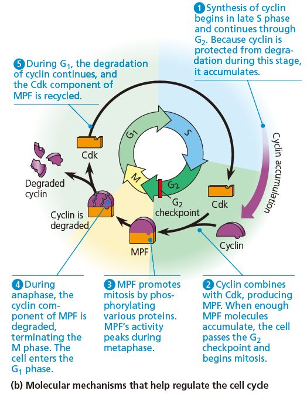

# 有絲分裂 Mitosis

## 有絲分裂各階段在顯微鏡下的特徵

- 間期 G2 of Interphase
    - 核仁、核膜完好
    - 中心體已被複製，現在有四個中心粒
    - 染色體仍不可見
- 前期 Prophase :  紡錘絲出現、染色質開始濃縮
    - 光學顯微鏡已可見染色體
    - 核仁開始消失，核膜還在
    - 紡錘絲隨著中心體遠離而形成
        - 較長，連接兩個中心體的為紡錘絲
        - 中心體旁邊短短的絲狀物，稱作星狀體 asters
- 前中期 Prometaphase :  核膜開始消失
    - 核膜變成碎片
    - 染色體更濃縮
    - 染色體形成 Kinetochore，在中節位置
    - 紡錘絲的微管侵入細胞膜
        - 有些微管附著在染色體的 Kinetochore
        - 有些則與異側的微管相連在一起，將細胞延長
- 中期 Metaphase : 染色體排在赤道板上
    - 中心體在細胞的兩側
    - 染色體整齊的排在赤道板 metaphase plate 上
- 後期 Anaphase : 染色體被拉至兩側
    - 時間最短，通常只有幾分鐘
    - cohesion 被切割，導致姊妹染色體互相遠離
    - 細胞被 nonkinetochore microtubules 延長
- 末期 Telophase : 核膜開始形成
    - 核膜開始形成
    - 核仁出現
    - 染色體被稀釋一些
    - 紡錘絲被分解
- 細胞質分裂 Cytokinesis

## 微管參與有絲分裂的分子機制

- 姊妹染色體的分離
    - 連結姊妹染色體的蛋白質: cohesion
    - 中節 Centromere，具有 kinetochores 著絲點，可與紡錘絲結合
    - 與著絲點連接的微管 kinetochore microtubule
        - 有 Motor Protein 拉住染色體，沿著微管行走
        - 像是 Pac-man 一樣，順便吃掉微管，讓微管變短 (靠著絲點那一側)
            - 
        - "walked" model / "relled in" model
- 延長細胞
    - 沒有與著絲點連接的微管 nonkinetochore microtubule
        - nonkinetochore microtubules from opposite poles push against each other

## 細胞週期

- 細胞週期
    - G1、S、G2、M
- 細胞週期重要的檢查點
    - G1-S checkpoint
        - 最重要，如果順利通過，通常細胞就會走向分裂
        - 沒通過，就進入 G0 時期
    - G2-M checkpoint

        1. **S、G2** : **cyclin** 在此階段累積，並且在此階段不會被分解
        2. ****G2 checkpoint :** cyclin + Cdk = MPF**

            - 一旦 MPF 數量足夠，就會通過 G2 checkpoint

        3. **M : **MPF 可以磷酸化與有絲分裂相關的酵素，促成有絲分裂發生

            - MPF 在中期濃度達到最高

        4. **Anaphase :** MPF 被拆開，cyclin 被分解，但是 Cdk 被回收，供下次細胞分裂使用
        5. 

    - M checkpoint
        - 中期染色體排好之後，才有辦法進入後期
- Cancer cells lose their ability to control mitosis

* * *

**補充**

- 有絲分裂的絲，並不是紡錘絲，而是十九世紀顯微鏡下的染色體，因其放大倍率太小而成絲狀。 (高中老師補充)
    - 細菌染色體呈環狀，不會在顯微鏡下變成絲狀，且當時科技不可能看到細菌染色體
    - 故**細菌的細胞分裂並不屬於有絲分裂**
    - 細菌的 DNA 複製方式，吃作
- 二分裂 Binary Fission
    - 同時指原核生物與單細胞真核生物，透過細胞分裂的無性生殖
    - 細胞在分裂前，會長成將近兩倍的體積
    - 但是原核生物在二分裂中並不會經過有絲分裂，而單細胞真核生物會