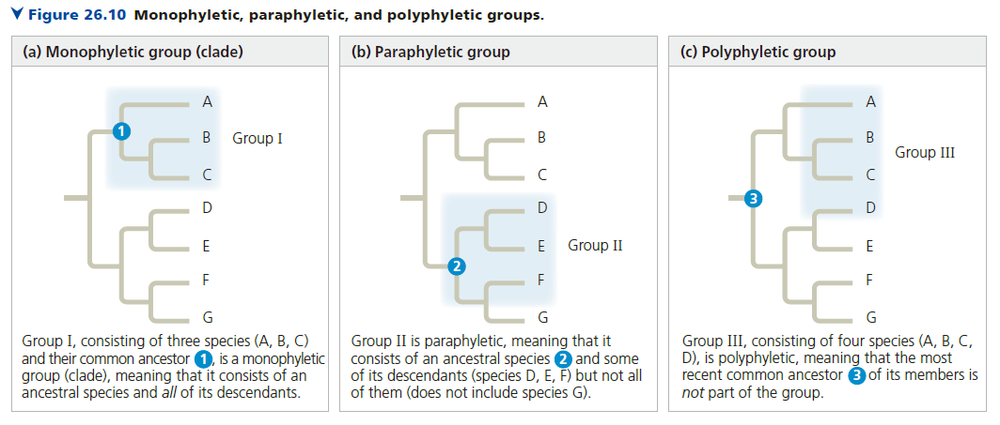
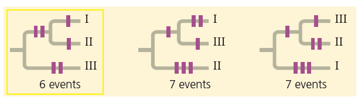

# 種系發生與生命樹
**Phylogeny and the Tree of Life**

## 種系發生顯示物種間演化的關聯

- 系統分類學 (Systematics)
    - 研究分類與演化之關聯性
- 生物分類學 (Taxonomy)
    - 研究如何分類生物，三域七界
    - 三域七界
        - Domain 域 → Kindom 界 → Phylum 門 → Class 綱
        - → Order 目 → Family 科 → Genus 屬 → Species 種
        - Phylum 門 (m, ㄇ)、 Class 綱 (C, ㄎ)、Order 目 (O 長的很像眼睛)
- 種系發生學 (Phylogency)
    - 研究演化歷史，建立種系發生樹
- 關聯
    - 若少了系統和準則，生物分類將會變得主觀。系統分類學認為我們需要利用「演化關係」作為分類的系統。
    - 生物分類學和種系發生學的關聯
        - 生物分類學: Taxon (pl. taxa)
            - 任意一個分類階層，除了三域之外，其他的 taxa 都可以被放入更高的階層
        - 種系發生學: Clade (pl. clades)
            - 演化支。包含單一共同祖先，以及其所有的後代物種，也就是「單系群 (monophyletic)」
            - 根據種系發生學，taxa 可分成三種，只有單系群相等於 clades

## 種系發生學顯示了物種演化的關聯性

- 分類學與種系發生
- 我們可以學到什麼
    - branch point
        - 每個 branch point 延伸出兩個 horizontal branches, called evolutionary lineage
    - 姊妹群 (sister taxa)
        - 一個演化事件一定只會分出兩個 clades
        - 在此演化事件之後分出的兩個 clades，互為姊妹群
            - 換句話說，這兩個 clades 共享了 immediate common ancestor (that is not shared by any other group)
    - 除了 root 之外，最早被 branched 的 taxon 稱作 basal taxon
        - (M) 例如在 APG IV 中，無油樟群就可被視為 basal taxon

## 形態學和分子生物學的資料用於推論種系發生

- 種系發生必須要區分 homology and analogy，且種系發生只關注 homology
    - Homology: 從共同祖先傳下來的，但有可能發生 divergent evolution (趨同演化)
    - Analogy: 趨同演化 (convergent evolution) 而來
    - 在細節上相似度越高，越可能是 homology。只要我們分析夠仔細、廣泛，我們就可區分兩者。
- 形態學
- 分子生物學
    - 考慮 shift (可能是 deletion or insertion)
    - analogy 的 sequence 在統計學上，可能會有 25% 的序列相同 (coincidental, 巧合)

## 共享的特徵被用於建立「種系發生樹」

- Cladistics: 根據種系發生學，taxa 可分成三種，只有單系群相等於 clades
    - 
    - 單系群 (monophyletic)
        - 包含單一共同祖先，以及其所有的後代物種
    - 並系群 (paraphyletic)
        - 所有該 taxon 物種均共享單一的共同祖先，且此祖先包含在並系群當中
        - 但是此單一的共同祖先的後代，並未全部包含在並系群中
        - 例如: 傳統的爬蟲類 taxon 中，並未包含鳥類，導致此爬蟲類 taxon 成為並系群
            - 爬蟲類確實共享單一共同祖先
            - 但是
    - 多系群 (polyphyletic)
        - 所有該 taxon 物種的單一的共同祖先，並沒有放在此 taxon
        - 例如: 若要將人類和細菌放在同一個 taxon，那必須要將人類和細菌的祖先放入此多系群，才會使其變成並系群。
- 共享特徵
    - 一個族群的共享特徵可以用來做「種系發生樹的重建」，但首先我們必須區分此特徵是「從共同祖先而來」還是「自己演化出來的」
    - 選定 ingroup 後 (通常是一個 clade)，選擇關係夠近的 outgroup
        - 若此共享特徵在 ingroup、outgroup 都有，
            - 那麼這個特徵就不可能是在此 ingroup 演化獲得，此種特徵稱作「shared ancestral characters」
        - 若此共享特徵只有在 ingroup 才有，
            - 那麼這個特徵就有可能是在此 ingroup 演化獲得，此種特徵稱作「shared derived characters」
            - 比較夠多 outgroup 之後，就可以確定是不是只有這個 clade 擁有這個特徵
- 種系發生樹亦可結合「時間尺度」與「基因改變量」
    - 種系發生樹的樹枝長度可能不具有任何意義，
    - 但是亦可代表時間尺度、基因改變量
        - 時間尺度: x 軸改成時間
        - 基因改變: x 軸改成鹼基改變量
            - 從共同祖先分離後，老鼠和果蠅各自演化，但是老鼠的鹼基改變量不一定比果蠅多
                - 從共同祖先分離後，基因改變量較大不一定代表物種較「進化」
        - 兩種圖有時可以互相參照，因為在某些情況下，我們可以用鹼基改變量推知經過的時間長度 (分子時鐘)
- 最大簡約法 (maximum parsimony) 與最大近似法 (maximum likelihood)
    - 最大簡約法: 看圖說故事，物種排列方式千百種，但是盡可能使用「演化事件發生最少」的推論
        - 
    - 最大近似法: 用在鹼基改變量的推論。take deletion and insertion into consideration，並盡可能使用鹼基改變最少的推論
- 種系發生樹只是「假說」
    - 隨著證據的更新，種系發生樹也可能被更新
    - 種系發生樹可預測性狀是否會出現在某個 taxon (phylogenetic bracketing, 種系發生包圍)
        - 如果兩個 clades 共享同樣的性狀，我們可以推測 common ancestor 也具有此性狀
            - 不一定要是姊妹系，例如鳥類和鱷魚共享「四腔室的心臟構造」 (不是姊妹系)
            - 我們可以推測鳥類和鱷魚追溯到的同一祖先具有此特徵
        - common ancestor 具有的特徵，後代應該也會擁有
            - 同上方舉例，恐龍為此例中 common ancestor 之後代，可推測恐龍具有「四腔室的心臟構造」
            - 因為化石通常不包含內臟，這種推論在預測生理功能的演化中，相當重要。

## 一個生物的基因組包含了演化歷史

- Orthologous genes 不同物種
- Paralogous genes 一個物種

## 分子時鐘

- 以相同速率改變鹼基的基因(?)

## 人們對於生命樹的理解不斷更新

- 三域說
- 水平基因移轉