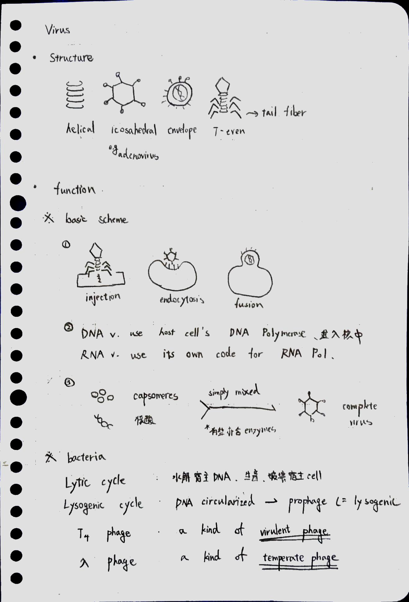
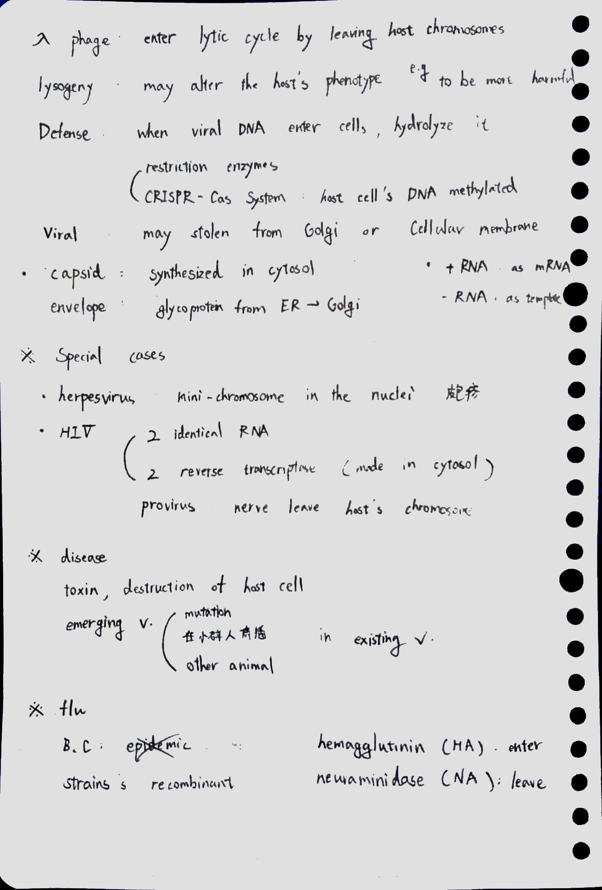
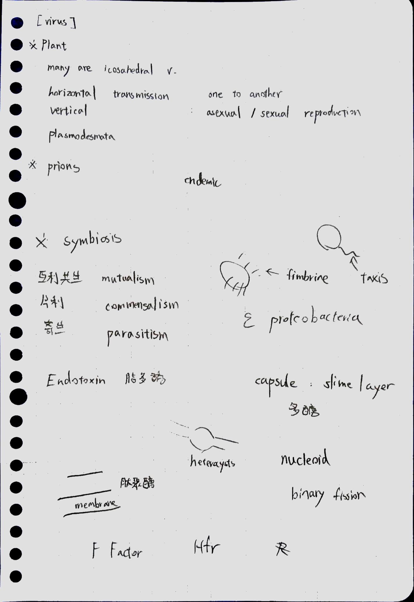

CH 26. 病毒的介紹 (含紙本筆記) Introduction to Viruses

- 病毒就是由蛋白質包裝而成的遺傳物質包裹
    - capsid
    - viral envelope
- 病毒只會在宿主細胞內複製
    - 對物種具有某種程度的識別性：host range
    - 細菌的致病病毒
        - 噬菌體簡介：lytic cycle, lysogenic cycle (必考)
            - lytic cycle
                - 噬菌體複製、組裝並破壞宿主
            - lysogenic cycle
                - 噬菌體基因融入細菌基因組，並隨著細菌分裂而傳遞到後代
        - 細菌的限制內切系統：阻止噬菌體感染
    - 動物的致病病毒
        - 動物的病毒分類
            - 通常都是 RNA 病毒，且只要是 RNA 病毒，通常都有套膜
            - 病毒的遺傳物質
                - 介紹
                    - 單股、雙股；DNA、RNA
                    - HIV：兩個完全相同的 RNA 分子
                - DNA
                    - 通常需要透過細胞核內酵素的協助 (?
                - single strand RNA
                    - ＋RNA
                        - RNA 本身作為 mRNA，感染後即可直接開始做壞事
                    - －RNA
                        - RNA 本身不能做事情，需要先經過 RNA 合成酶合成出互補的 RNA
                        - 互補的 RNA 可同時作為 mRNA 和新遺傳物質的模板
                        - 通常此類病毒不使用宿主的聚合酶，而是使用自己的聚合酶（在自己的基因組裡面）
                        - 例如流感病毒
                    - 通常不透過細胞核
                - Retrovirus
                    - 內含反轉錄酶
                    - 請看下方 HIV 的介紹
        - 愛滋病專論（必考）
            - HIV 結構
                - 兩股完全相同的 RNA (沒有模板股、編碼股之差??)
                - 內含反轉錄酶

            1. HIV 的感染過程
                1. envelope 上的 glycoprotein 可識別白血球上的特定受器
                2. Fuse，然後 Capsid protein 被降解
                3. 反轉錄酶合成出新的一股 DNA
                4. 反轉錄酶同時促使新合成的 DNA 變成模板股，合成出新的互補 DNA
                5. 雙股 DNA 作為 provirus，結合宿主的染色體
                    1. provirus vs. lytic cycle

                6. proviral gene are transcribed into RNA, RNA 同時作為遺傳物質、capsid proteins 之 mRNA

                7. ER 合成 glycoprotein
                8. 囊泡將 glycoprotein 帶到細胞膜，為 HIV 「出芽」做準備
                9. Capsid 和反轉錄酶也已經準備好，圍繞在病毒的 RNA 旁邊
                10. 出芽

- 病毒會致病
    - 流感病毒專論
    - 普利昂蛋白
    - 流行病
        - 疫苗用於預防疾病
        - pandemic (疾病大流行)
- 補充：病毒可能的來源
- 原始筆記
    - 病毒結構
    - 病毒攻擊的基本策略
        - 進入細胞
        - DNA 病毒: 使用宿主的酵素
        - RNA 病毒: 使用自己的酵素基因
    - 噬菌體
        - lytic, lysogenic
        - lambda
    - 特殊的病毒
        - HIV
        - herpesvirus: 帶狀皰疹病毒 (DNA 形成環狀，住在神經核當中)
        - 流感病毒

