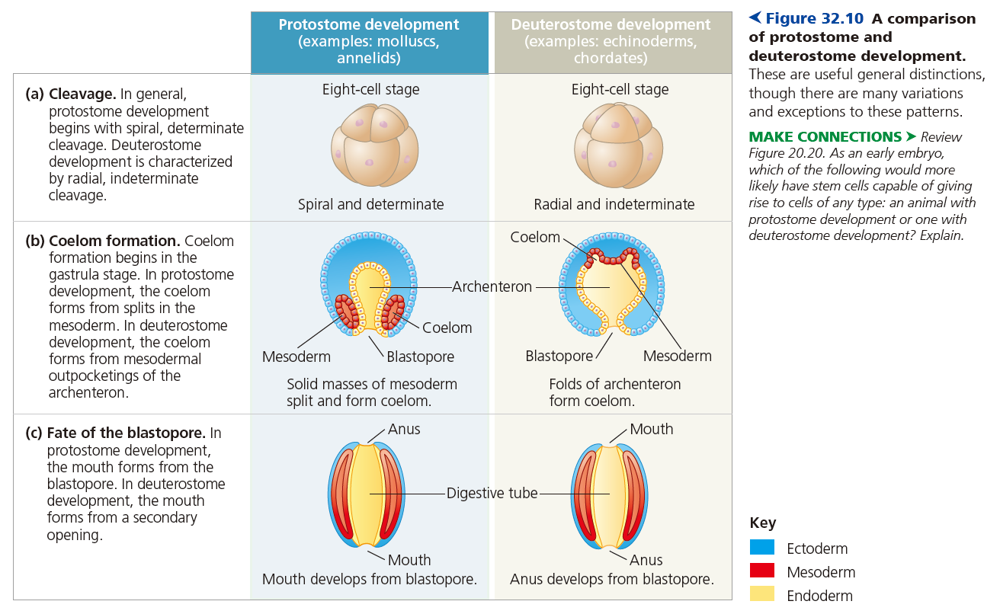
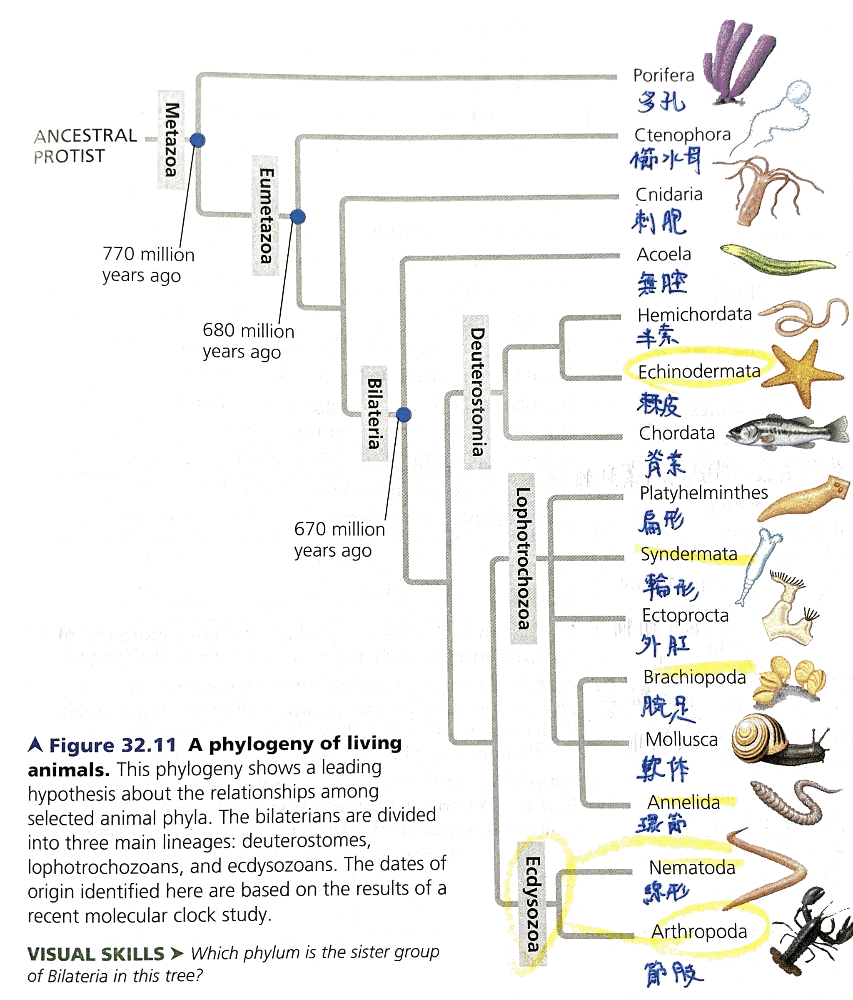

CH 32. 動物多樣性 An Introduction to Animal Diversity

**動物的定義**

- 營養模式
    - heterotrophs
- 細胞結構與特化
    - multicellular eukaryotes
    - collagen
- 生活史
    - diploid stage
- 發育模式
    - zygote 經過 cleavage → blastula
    - blastula 經過 gastrulation → gastrula
        - 原腸 archenteron
        - 開始分成外胚層、內胚層
    - larva 經過 metamorphosis → juvenile
        - juvenile 像是成年，但是並沒有性成熟
- Hox genes
    - 一種 homeoboxes
    - highly conserved
    - 海綿沒有 Hox 基因
    - Hox 經過 duplication，扮演調控體節、對稱發育的重要角色

* * *

**動物的演化史**

- 動物來自於單細胞的祖先
    - choanoflagellates 是現存最接近動物的種系
    - 為了要形成多細胞生物體，必須要有新的機制將細胞連結 adhere
        - cadherin 在細胞連結、細胞傳訊扮演重要角色
            - 其上方的 CCD domain 為 highly conserved
            - CCD 存在於所有動物，並不存在於動物外的所有生物
- 前寒武紀
    - Neoproterozoic 新原古代
        - Ediacaran biota 埃迪卡拉動物
- 古生代 Paleozoic
    - 寒武紀大爆發 Cambrian explosion
        - 演化特徵
            - bilaterians
        - 原因
            - New predator-prey relationships
            - A rise in atmospheric oxygen
            - The evolution of the Hox gene complex and addition of new microRNAs
- 中生代 Mesozoic Era
    - Coral reefs 珊瑚礁出現
    - plesiosaur 蛇頸龍演化自回到水中的爬蟲類
    - 第一個哺乳動物出現
    - 開花植物、昆蟲多樣化
- 新生代 Cenozoic Era
    - 恐龍滅絕，哺乳動物體積增加，佔領空缺的 ecological niches

* * *

**Body Plan**

- 對稱
    - radial symmetry
        - Diploblastic
        - sessile or planktonic (緩慢被動漂浮濾食)
    - bilateral symmetry
        - Triploblastic
            - 外胚層 Ectoderm
            - 中胚層 Mesoderm
            - 內胚層 Endoderm
        - 通常移動速度比較快，通常有 CNS
        - 體側
            - dorsal (top) / ventral (bottom)
            - right / left
            - anterior (front) / posterior (back) ends
- 組織
    - 海綿沒有組織，也沒有胚層
- 體腔 Coelom
    - 三胚層動物依據體腔形成方式，可分成
        - 真體腔動物 Coelomates
            - 體腔只由中胚層構成
        - 假體腔動物 Pseudocoelomates
            - 體腔由中胚層、內胚層共同構成
            - Nematoda 線蟲
        - 無體腔動物 acoelomates
            - 注意，無體腔屬於三胚層
            - planarians 扁蟲
    - 體腔功能
        - 內有液體，緩衝器官互撞
        - 液體具有壓力，可以使肌肉作功
        - 發育時，器官可以在體腔移動位置
- 原口 Protostome、後口 Deuterostomia
    - 卵裂模式
        - spiral / determinate
        - radial / indeterminate
    - 體腔形成
    - Blastopore 的命運
        - 原口動物: blastopore → mouth
        - 後口動物: blastopore → anus

* * *

**動物的譜系**

- 動物親緣關係樹的特色
    - 所有動物都有共同祖先
    - 海綿是所有其他動物的姊妹群
    - Eumetazoa 具有真正的組織
    - 兩側對稱動物分成三類
        - 原口
        - 後口
        - 冠輪

* * *

**補充: 外胚層、中胚層、內胚層**

- [[普通生物] CH 46. 動物的發育 Development in Animals](evernote:///view/74909985/s435/2bd5bc77-1dcd-4900-8fb4-a5e8496efe76/2bd5bc77-1dcd-4900-8fb4-a5e8496efe76/)