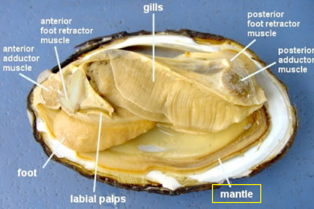

# 無脊椎動物 Invertebrates

## 1. Porifera 多孔動物

- 演化發育
    - 沒有組織
    - 沒有對稱、沒有胚層
    - 細胞可任意轉變其分化型態
- 特色
    - 著生性 sedentary, sessile
    - 食物來源
        - 濾食者
        - 從入水孔 pores 進入，出水孔 osculum 出去
    - 兩層細胞
        - Epidermal cells
        - Mesohyl 作為 gelatinous matrix 夾在中間
            - 中間有膠質層、骨針 spicules、某種蛋白質 spongein
        - Amoebocyte : 可用偽足移動，在 matrix 中爬行，餵食其他細胞)
        - Choanocyte : Flagellum 和 Collar 擺動可讓水進去，利用胞飲作用，濾食
    - 雌雄同體 hermaphrodites
        - 但不會同時表現兩種性別 sequential hermaphroditism
    - 海綿會分泌抗生素

## Cnidarians 刺絲胞動物

- 演化發育
    - 有組織動物 Eumetazoas 的基底群
    - 雙胚層動物 Diploblastic
- 依據是否有水母型，分成兩大群
    - **Medusozoans** (生活史可能有水母型)
        - Scyphozoans (水母)
            - Medusa 佔據絕大部分的 life cycle
        - Cubozoans (方形水母)
            - Medusa 佔據絕大部分的 life cycle
        - Hydrozoans (水螅)
            - Polyp、Medusa 交替出現
            - 可行出芽生殖
    - **Anthozoans **(生活史沒有水母型)
        - 珊瑚礁 (corals)
        - 海葵 (anemones)
        - 可分泌堅硬的外骨骼
- 特色
    - 刺絲胞動物生活史分成兩種狀態 (帶過)
        - **Polyp 水螅體**
        - **Medusa 水母體**
    - 「Tentacle 觸手」內有多個「**Cnidocytes 刺細胞**」
        - 刺細胞上有 Trigger
        - 刺細胞內部有特殊胞器 Cnidae
            - 可以伸出細胞外，並將內部的刺像鞭子一樣抽出去
        - 特化的 Cnidae－Nematocyst (一種胞器)，
            - 可以伸出 Stinging Thread，直接穿透獵物
    - 具有神經和運動機能
        - 沒有神經中樞，神經網貫串全身
        - 外層為 epidermis，內層為 gastrodermis
            - 具有陳束的 microfilaments 排列成收縮性纖維
            - 選擇性的收縮可導致形狀的改變
        - 充滿水的消化腔，可做為 hydrostatic skeleton (就像是充滿水的氣球)

## Lophotrochozoans 冠輪動物

- 以分子生物劃分出來的動物群
    - 形態學上有 Lophophore 觸手冠
    - 或有 Trochophore 擔輪幼蟲
    - 不過有例外
- **扁形動物 Platyhelminthes (Flatworm)**
    - 非寄生
        - 渦蟲 Planaria
            - 循環
                - 沒有循環系統
                - 表面非常扁平，可透過擴散作用運輸物質
            - 消化
                - 具有攝食構造、消化腔
                - 消化腔具有分支，可運送物質到每個細胞
                - 但是消化是在細胞內進行
            - 排泄
                - 原腎體 protonephridia
                - 內有 焰細胞
            - 生殖
                - 可行無性生殖，有些渦蟲可以分成兩半生殖
            - 神經
                - 避光
                - 神經組織化
                - 變成神經元 ganglia 成對出現，靠近 eyespot
                - 神經元在 ventral 形成神經索
                    - vs. 脊索動物是 dorsal nerve chord
            - 常常在水草中生存
    - 寄生
        - 吸蟲 Trematodoes
            - blood fluke 血吸蟲、liver fluke 肝吸蟲
        - 絛蟲 Tapeworm
            - 像是錄影帶的帶子
            - sucks, hooks，沒有任何消化構造，單純靠表皮組織吸收人類腸道養分
        - 生活史
            - 通常具有中間宿主、最終宿主
            - 有些甚至沒有
            - 具有極高的宿主專一性，可同時規避中間宿主、最終宿主的免疫系統
- **Syndermata 輪型動物**
    - Rotifer 是假體腔動物，為孤雌生殖 parthenogenesis
    - Acanthocephalans 通常寄生於不只一種宿主上，其可能改變節肢動物宿主行為
- **Lophophorates: Ectoprocts, Brachiopods**
    - Ectoprocts 外肛動物
        - 骨骼: 幾丁質
        - 在 lophophore 旁邊有肛門，並沒有被骨骼包住 (腸腔為 U 字形)
    - Brachiopods 腕足動物
        - 很像雙殼類，但是裡面有兩根像羽毛的東西 (Lophophore)，固著在海床上
        - 兩側對稱: 對稱平面與開口面垂直
- **Molluscs 軟體動物**
    - Body plan
        - 肉足 muscular food
        - 內臟團 visceral mass
        - 外套膜 mantle，會分泌外殼
        - 在下方圖片中，由外而內: 外殼 → mantle → mantle cavity → visceral mass
        - 
    - 特色
        - 齒舌 Radula
        - 排泄: Metanephrdium 後腎管
            - 比原腎體還要先進一點
            - 為兩個開口的管子
        - 生殖: 通常是雌雄異體，但是很多蝸牛是雌雄同體
    - 分類
        - 多板鋼 Polyplacophora (chitons 石鱉)
            - 很長活在消波塊上
            - 殼由八塊節片相連而成
            - 齒舌 Radula
        - 腹足綱 Gastropoda
            - 蝸牛、蛞蝓
            - 透過鞭毛走路
            - 齒舌，像是銼刀一樣，刮食
            - 有些會變成像魚槍那樣的東西
                - 玉螺
        - 雙殼綱 Bivalvia
            - 有些具有眼睛，在閉殼肌的外側，很多，呈輻射狀排列
            - 閉殼肌 Adductor muscle
            - 鰓 gill 同時具有交換氣體、攝食的功能
            - 有兩個孔 siphon，分為 incurrent 入水和 excurrent 出水
            - 大多數行固著生活，以 threads 固定，但是其可用足滑動
            - 
        - 頭足綱 Cephalopods
            - 唯一具有封閉式循環系統的軟體動物
            - 唾液、墨汁可能具有毒性
            - 移動方式
                - 足特化為部分觸手，上面有出水孔，可快速高壓噴水產生後座力
                - 利用外套膜擴張，將水吸入外套膜，再經由快速收縮射水
            - 有殼的頭足類，稱作菊石 ammonites，已經滅絕
                - 目前僅剩鸚鵡螺是有殼的頭足類動物
    - 軟體動物的毒液非常多樣，為短多肽鏈，且非常具有專一性，為生物藥劑學的重點研究對象
        - 軟體動物甚至能同時分泌多種毒液，並且能依物種調配其比例
        - venom (咬到會 GG), poison (吃下這個動物會 GG)
    - 軟體動物的滅絕速度相當快速

## Annelids 環節動物 

- Errantians 遊走類
    - 有 parapodia 相當於足的結構
    - parapodia 上面有很多的剛毛 chaetae
- Sedentarians 著生類 (水蛭和蚯蚓是著生類，要注意)
    - Leeches 水蛭
        - 吸血時，會分泌麻醉物質，宿主通常「不會察覺 oblivious」
        - 分泌 hirudin 蛭素，使得附近血液不會凝固
    - Earthworm 蚯蚓
        - 特色:
            - 每一體節由縱肌環繞，再來是環肌。每個體節之間有 septum 分隔
            - 後腎管在體腔內有開口，體腔外也有開口
            - 在咽下方兩側有兩個神經節，神經纖維融合後，再形成 ventral nerve cords
            - 封閉式循環系統，在 dorsal, ventral 各有一條血管
                - 有些體節的血管有幫浦功能
            - 體表有密密麻麻的血管，作為呼吸器官
        - 

* * *

    - Ecodysozoa 一定會蛻皮，但是會蛻皮的動物不一定是 Ecodysozoa
    - Lophophochozoans
        - 攝食的嘴部有網狀 或 有透過某種特殊毛狀物游泳的幼蟲
- 軟體動物常用於模式生物
- 某種線蟲用於發育研究的模型生物