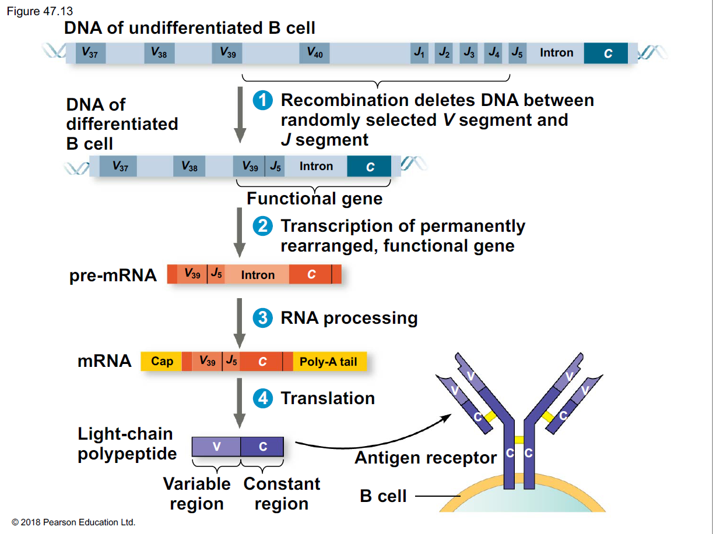

# 免疫系統

## 先天性免疫 Innate Immunity

所有動物免疫系統的原則 : 屏障、吞噬、辨識，並發出警訊、執行清除

- 屏障
  - 以昆蟲而言，外骨骼、腸胃道的幾丁質、溶酶可作為屏障
  - 以脊椎動物而言，可能有皮膚、黏膜......
- 吞噬性細胞
  - 無脊椎動物，通常利用 Hemocytes 這種細胞扮演 Phagocytes 的角色
  - 脊椎動物，則主要由嗜中性球、巨噬細胞、樹突細胞扮演 Phagocytes 的角色
- 辨識
  - 如 TLR (Toll-like Receptors) 受體

### 脊椎動物的先天性免疫

- Barrier
  - mucus
  - ciliated 上皮細胞
  - lysozyme
  - 皮膚的低酸鹼值 (3-5)
- Innate Immune cells
  - 吞噬型
    - Neutrophils
    - Macrophages
    - Dendritic cells
  - 非吞噬型
    - 致細胞凋亡 → Natural Killer
    - 攻擊多細胞生物 → Eosinophils
- Inflammatory Response
  - local inflammatory response
    - mast cells
      - histamine
    - pus 膿
  - systemic inflammatory response
    - fever
    - septic shock 敗血性休克
- Related Proteins
  - Antimicrobial peptides: 干擾真菌、細菌的膜完整性 (membrane integrity)
  - Interferons: 干擾病毒複製
  - Complement System: 補體系統

## 後天性免疫 Adaptive Immunity

### 後天性免疫的變異

- 同一個細胞只會表現同一種 receptor，其後代也表現相同 receptor
- 變異性的來源，來自於 DNA 被修改，換句話說，免疫細胞的 DNA 和身體其他細胞不太相同
- 以 B 細胞為例
  - 有 heavy chain 和 light chain
  - heavy chain 和 light chain 上面各自有其 varible region (V), constant region (C)
    - heavy chain 上面的 V 和 light chain 上面的 V 形狀不同
    - light chain 的 DNA 重組
      - 形成細胞時，任選一個 V 基因、任選一個 J 基因
      - 中間的 DNA 直接剪掉
      - mature mRNA 上面，只會有一個 V gene、一個 J gene

### 後天性免疫的啟動

1. APC Cells 將抗原呈現給 helper T，活化 helper T
   - 先天性 → 後天性的關鍵
     - 樹突細胞、巨噬細胞移動
     - APC Cells
       - 只有他們有 MHC II
         - 將抗原吞噬後，分解成小碎片，呈現在 MHC II 上面
       - 可活化 helper T: 巨噬、樹突
       - 通常不可活化 helper T: B 細胞
   - 識別
     - 抗原碎片 on MHC II + Receptor on helper T
       - MHC II on 抗原呈現細胞
       - CD4 on helper T
   - helper T 的活化
     - APC 和 helper T 都會分泌 cytokines，使 helper T 活化
2. 活化後的 helper T，分泌 cytokines，進一步使免疫細胞增生
   - 已經和受體結合的 B 細胞，可藉由和 helper T 結合，讓自身增生
   - helper T 細胞可活化 cytotoxic T
3. 具有特定受器的免疫細胞增生，稱作 clonal selection
   - give rise to effector cells (e.g plasma cells), memory cells
4. 後天性免疫的防禦方式
   - 體液免疫: 和體液的游離抗原結合
     - neutralization: 中和作用
     - opsonization: 促進吞噬，可觸發更多抗原呈現，是正回饋
     - precipitation
     - 與補體系統合作: 啟動 membrane attack complex (可致穿孔)
     - 與受感染細胞膜上的異常分子結合，可促進 natural killer 攻擊目標
   - 細胞免疫
     - 受感染的細胞，其細胞內會有異常分子被製造
     - 這些異常分子被表現在 MHC I 上
       - 所有有核的細胞都有 MHC I
     - 被 helper T 啟動的 cytotoxic T，利用 CD8 和異常的 MHC I 結合
     - 釋放 Perforin、Granzymes，造成細胞穿孔

## 免疫失調

- 自體耐受性
    - 若免疫細胞對自己的身體有免疫反應，則會細胞凋亡
    - 若此過程失敗，則會導致自體免疫疾病
- 過敏 allergies
- 自體免疫疾病 autoimmune disease
    - 例如: type-1 diabete,  multiple sclerosis 多發性硬化症 (攻擊髓鞘)
- 免疫缺乏疾病
    - SCID: 泡泡男孩
- 免疫排斥

## 其他瑣碎的主題

- 病原體的演化
    - 有些細菌可以住在吞噬型細胞裡面，抵抗先天性免疫
    - Latency 潛伏期
    - HIV
- Immunization 接種疫苗
    - 初級免疫 primary (10-14 天)
    - 次級免疫 secondary: 更快 (2-7 天)、更強、更持久
- Active and Passive Immunity
- Antibodies as Tools
    - 單株抗體 monoclonal antibodies
        - 驗孕棒，驗人類絨毛膜刺激素
        - 補充: 免疫檢查點抑制劑
        - 補充: 檢驗 COVID-19 是用 RT-PCR，並不是用單株抗體
    - 檢查是否有針對該病毒的抗體，可做為檢驗是否感染過病毒的基準
        - 把人類所有已知的病原體外殼放入檢驗的 kit 中
        - 再滴入人類血液，定序與抗體起反應的成分之基因組，可得知曾經感染過哪些病毒