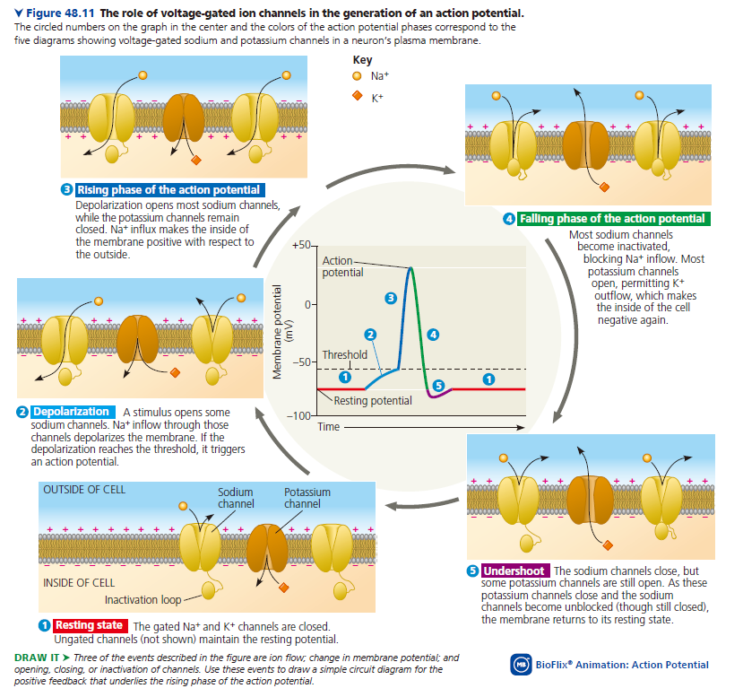
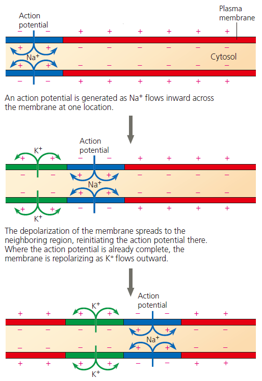
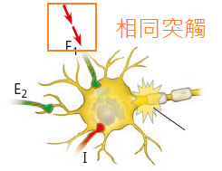
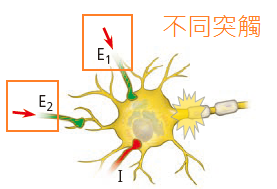

CH 48. 動物的電訊號 Electrial Signals in Animals

**神經細胞**

- 神經元
    - 神經元是神經訊號傳遞的最小單位
    - 神經傳遞涉及到化學、電訊號傳遞
    - 神經元位置
        - PNS: 位於「神經節 ganglia」
        - CNS: 或大腦皮質 cortex、神經核 nuclei
- 神經元的構造
    - 軸突末梢具有大量的
        - Ca2+ 通道
        - 神經遞質囊泡
        - 粒線體
- 樹突 + 細胞本體 = 接收突觸前訊號的地方
- 軸丘 Axon hillock = 最初產生動作電位的地方
- Nerve = Axon + 結締組織

* * *

**靜止膜電位**

- **濃度梯度的產生: 鈉鉀幫浦的貢獻**
- **Leak Channel + 離子流動 = 電位產生**
    - 因為 K+ 胞內濃度很高，想要流出去，這個流動的梯度，造成了電位梯度
- **能斯特方程式: 決定平衡電位大小**
- **離子通透性: 決定膜電位偏向哪個離子的平衡電位**
    - 靜止狀態下，鉀離子通透性很高，鈉離子通透性很低，因此靜止膜電位幾乎全由鉀離子決定
- 重要觀念
    - 鈉鉀幫浦每次運輸雖然會產生一個淨負電荷，但是速度太慢了
    - 真正在細胞膜內外流動的離子非常少數，不可能造成濃度的變化
    - 細胞內有非常多帶負電的大分子，不過並不構成細胞膜電位 (?)

* * *

**動作電位的產生**

- 來自於 Gated channel 的開關
- Graded Potential
    - 例如感覺訊號刺激
    - 如果累績到達閾值，就會引發動作電位
- 動作電位特色
    - 全有或全無
    - 電位最大值是定質，不由刺激強度決定
    - 產生頻率正比於刺激強度
- **動作電位的階段**
    - 
    - **Resting State**
    - **Depolarization**
        - Graded Potential 累加
    - **Rising Phase**
        - 到達 Threshold，此時鈉離子通道大量開啟
        - 鈉離子通透性增加，平衡電位偏向鈉離子平衡電為
    - **Falling Phase**
        - 此時鈉離子通道仍然開啟，但是被 inactivated
        - 鉀離子通道此時才開始因膜電位而開啟，大量鉀離子 (正電) 流出
    - **Undershoot**
        - 鉀離子通道一旦開啟，不能很快關閉，因此造成短暫的過極化現象
- 動作電位重要觀念
    - 由於參與靜止膜電位的流動離子本來就很少，
    - 因此動作電位涉及到的「流動離子」相較於整個細胞而言，根本是微乎其微
    - 所以 Refrectory Period 不可能是因為濃度梯度造成
    - 鈉、鉀離子通道的差異
        - 鈉離子: 快開快關
            - Inactivation of Na+ Channel: 不反應期 Refrectory Period
                - 在 falling phase 仍然開啟，但是被 inactivated
                - 要直到早期 undershoot period，才會 close，解除 inactivated 狀態
                    - 才會再次對電位敏感
        - 鉀離子: 慢開慢關
- 動作電位的傳遞
    - 某一段發生動作電位，促使後面那一段開始去極化...
    - 
    - 只會往單一方向: 因為不反應期 Refrectory Period
    - 長距離傳輸的演化
        - 無脊椎動物: 粗大的軸突，減少電阻
        - 脊椎動物: 髓鞘，相較於粗大的軸突，非常節省空間
            - 髓鞘
                - 絕緣，使得動作電位可以傳得更遠
                - 也使得離子通道的開合可以在較少地方發生，增加速度

* * *

**突觸與神經遞質**

- 突觸類型
    - 電突觸: 脊椎動物的心臟、無脊椎動物的整個神經系統常見
    - 化學突觸: 神經遞質
- 神經遞質的釋放的機制
    - Ca2+ 離子通道
- **化學突觸的調控**
    - 神經遞質數量
        - 神經遞質會被水解 Hydrolysis 或 再吸收 Reuptake，這會終止神經訊號傳遞
        - 可能會被運輸到突觸前、突觸後，或者是周圍的膠細胞
        - 像是乙醯膽鹼是被水解，但是血親素是被 Reuptake
    - 突觸後神經元反應能力
        - 受器數量受到動態調控
- 化學突觸如何影響突觸後神經元
    - **Ionotropic receptor**
        - ligand-gated ion channel
            - 造成 Graded Potential
        - EPSP、IPSP
            - **造成 EPSP 的 channel**
                - 通過同時增加 K+  和 Na+  通透性，讓 Na+ 大量流入，使得突觸後神經元發生去極化
            - **造成 EPSP 的 channel**
                - 通過增加 K+ 或 Cl-  通透性，使得突觸後神經元發生過極化
        - Summation
            - EPSP Summation
                - **Temporal**
                    - 
                    - 在前一個 Graded Potential 消失前
                    - 同一個突觸又傳了一個 IPSP
                - **Spatial**
                    - 
                    - 不同突觸在靠近的時間，傳送 EPSP 到同一個突觸後神經元
            - 上述加總方式，同樣適用於 IPSP
            - 整個突觸後神經元的淨變化，由 **EPSP - IPSP** 決定
                - 淨變化 = 到底整個細胞是要去極化還是過極化
                - 軸丘的電位，反映了 EPSP - IPSP 的淨效果
    - **Metabotropic receptor**
        - G-protein-coupled receptor
        - 可透過 Kinase A 之類的蛋白質磷酸化，使得其他 Ionotropic receptor 更敏感
        - 由於 cascade, amplification，一個 GPCR 通常可以影響很多個 Ionotropic receptor
    - 上述兩種 receptor 的效果可能會剛好相反
    - 在突觸後神經元，可能只有上述的其中一種，也有可能有兩種。
- **神經遞質的分類**
    - 乙醯膽鹼
        - 調控: 會被 Acetylcholinesterase 水解
        - 乙醯膽鹼受體可分成兩種「蕈毒鹼敏感 M 型」和「尼古丁敏感 N 型」
            - 蕈毒鹼敏感受器為 GPCR，可分為 M1, M2, M3
                - 副交感神經末梢釋放乙醯膽鹼
                - 只有心房有乙醯膽鹼受體，而且只有蕈毒鹼敏感受器
                - 減少 Adenylyl cyclase 活性、開啟 K+ 通道 = 減緩心跳
            - 尼古丁敏感受器為 Ionotropic receptor
                - 控制骨骼肌收縮，為興奮性受器
        - 藥理學
            - 尼古丁: 可刺激尼古丁敏感受器
            - 沙林等神經毒氣: 可抑制乙醯膽鹼水解
            - 肉毒桿菌毒素 botulinum toxin: 抑制乙醯膽鹼在節前神經元軸突末梢釋放
            - (補充) 阿托品: 是一種 M 型 Antagonist，對 M 型受器具有高度選擇性
    - 胺基酸與其修飾物
        - Glutamate
        - Glysine (腦部之外的 CNS)
        - GABA (腦部的抑制性神經遞質)
            - Benzodiazepine 類的藥物，能選擇性與 GABA 受器結合，達到鎮靜安眠的效果
                - 例如 Diazepam (Valium), Alprazolam (Xanax),
    - 生物胺 Biogenic Amine
        - 總共有五個，背起來
        - 兒茶酚胺 Catecholamines (來自於 tyrosine)
            - Dopamine
                - Dopa 無法通過 BBB，因此使用 L-Dopa 做帕金森氏症的治療
            - Norephinephrine
            - Ephinephrine
        - 血親素 Serotonin (5-HT) (來自 tryptophan)
            - SSRI 選擇性的抑制 5-HT 的 reuptake，例如 Prozac (Fluoxetine), Zoloft (Sertraline), Lexapro (Escitalopram)
        - 組織胺 Histamine
    - 神經肽
        - 物質 P
            - 造成發炎疼痛的物質之一
        - 腦內啡 endorphin
            - 類鴉片類藥物能夠與腦內啡受器結合，造成興快感
    - 氣體
        - NO
            - 在需要的時候，才立刻被合成
        - CO
            - 控制下視丘激素的釋放
    - 演化
        - 在無脊椎動物中，Glutamate 是最主要的神經遞質，而不是乙醯膽鹼
        - 脊椎動物中 Glutamate 是 CNS 最常見的神經遞質，參與記憶與學習