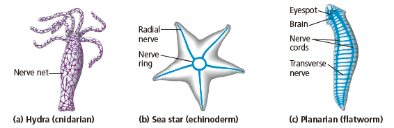
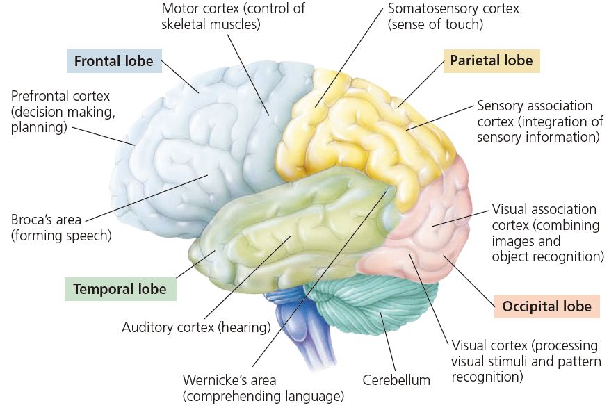

CH 49. 神經的調控 Neural Regulation

**神經系統概述**

- 神經系統的演化
    - 各種動物的神經系統多樣性
        - 
        - 附註
            - 棘皮動物: 每隻手都有 Nerve
            - 扁形動物: 有兩個 Nerve chord
            - 其他大多數的動物都是 vental chord，只有脊索動物是 dorsal
    - 兩側對稱的動物的神經系統 "cephalization"，可分成 CNS、PNS
    - 補充: 神經系統發育模式生物
- 脊椎動物的神經系統
    - CNS
        - 胚胎發育
            - Radial glia 由神經管遷移，形成中樞神經系統
                - 成體仍具備一些 Radial gila
            - Astrocytes 形成 BBB
        - 白質、灰質
            - 白質之所以是白色，是因為髓鞘
        - 補充: CNS 缺乏損傷修復能力
            - 支持細胞不具有修復神經組織能力
                - 寡樹突膠細胞 → 不具有修復髓鞘能力
                - 星狀膠細胞 → 膠質疤
                - 微小膠細胞 → 巨噬細胞、過度發炎
    - PNS
        - Afferent: Sensory
        - Efferent 出: 運動
            - Motor sysytem
            - Autonomic nervous system
                - Sympathetic
                    - fight-or-flight
                - Parasympathetic
                    - rest-and-digest
                - Enteric nervous system

* * *

**脊椎動物的腦部結構**

- 小常識
    - 1011 (一千億個) 神經元
    - 1014 (100 兆) 神經聯繫
- 三大區域
    - Ventricular system 與脊隨中央管相通
    - Forebrain 前腦
        - Cerebrum 大腦
            - Corpus callosum 胼胝體
        - Diencephalon 間腦
            - Thalamus 視丘
                - 感覺中繼站
                - 大腦基部的神經元，準備要發射投射到大腦各處，就在丘腦
            - Epithalamus 上視丘
                - 松果體 (the pineal body)
                    - 分泌褪黑激素 (melation)
                    - Circadian rhythm 生理時鐘
            - Hypothalamus 下視丘
                - 調控內分泌、體溫、飢渴、性
                - 自律神經系統的中心，自律神經訊號不需到達大腦皮質處理
        - 學習、情緒、思考、睡眠
    - Midbrain
        - 調控感覺系統的輸入
        - 視覺、聽覺反射
    - Hindbrain
        - Cerebellum 小腦
            - motor skill learning
            - 手眼協調
        - Pons 橋腦
            - 橋腦連接小腦的左右兩邊，做為橋樑
        - Medulla oblongata 延腦
            - 錐體 (Pyramid)
                - 下行運動神經的左右交叉
    - 腦幹: 中腦、橋腦、延腦
    - 演化發育
        - 在較基底的脊椎動物，後腦的體積比前腦、中腦還大
        - 鳥類、哺乳類的小腦出現複雜皺褶
        - 只有哺乳動物有皺褶
    - 胚胎發育
- 深入探索
    - Arosal and sleep
        - Reticular formation
            - 與控制睡眠有相當關聯
            - 尤其是控制 REM 睡眠
            - 將感覺在延腦、中腦整合後，投射到大腦皮質
            - 同時也與感覺、獎勵系統有關
        - Biological clock
            - Circadian Rhythms 晝夜節律
                - 在哺乳動物，晝夜節律由上視束交叉核 (SCN 控制)
                    - SCN 像是 Pacemaker
                - 會與光線週期同步，是解決 Jet lag 的生理機制
                - 補充: SCN 會受老化影響
            - 相關的分子，其基因表現強弱具有週期性，日夜有別
        - 有些動物可以邊睡覺，邊做很複雜的活動
            - 像是瓶鼻海豚，可以邊睡覺邊游泳。EEG 圖顯示，海豚同時只會有一側的大腦在睡覺
    - Emotions
        - 邊緣系統參與最重要的工作
            - 存放與情緒相關的記憶，並且當類似情境被觸發時，邊緣系統會被活化
            - amygdala
        - 情緒的產生，通常也需要大腦皮質的參與，而不僅是邊緣系統的工作而已
    - 大腦影像
        - PET (正子造影): 放射性葡萄糖
        - fMRI (功能性核磁共振造影): 區域的氧濃度

* * *

**大腦皮質**

- 
- 每個半球都分成四大部分
    - 額葉 (決策、肢體移動計畫)、頂葉 (體感覺)、顳葉 (視覺區)、枕葉 (聽覺區)
        - 中央溝前方為運動皮質，運動皮質前方是運動聯合區；
        - 中央溝後方為感覺皮質，感覺皮質後方是感覺聯合區。
        - 前額葉是大腦決策的重要區域，另外也對於情緒表現非常重要。
- 深入探討
    - **感覺與運動**
        - 感覺皮質與運動皮質都有 homunculus，表示不同的皮質區域對應不同的身體部位
        - 感覺與運動聯合區，負責整合不同層次的感覺與運動。
    - **偏側化 Lateralization**
        - 左腦負責語言、數理邏輯
        - 右腦負責臉部以及圖形辨識、空間關係推理、非口語的思考
    - **前額葉功能**
        - Lobotomy surgery
            - 移除前額葉的患者，通常會有情緒處理障礙、決策障礙
    - **說話相關 (都在左腦)**
        - Broca's area: 病人無法製造符合文法的流暢句子。可以察覺自己說話有問題。
        - Wernicke's area: 此類患者有語言理解障礙。雖然患者能夠說初具語法、速度和語調的言語，但是患者的談話內容沒有意義、不知所云。無法察覺自己說話有問題。
- 演化發育
    - 輻鰭魚的 Midbrain 負責處理和回應視覺訊號。
    - 鳥類與哺乳動物的共同祖先，具有 pallium
    - Song Bird 大腦並沒有皮質皺褶，但是卻可進行複雜的資訊處理。有皺褶的腦袋似乎不是處理複雜資訊必要的解剖構造。

* * *

**記憶、學習的分子機制**

- Neural Plasticity
    - 神經元間的資訊流可增強、可變弱。
    - Autism (自閉症)，是一種發育障礙，其 Neural Plasticity 具有某種問題。
- 短期記憶與長期記憶
    - 短期記憶通常由海馬迴連結到皮質
    - 長期記憶則是皮質與皮質間的聯繫
- 長期記憶的固化 (consolidation)，牽涉到與大腦皮質的連結。
    - 此過程通常被認為在睡眠當中發生。
- 海馬迴受到損傷的患者，無法形成短期記憶，也無法形成長期記憶。但是先前的記憶並未受損。
- LTP 形成
    - 神經遞質: Glutamate
    - 必須要同時有 AMPA、NMDA receptor 活化
    - 步驟
        - Open NMDA，被 Mg2+ Block，需要被去極化，才有辦法移除 Mg2+ (單靠 Glutamate 不能移除 Mg2+)
        - 去極化的同時，引發下游路徑，讓預先儲存在突觸後細胞內的 AMPA 插入到細胞膜上
        - 往後，只要有 Glutamate，就會活化 AMPA，導致突觸後神經元去極化，進而使 NMDA 受器發揮作用

* * *

**神經系統疾病的分子機制**

- **思覺失調症**
    - 特徵
        - hallucination 幻覺 (幻聽、幻視)
        - delusion (妄想)
    - 治療
        - (補充) 可分成典型抗精神藥物與非典型抗精神藥物 (第二代抗精神藥物)
            - 第一代藥物可能會造成椎體外反應的增加
            - Risperidone, Quetiapine
- **憂鬱症**
    - 特徵
        - 在睡眠、食慾和精力上面缺乏
- **雙極性情感疾患**
    - 特徵
        - 兩種時期: manic, depressive
            - manic 又可分成輕度、重度
- 退化性神經疾病
    - **阿茲海默症**
        - 流行病學
            - 65 歲以上約 10%，85 歲以上約 35%
        - 組織切片、影像
            - 類澱粉斑塊 (amyloid plaques)
                - β-amyloid 沉澱
            - 神經纖維糾結 (neurofibrillary tangles)
                - tau 蛋白
            - 大腦空洞化
        - 可能機制
            - β-amyloid 前驅物受到不正常切割，在細胞外累積
            - tau 蛋白參與神經元的微管組成，但是在阿茲海默症當中 tau 蛋白，會不正常的自我摺疊
                - 早發阿茲海默症的早期病情進展，可能與 tau 蛋白摺疊有關
            - 利用這些機轉與解釋發展的治療方式，沒有任何一個通過臨床試驗
    - **帕金森氏症**
        - 組織切片
            - 觀察的到基底核「黑質區」病變
        - (補充) 家族遺傳性帕金森氏症可能機轉
            - 正常: 受損的粒線體可經由細胞自噬而被清除
                - 正常的粒線體具有正常的氫離子膜電位梯度
                - 此梯度可使得 PINK1 被運輸到粒線體內部而快速被分解
                - 粒線體受損
                    - 當粒線體電位被破壞，PINK1 會自體磷酸化，並在粒線體外膜累積
                    - 細胞質的 Parkin 蛋白轉移到粒線體外膜上
                    - 某些粒線體外膜蛋白被泛素化修飾 (Ubiquitination)，最終引發細胞自噬路徑
            - 不正常: PINK1 或 Parkin 蛋白失去功能
                - 無法有效清除受損的粒線體，導致細胞死亡
        - 可能治療方案
            - 燒灼破壞術
                - 清醒開顱手術，可確保患者保留必要腦部功能
            - 深腦刺激
                - 利用類似 pacemaker 的東西，調控大腦不正常的訊號傳遞
            - 植入幹細胞
            - L-Dopa 治療