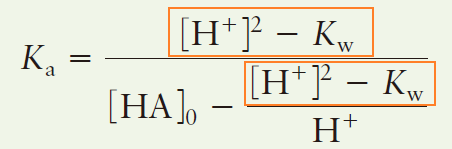
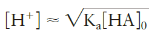
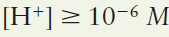
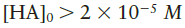
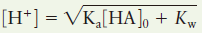

CH 07. 酸鹼 Acids and Bases (含統整: 該用哪個公式)

**基礎觀念**

- 酸鹼定義
- 酸鹼強度
    - conjugate base 共軛鹼
    - 由 Ka 大小比較酸鹼強度
    - 水的酸鹼值
- pH 值
- 鹽類、酸鹼中和定性分析
    - 強酸加強鹼
    - 弱酸加強鹼
    - 弱鹼加強酸
    - 弱鹼加弱酸
        - 比較複雜

* * *

**計算**

- 基本計算
    - 利用 Ka 求弱酸溶解的氫離子濃度
        - 假定 濃度 >> x
    - 利用 Ka 計算解離度
- 涉及多個 Ka
    - 同離子效應，由較強酸決定氫離子濃度
    - 多質子酸解離
        - 硫酸的 Ka2 不可忽略
        - 其他
            - Fraction 定義
- 極弱酸解離，水所解離的氫離子不可忽略，需引入下列條件計算
    - 電中性原理
        - 正負放兩邊
        - 價數當係數
        - 注意氫氧根、氫離子
    - 濃度加總為定值
        - 原本酸的濃度 = 逐步解離
        - 多質子酸，例如磷酸
            - [原本酸濃度] = [磷酸濃度] + [磷酸二氫根] + [磷酸氫根] + [磷酸根濃度]
                - 左邊放原本的
                - 右邊從未解離的原酸，逐步解離
                - 不可能會有氫氧根、氫離子
- 共軛鹼計算

* * *

**統整：到底該用哪條公式**

* * *

- 先用  求
    - 若 
        - 直接是答案
    - **若 [H+] 比 10^-6 M 小** → 需要考慮水
        - (10^-6 * 5%)
            - 
        - **[HA]₀ < 2×10^-5 M**
            - 用   求出的 [H+]
            - 猜一個比算出來的 [H+] 還要大的數字，帶入「分母」，用 Ka 解分子的 [H+]