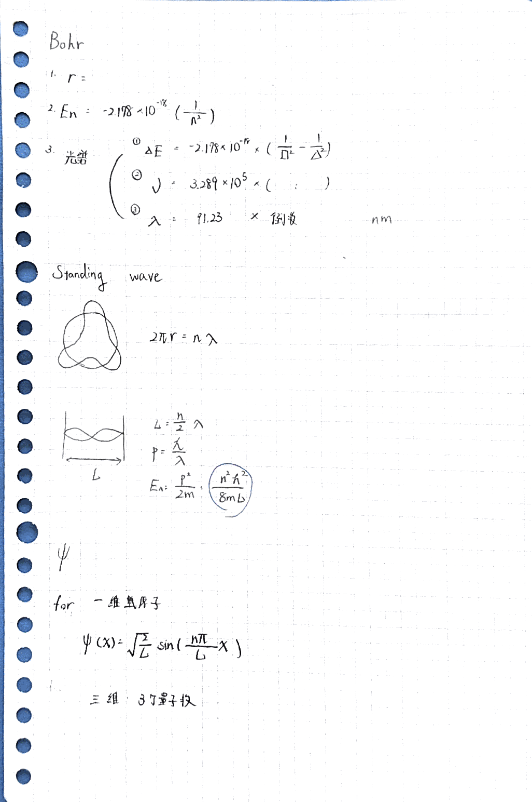

CH 12. 量子力學以及原子相關的理論 (含紙本筆記) Quantum Mechanics and Atomic Theory

- **波耳氫原子模型: 利用量子化，成功解釋氫原子光譜**
- **薛丁格方程式 for Particle in the box**
    - Particle in the box: 電子在一維弦上形成駐波
    - 駐波能量公式可由: 動量動能互換、物質波公式、駐波條件 (弦長)
    - 薛丁格方程式 for Particle in the box 推導重點
        - 為何要用 sin : 滿足邊界條件 boundary condition
        - sin 函數的伸縮也是與 boundary condition 有關
        - 使用積分得到 √(2/L)
- **電子出現機率與薛丁格方程式平方成正比**
    - 電子出現機率 = (薛丁格方程式)2 × 4π(軌域半徑)2
    - 軌域為電子出現機率為 95% 的範圍
    - 測不準原理
- **多質子****與****多電子**
    - 類氫原子 (總共只有一個電子，Li2+) 光譜可由波耳氫原子模型推廣得到
    - 一維的電子要一個量子數，三維就要三個
        - Particle in the Box 無法解釋任何實際的現象
        - 三維會解出很多個薛丁格方程式
- **元素週期表**
    - 遮蔽效應：內層電子降低原子核的正電性，故對外圍的電子吸引力降低。
    - 過渡金屬：左到右，電子增加，半徑變小，但是又被遮蔽效應影響，故過鍍金屬沒有週期性。

* * *

**紙本筆記**
(包含 波耳氫原子模型、一維弦上駐波形成的能量、薛丁格方程式 for Particle in the box)

