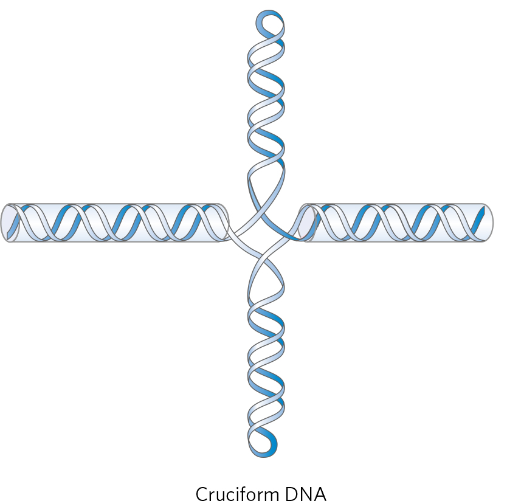

## DNA Supercoil

- **DNA Supercoil 基本介紹**
  - Coil of coil
  - 受到嚴密調控
- **一條 DNA，可以比 typical B form DNA 轉的更少 turn，也可以轉的更多 turn**
  - relaxed : turns 數量 = bp / 10.5，此為熱力學最穩定的形式
  - underwound : turns 數量小於 relaxed state
  - overwound : turns 數量大於 relaxed state
- **Underwound, Overwound 並非熱力學穩定 (Strained)，傾向形成 Supercoil 而穩定**
  - 以 Underwound 舉例
    - 直觀的想法是少 turn 的地方直接雙股分離，但此狀態熱力學非常不穩定
  - 形成 Supercoil 可以釋放 underwound, overwound 造成的 strain。
    - 形成 supercoil 過程並沒有改變 turn 數，但藉由 supercoil 空間關係，使得 turn 數不一定要和 relaxed form 一樣才能夠產生 3.4 nm 的 pitch。
  - 
- **DNA supercoil 的重要性**
  - 電泳速度不同 : Supercoil 越多，跑的速度越快
  - DNA 通常維持在 underwound 狀態以方便進行基因表達、DNA 複製
  - 可形成特殊 DNA 結構
    - Cruciform DNA，在細菌辨識序列扮演重要角色
      - 
    - 協助 Z-DNA (left-handed) 的折疊
  - 染色體的摺疊也需要 Supercoil
    - Plectonomic (right-handed)
      - 質體通常以此種方式折疊
      - 可能會產生 branch
    - Solenoid / Toroid (left-handed)
      - 染色體通常以這種方式摺疊
      - 若沒有蛋白質協助很難完成
    - 
  - 許多化療藥物的 target 就是 Topoisomerase (生藥)
    - Camptothecin (喜樹鹼) : Topoisomerase I 抑制劑
    - Etoposide (普達非倫毒素衍生物) : Topoisomerase II 抑制劑
- **計算 wound 程度 : Superhelical density (Specific linking difference)**
  - ∆Lk / Lk_of_relaxed_state
  - 一般生物約介在 -0.05 ~ -0.07
- **在環狀 DNA，可利用 Linking number 定量的討論整條 DNA wound 的程度**
  - Linking number 定義
    - 僅限環狀 DNA，Nick DNA, Linear DNA 都不在討論範圍內
    - 將一股 DNA 當作一個平面，看另一股由下而上 (或由上而下) 穿過平面幾次。
      - 不要上下都算一次
      - 
    - 若環狀 DNA 分子只有 Lk 不同，將其稱作 topoisomers
      - 轉換之間必須要斷鍵
  - 整個 DNA Linking number 的改變，將會造成整條 DNA overwound 或 underwound
    - Linking number 減少，造成 underwound
    - Linking number 增加，造成 overwound
  - 整條 DNA underwound 會造成 negative supercoil，而 overwound 則反之
    - LK 下降 → underwound → negative supercoil : right-handed
    - LK 上升 → overwound → positive supercoil : left-handed
    - 
      - [圖片來源](https://www.researchgate.net/figure/Supercoiling-its-handedness-and-sign-A-Negatively-supercoiled-DNA-left-loses_fig2_5946489)
  - 懷特公式
    - Lk = Twist + Writhe
    - Writhe 就是 ∆Lk，Lk_0 就是 Twist (bp / 10.5)
- **線狀 DNA 不能討論 Linking number 變化，但是仍有 underwound, overwound 的問題**
  - 仍有 underwound, overwound 的問題，就代表仍會產生 supercoil
  - 此現象發生於兩端為固定端的情況
  - 當線狀 DNA 形成兩端固定的 Loop 時，情況可近似於環狀 DNA
- **Underwound, overwound 也可以只發生在局部，不一定要是整個 DNA**
  - 何時會發生 : DNA 解旋的時候，會造成局部 underwound，局部 overwound 
    - 解旋後的端會產生 underwound (畢竟 turn 數較少，比較好分開)
    - 還沒解旋的端 (在更 downstream 的地方) 則產生 overwound (互補的概念)
    - 隨著轉錄往下進行，還沒解旋的端，overwound 會越來越嚴重
  - 
- **Topoisomerase 可以造成或紓解 underwound, overwound**
  - 共通的邏輯就是把 DNA 切斷，轉 360 度，讓 Supercoil 圈數改變，再接回去就可以了
  - Topoisomerase 可分成 Type I, Type II
    - Type I
      - 一次打斷一股
      - *E. coli* Topo I, Topo III
    - Type II :
      - 一次打斷兩股
      - *E. coli* Topo II
  - *E. coli* 的 Topoisomerase 有三種。
    - Type I
      - Topo I, Topo III
      - 一次打斷一股
      - 將 underwound 的 DNA 加入新的 turn (做一次 Lk + 1)
      - Topo I 機制
        - 重點摘錄
          - 不需 ATP，因為加入新的 turn 是熱力學 favored
          - 活性中心是 Tyrosine
          - 斷掉那一股的斷點之 5' 端被 Tyr 固定，3' 端可擺動
        - 細節
          - 在 Closed Conformation 中，Tyr 攻擊磷酸根，使單股斷開
          - 酵素轉成 Open Conformation，此時未斷開的單股翻轉而重疊在斷股上
          - 酵素回到 Closed Conformation，此時斷掉那一股的斷點之 5' 端被 Tyr 固定，3' 端可擺動。3' 端擺動使其穿過未斷掉那股，回去和原本的 5' 端接合。
        - 
    - Type II
      - Topo II
        - 又稱作 DNA gyrase
        - 在解旋酶後方鬆開解旋造成的局部 overwound)
      - 一次打斷兩股
      - 將 DNA underwinding (做一次 Lk-2)
  - 真核生物的 Topoisomerase 有很多種，最重要的是 Topo I, IIα, IIβ, IV
    - Type I : 如 Eukaryotic Topo I, III (*E. coli* 也是 1 跟 3)
    - Type II 比較複雜，可分成 Eukaryotic Topo IIα, IIβ