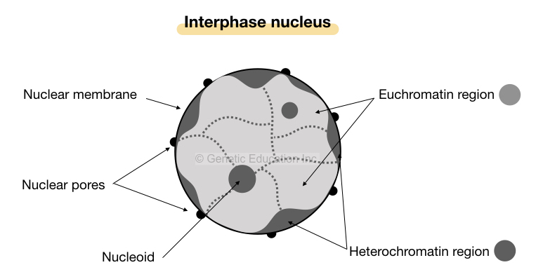

## 不同生物的染色體

- 原核生物環狀染色體構造
  - 原核生物 DNA 染色體構造
    - 環狀 DNA
    - 占用很大一部份的細胞質
    - 有一部份黏在細胞膜上面
  - 原核生物 DNA 會形成類似細胞核的結構，稱作 Nucleoids (類核體)
    - 主要是 DNA Supercoil 形成，其次才是 Protein interaction
  - 粒線體、葉綠體也有 DNA
    - 植物的葉綠體、粒線體 DNA bp 數量遠比動物的還多。
- 真核生物線狀染色體結構
  - 染色體的構成
    - DNA (至少須包含 telomere, centromere, replication origin)
    - Histone
    - 其他非組蛋白的蛋白質

## 真核生物的染色體結構形成

- 染色體的結構會隨細胞週期的進行而改變
- **染色體的最小單位 : Nucleosomes (DNA + Histone)**
  - DNA 以 Solenoid (left-handed) 方式纏繞在 Histone 上方
  - 纏繞在 Histone 上面的 DNA 有約 146 bp
  - 連接兩個 Histone 之間的 "linker" 有 54 bp
  - 加起來大概 200 bp
  - 
- **Histone 的結構與功能**
  - 以 8 個單元構成 octamer
    - H2A, H2B, H3, H4 各有兩個，唯獨沒有 H1
    - 
  - 圓盤區域有非常多帶正電的胺基酸 (Lys, Arg)，可和帶負電的 DNA 緊密連結
    - AT rich 會使得 DNA 與 Histone 結合更緊密
    - GC rich 會使得 DNA 與 Histone 結合較疏離
  - 纏繞 DNA 時，以 underwinding 的方式纏繞
    - 所以需要有 topoisomerase 紓解互補產生的 overwinding
  - Histone Tail 可能還參與 Nucleosomes 之間的 Interactions
    - 
  - Histone Modification
    - Histone Tail 並沒有任何結構，但可以共價修飾，調控基因表現
    - 通常 methylation = silence, acylation = more expression (並非絕對)
    - 某些修飾會導致 Heterochromatin 的產生 (與之相對的是 Euchromatin)
      - Heterochromatin 的形成是 Chain Reaction
      - 很像是 Heterochromatin invades euchromatin
      - Barrier Protein 可辨認 Barrier seq. 並 bind，阻止 reader-writer complex 繼續把所有的染色體變成 Heterochromatin
    - 修飾機制概述
      - regulatory proteins recruit *writer complex*
      - 部分會形成連鎖反應 (chain reaction)
        - reader complex detects modification, recruiting writer complex
        - forming reader-writer complex
      - eraser complex 可「擦除」修飾
- **核小體接著纏繞成 30nm fiber 結構 (little evidence *in vivo*)**
  - 主要由 H1 結合在 linker DNA 上面形成 (H1 不構成 Histone Core)
  - 
    - [圖片來源](https://en.wikipedia.org/wiki/Chromatin#30-nanometer_chromatin_fiber)
- **Crumpled globule 結構可能是 *in vivo* 的染色體濃縮方式**
  - 由 10 nm fiber (也就是 beads on a string) 摺疊出來
  - DNA 是以 Loop 的方式掛在所謂的 Chromosomal Scaffold 構造上
  - Chromosomal Scaffold Proteins
    - Topo II, SMC Protein
  - DNA Arrangement of Condensed Chrosome (看最右邊那張圖)
    - 
- **濃縮的染色體構造由 SMC Protein 維持**
  - SMC Protein 的構造
    - 有五個 domain
    - C terminal + N terminal 可以形成一個 ATP binding site
    - 
  - SMC Protein 的類型
    - Cohesins
      - 協助姊妹染色體連結
    - Condensins
      - 製造 Positive Supercoil，使染色體在細胞分裂更濃縮
  - Cohesins 與 Condensins 的作用
    - Cohesin 在 DNA replication 前就已經加入
    - 在 Anaphase 的時候，姊妹染色體分離，靠的就是 Separase 將 Cohesin 水解
    - 在 Telophase 後，染色體要「去濃縮」，需要移除 Condensins
    - 
    - 有證據顯示，Condensins 或許是形成 Rosette 的結構去濃縮染色體
    - 
- **染色質的結構是動態的，而且會影響到基因表現**
  - **Heterochromatin / Euchromatin**
    - Heterochromatin 上的 DNA 序列較難被存取，因此其基因表達會受限
    - 可在 Interphase 的時候觀測到有些核小體比較 condensed，有些比較沒這麼濃縮
    - Heterochromatin 通常在圍繞在核膜內側，而 Euchromatin 在細胞核中央
      - 
    - [圖片來源](https://geneticeducation.co.in/euchromatin-vs-heterochromatin-differences-and-similarities/)
  - 每個核小體在核中有固定空間，並且可移動，讓核小體之間有 interaction
    - Chromosome territory
    - 利用 Chromosome Conformation Capture 技術可以知道 Interaction 的發生
  - 染色質的結構可被表觀遺傳 epigenetic inheritance 傳承

## 補充 : ATAC-seq : 檢測 Chromatin Accessibility

- 重要的酵素為 Tn5 transposase，看字面就知道跟 Transposon 有關。此酵素作用的地方其 Chromatin Accessibility 較高。
- 因此後續就分析原本的核酸序列，哪裡被插入較多 Transposon-related sequence，就知道哪裡 Chromatin Accessibility 較高。
- ATAC-seq 較有趣的地方
  - 還可以分析 Regulatory Protein Binding DNA 的地方。通常出現在 ATAC-seq 圖譜的高峰處中央 (會突然凹陷下去)。因為此部分被 Regulatory Protein 佔領，因此 Transposase 無法作用。
  - 可透過 Chromatin Accessibility 推測細胞種類
  - 臨床上可應用於癌症預後評估
    - 若幹細胞相關的基因座 Chromatin Accessibility 較高，預後會較差
    - 甚至可用於評估癌細胞是來自於哪種器官。同樣的 oncogene，在不同的器官其 Chromatin Accessibility 程度不同，位置也不大相同。
  - 研究上可研究 Oncogene 的位置，以及常見的突變
    - Oncogene 通常都會大量表達 (在 Euchromatin)，因此 ATAC-seq 數據會較高
    - 可以分析 ATAC-seq 較高的地方其序列，了解常見的突變類型
  - 可建構 enhancer connectome map，尋找 disease-associated DNA element
  - Perturb-ATAC : 針對單一細胞做 ATAC，然後做幾千、萬遍這樣
