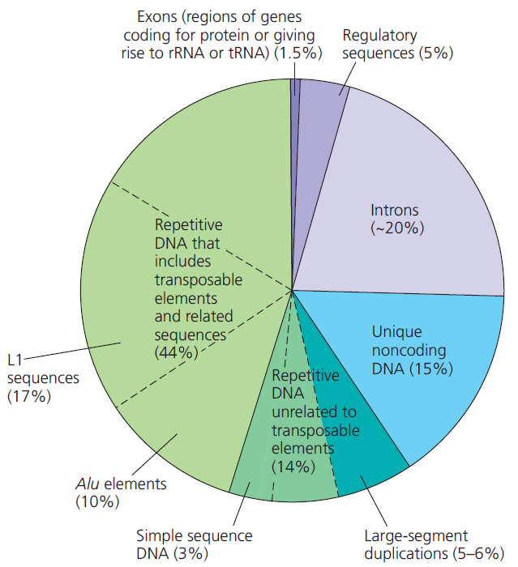

## 人類基因組的構成

- Repetitive Sequence 在細菌不常見，但在真核生物相當常見。
- 只有 **1.5%** 的基因組是 Exons
- 約有 **20%** 的基因組是 Introns
- Transposon 相關的 Repetitive DNA 占了將近 **50%** 的基因組
  - 其中 L1 sequence, Alu sequence 是比較重要的
- Simple Sequence Repeats 約佔 3%
  - 又稱作 Short tandem repeats, Microsatellite
  - 一單位約 10bp 以下，重複數百萬次
  - 重要的 SSRs
    - Centromere (著絲粒)
      - 位於一條染色體的中央
      - AT rich
      - 與染色體著絲有緊密關聯
    - Telomeres (端粒)
      - 位於一條染色體的兩端結尾
      - 5'-TG rich
      - 受 telomerase 催化形成
      - 正常人細胞可分裂 52 次 (Hayflick limit)
    - 其他 SSRs
      - 散佈在 Centromere, Telomeres 中間
      - 形成機制可能來自於 Replication slippage
      - 作為遺傳圖譜鑑定、法醫鑑定使用
  - 會在離心的時候，和其他基因組分開，形成 Satellite DNA
    - 形成夾心餅的構造，內餡是其他基因組，外面的餅乾是 Satellite DNA
    - 因為 SSRs 通常是 AT rich 或 GC rich，和其他的基因組密度稍有不同
- 基因組只有很小一部份的序列已知功能
  - 其他的部分可能參與調控
    - 有些部分作為 Control element 或 promoter
    - 有些部分會轉錄出調控用的 RNA，但不會轉譯出蛋白質
  - 另外也有其他說法
    - Junk genes (unwanted)
    - Pseudogene
    - 保護重要基因
- 注意 Repetitive sequence 的定義並無考量是否為 Protein-coding region
  - 所以有些 duplicated protein-coding genes 也可以是 repetitive sequence

## 補充 : 基因組與演化

- 普生觀念的反思
  - Microevolution 通常來自於突變
  - 但是 Microevolution 真的能累積成 Macroevolution 嗎？
- Macroevolution 的可能發生方式
  - Conserved Seq. 的改變，很可能帶來巨大的影響
    - 例如 : human accelerated regions
  - 形態學上的巨大演變，通常來自於調控發育的調控基因發生突變
  - 很多時候，一個新的基因出現，並不是核苷酸的突變累積，而是現有基因的複製和突變
    - Gene duplication
    - Divergence of duplicated gene
    - Gene Family
    - Pseudogenes
  - The Recombination of Exons
- 基因突變發生的原因
  - DNA 複製、修復機制的缺失
    - DNA 複製的時候，有時出錯時必須要修復，但修復時不小心配對到錯誤的模板
    - DNA 受到外界傷害必定會被修復，但是修的也許不好
  - Transposon 跳來跳去，有時候會導致新的基因產生
    - 例如插進去 Intron
- 易搞混的觀念
  - Speciation 並不是 Natural Selection 的結果
    - Speciation 來自於不同 Population 的 Gene Flow 被 Barrier 切斷的結果
    - 最主要來自於地理隔離，但基因突變出 Barrier 也是有可能的
    - 後來差異越來越大，直到前合子屏障、後合子屏障都出現後，種化就完成了
  - 突變的個體若能倖存，將可能使突變以某種分布方式分布於族群中s