# DNA 複製

## 1. 概論與酵素整理

### 1-1. 概論

- DNA 的複製非常精確，來自於以下機制
  - 經過調控的核苷酸生合成，使每種 dNTPs 的數量平衡
  - 鹼基配對
  - Proofreading, 3'→5' exonuclease
  - Mismatch repair

### 1-2. DNA Polymerase 催化特性

- 不能 de novo synthesis 出一條新的 strand，只能延長已經存在的
  - DNA Primase 先製造出 **RNA Primer**，接者 DNA Pol 再延長此 Primer
- 具有 Proofreading、3'→5' exonuclease 活性 (3 subunit)
  - mismatch DNA strand 在 3' 端體積較大 (因為 bond energy 較小)
  - 和 DNA Pol III 的構形不合，阻止繼續接上新的核苷酸
  - 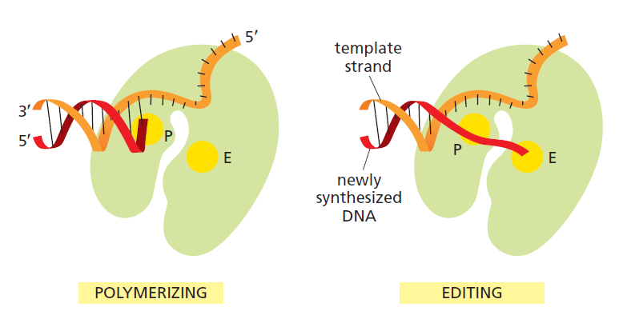
- 催化機制
  - 催化中心具有三個 Asp，其中有兩個 Asp 是 highly conserved
  - 催化中心具有兩個 Mg^2+^ 作為 cofactor

### 1-3. 其他 Enzymes

- Dna 家族
  - Dna 蛋白全部都是 ATPase，屬於 AAA+ ATPase 家族
- Topoisomerases
  - DNA gyrase 為 Type II Topoisomerase
- Endonuclease vs. Exonuclease
  - endo = 在 DNA 中間直接直接切開
    - 例如 restriction endonuclease
  - exo = 在 DNA 的其中一端拔除若干核苷酸
    - 通常具有方向性，5'→3' 或 3'→5' 

## 2. *E. coli* 的 DNA 複製

### 2-1. *E. coli* 的 DNA 聚合酶

- 細菌至少有五種 DNA 聚合酶
  - **DNA Pol III** 是 DNA Replication 最主要的聚合酶
    - 在細胞內數量很少，因為受到嚴格調控
    - 具有高 Polymerization rate, Processivity, Vmax
  - **DNA Pol I** 最主要用於小片段核苷酸的清除
    - 在細胞內數量相當多，但速度太慢，不適合進行整個 Genome 的複製
    - 研究顯示 *pol1* 的缺陷，會使 DNA 非常容易受損，但不至於完全無法生長
    - 同時具有 3'→5' 和 5'→3' 端的 exonuclease 活性
      - 3'→5' exonuclease 近似於 Pol III 的 Proofreading
      - **5'→3' exonuclease** 是其他 DNA Pol 沒有的功能
    - 可由蛋白酶水解出兩個 fragments
      - 靠近 N 端是小片段，具有 5'→3' exonuclease 的能力
      - 靠近 C 端是大片段，此片段可獨立進行 DNA 聚合、3'→5' proofreading
        - 又稱為 Klenow fragment，是 PCR 最早用的 DNA 聚合酶
  - **DNA Pol II, IV, V** 用於 DNA 修復與重組
    - 如 DNA Pol V 用於 SOS response
- 整個 DNA Pol III Holoenzyme
  - 這些 subunit 並非來自於相同基因
  - 主要由三大部分組成
    - **Pol III Core polymerase**
      - **α subunit** 負責催化聚合反應
      - **3 subunit** 負責 3'→5' 的 Proofreading (具有 exonuclease 活性)
    - **Sliding clamp (β subunit)**
    - **Clamp-loading complex (γδδ' subunit)**
  - Holoenzyme = 擁有 cofactors 或其他 proteins，而得以工作的酵素系統

### 2-2. 起始

1. **DnaA** 結合到 R、I sites 上
   1. 造成 DNA 纏繞形成 positive supercoil
   2. 此壓力造成 **DUE** site 附近的雙股打開
      - DUE = DNA Unwinding Elements
2. **DnaC** 幫助 **Helicase (DnaB)**結合上單股 DNA
   - 確保 DnaB 正確接合後，DnaC 離開
3. **Helicase (DnaB)** 沿著單股的 5’ 往 3’ 移動並把雙股打開
   - 這是最重要的一步
   - Helicase 是 **ATPase**，通常會結合在某一股上，而非完整包覆兩股
   - DnaB 連結並將 **DNA Pol III** 以及其餘蛋白送入中心
4. **SSB**（single-stranded DNA-binding protein）結合並穩定單股。
5. **DNA gyrase**：在複製叉前方釋放壓力，是一種 type II topoisomerase。
6. 當 DNA Pol III 穩定的起始 DNA 複製後，將有分子機制確保複製只發生一次
   - Hda 機制
     1. 發生於 DNA Pol III 與 DNA 穩定結合後
     2. **Hda** 結合 DNA Pol III 的 **β subunits**，並水解 ATP
     3. 水解 ATP 的過程中，使 DnaA complex 全部脫離
     4. 下次 DnaA 和 ATP 結合，就是下次複製了
   - ***oriC* 的 methylation** 會影響 DNA 複製
     - 剛複製的 DNA 是 hemimethylated
     - 半甲基化的 *oriC* 透過與 **SecA** 和細胞膜作用，將細菌分成兩個細胞
       - 母、子細菌的 DNA 都有一部分會黏住細胞膜，往兩側將 DNA 分開
     - 完成分裂後，SecA 和 *oriC* 脫離
       - 其 *oriC* 才被 Dam 甲基化

### 2-3. 延長

- **Replication Fork** 形成

  - Pol III 繼續留在中心
  - SSB 結合單股 DNA
  - DNA gyrase 在複製叉前方釋放壓力
  - **Primase (DnaG)** 與 **DnaB Helicase** 形成 Primosome
  - **DNA Pol I** 將 Primers 移除，而 **DNA ligase** 則填補中間的縫隙
  - Replication Fork 的移動方向
    - from https://ib.bioninja.com.au
    - 注意此圖的 Origin 兩端 Leading, lagging 的位置互相對調
    - 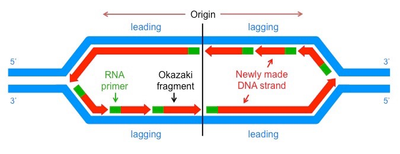

- 切除 RNA Primer, 把 Nick 填補起來, 把兩個 Fragments 黏在一起是一連串的過程

  - **DNA Pol I, RNase H1** 用於切除 RNA Primer
    - 兩者均有 5'→3' exonuclease 活性
  - DNA Pol I 填補 RNA Primer 切除後留下的 Nick
    - 此時兩個 Fragments，一個較靠近延遲股 5' 端，一個較遠離延遲股 5' 端
    - 較靠近 5' 端的 Fragment (下圖右方區段) 延伸其 3' 端，填補 Gap
  - **DNA Ligase** 將已經填補 Nick 的兩個 Fragments 黏在一起
  - 下圖為整個流程
    - 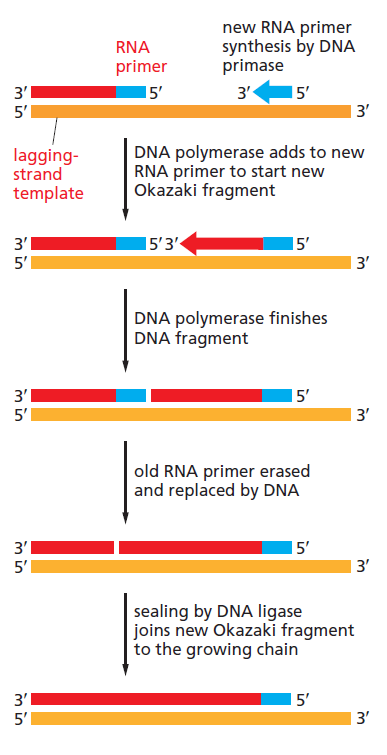
  - DNA Ligase 的作用機制
    - 在 DNA ligase 上的 Lys 接上 AMP，放出 pyrophosphate 
      - 病毒與真核生物**消耗 ATP**
      - 細菌則是消耗 NAD+，放出 nicotinamide mononucleotide (NMN)
    - 將 AMP 接在 5’phosphate end 上面
    - 3’ hydroxyl end 親核攻擊 5’ phosphate end
    - 形成 phosphodiester bond。
    - 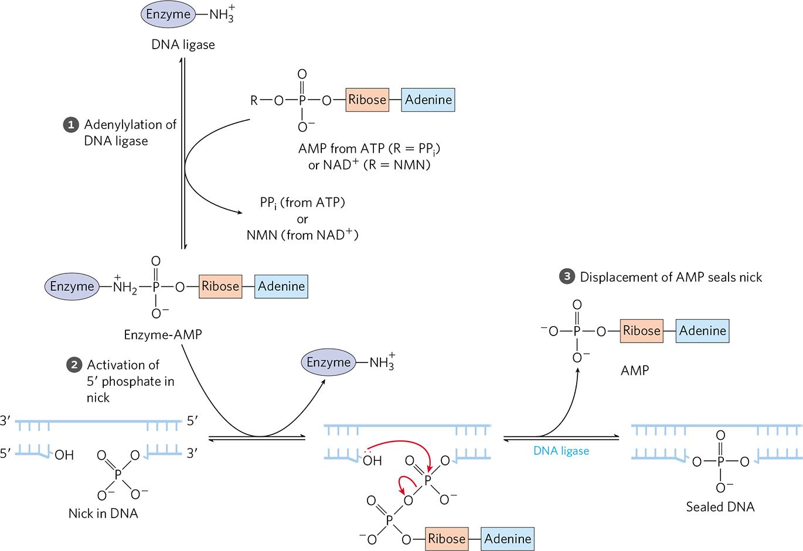

- **Sliding Clamp** 協助 DNA 聚合酶穩定的連結模板股

  - DNA Pol III Core enzyme 對於 DNA 的 affinity 太低
    - 若沒有 Sliding Clamp (β subunit) 協助，DNA 只能聚合幾個 dNTPs
  - 只要 DNA Pol III 碰到雙股，Sliding Clamp 就會和 DNA 聚合酶脫離

- Clamp Loader 會將 Sliding Clamp 與 Core enzyme 結合

  - 過程中會消耗 ATP
  - 結合 ATP 的 Clamp Loader 會將 Sliding Clamp 打開
  - 在 Clamp Loader 水解 ATP 的過程中，Sliding Clamp 會繞住 DNA 並閉合
  - 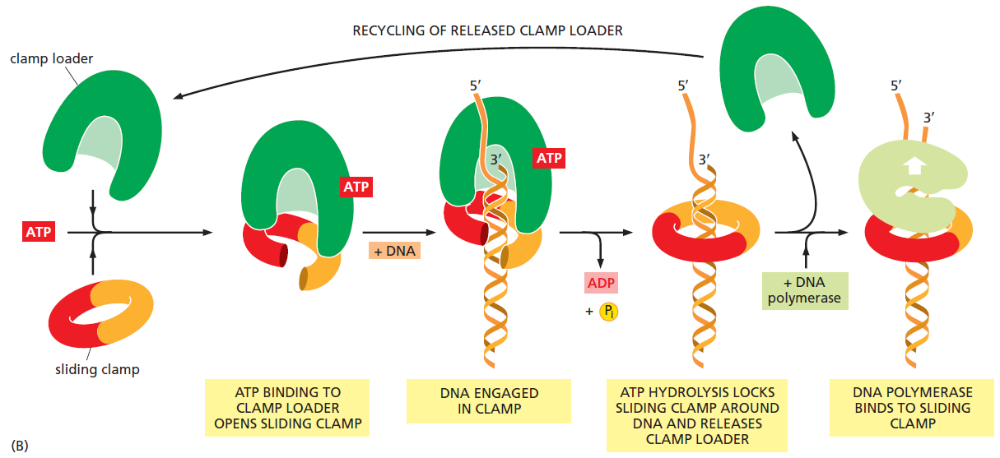

- Leading strand (領先股) 和 Lagging strand (延遲股) 的合成差異

  - 領先股和延遲股的合成方向都是 **5'→3'**
  - 在領先股中，DNA Pol III 不停的合成新股，中間不需更換
  - 在延遲股中，當 DNA Pol III 遇到已經合成好的 Okazaki Fragment，會脫離 DNA
    - 此時需要更換 DNA Pol III
    - Clamp Loader 會將 Sliding Clamp 與 Core enzyme 結合

- 看圖說故事了解兩股合成的差異 ([影片連結](https://youtu.be/7Hk9jct2ozY))

  1. 圖一
     - 藍紫色為 DNA Pol，綠色為 Sliding Clamp
     - 中間粉藍色伸出手的部分為 Clamp Loader
     - 粉紫色部分為沒有 Sliding Clamp 的 Core enzyme
     - 左側水藍色部分為 DnaB (Helicase)
     - 由圖可見，一個有效率的 Replisome 需要三個 Core enzymes
     - 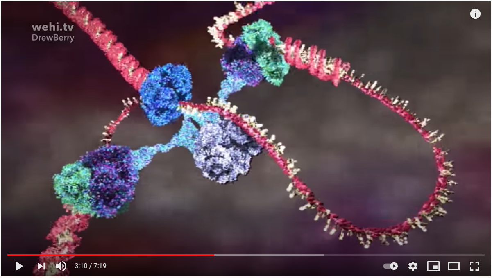

  2. 圖二
     - 橘色框框中，棕綠色的 DnaG (Primase) 與水藍色的 DnaB (Helicase) 結合
       - 合成一小段 Primer 之後 DnaG 會脫離 DnaB
     - 黃色框框中，為 Open Form 的 Sliding Clamp，與 Clamp Loader 結合
       - Clamp Loader 此時為 ATP-bound
       - Clamp Loader 水解 ATP 過程中，將會閉合 Clamp Loader，使其繞住 DNA
     - 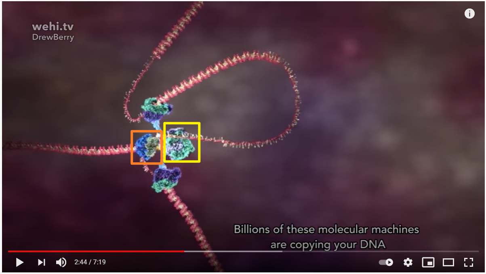

  3. 圖三
     - 當紫色的 Core Enzyme 碰到雙股時，就會脫離 DNA
       - 留下綠色的 Sliding Clamp 在 Lagging strand 上
       - 雙股也就是已經合成好的 Okazaki Fragment
     - 此時圖二中正在組裝的 Core Enzyme + Sliding Clamp 已經組裝完
       - 已經組裝好的這兩隻，將重新定位到黃色框框位置
       - 而脫離 Sliding Clamp 的 Core enzyme 將移動到圖二黃色位置
         - 與下一個 Sliding Clamp 結合
     - 最後會回到圖二的狀態
     - 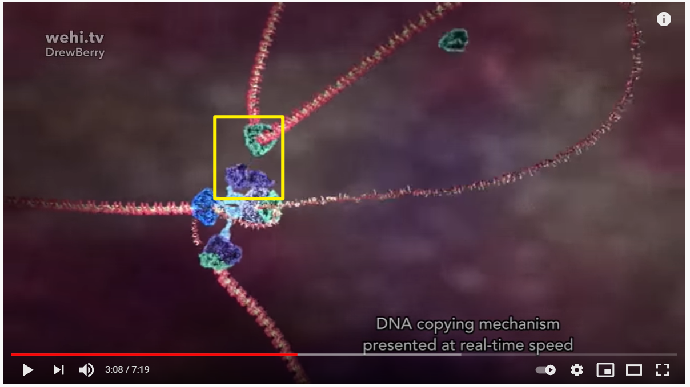

  4. 圖四 (簡化版)
     - 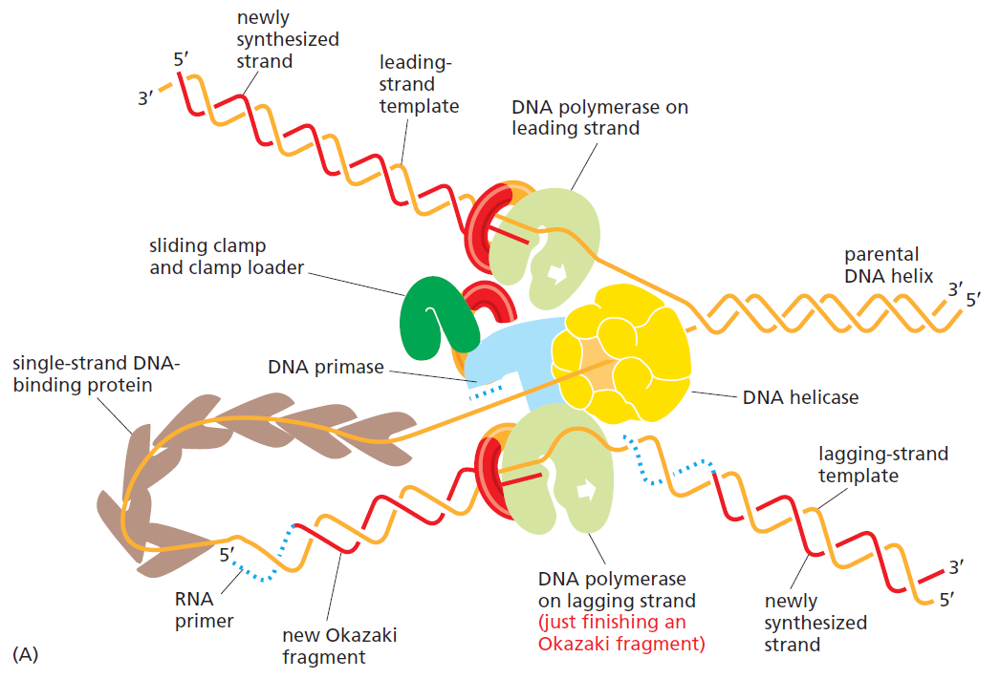

### 2-4. 終止

- 根據預測，兩個 Replication Fork 最後會撞在一起 (見下圖)
  - 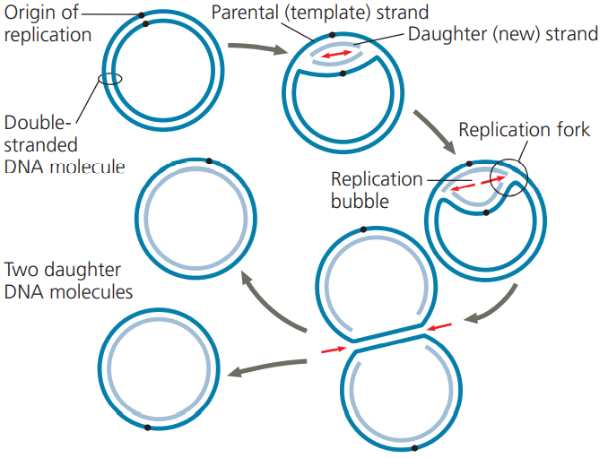
- *E. coli* 染色體包含了 Ter seq. ，似乎在終止合成上扮演重要角色
  - 在眾多的 **Ter seq.** 只有最先與 DNA 複製叉接觸的 Ter sequence 會有作用
    - 形成 **Tus-Ter** complex (Tus 為一種辨認 Ter 的 Protein)
    - 會大幅降低 DNA 合成速度，甚至停止
    - 複製叉的兩端各會有一個 Ter sequence 起作用
  - Ter seq. 的位置
    - 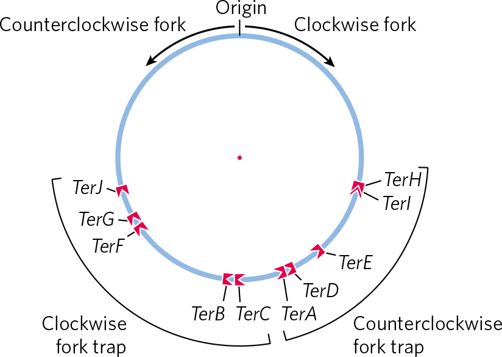
  - 當複製叉的兩端互相接觸時，DNA 複製將會停止
    - 當一股複製比較慢時，Tus-Ter 交互作用可以防止另一股的 DNA over replication
  - 當 DNA 複製叉兩端都接觸到 Ter seq 時，複製叉兩端還會有幾百個鹼基對的距離
    - 最後的幾百個鹼基對仍會複製 (機制尚未明瞭)
  - 最後形成以 **catenanes** 形式互相連接的兩個 DNA circles
    - 需要以 **topoisomerase IV** 將其拆散成兩個 DNA circle 再送到子細胞中
    - 其他環型 DNA 複製的 DNA 分離機制類似 (例如病毒)

## 3. 真核生物的 DNA 複製

### 3-1. 起始

- 真核生物具有多個複製起點
  - 理論上 Replication Fork 向左右延長，只需要一個起始點即可
  - 但為了效率，真核生物的一個染色體有多個複製起點
- 真核生物從 Replication Origin 起始複製由細胞週期調控
  - Origin Recognition Complex 識別起始位置
- 一個細胞週期只會發生一次
  - 主要跟 CdK 活化的下游路徑有關
  - 由於 CdK 的狀態在 M 期結束會重置，因此下一次進入 G~1~ 時就可以再發生一次

### 3-2. 延長

- <mark>施工中</mark>
- 在 DNA 複製過程中，Histone 就已經開始在折疊 DNA

### 3-3. 終止與端粒合成

- 相較於原核生物，真核生物不需要終止複製點，因為基因是 Linear form
- 衍生出 End Replication Problem
  - 最後一個 Fragment Primer 會消失掉
    - 因為 Primer 切除後，其空缺必須要從另一個 Framgent 的 3' 端延長修補
    - 但最後一個 Fragment 已經沒有下一個 Fragment 可以延長其 3' 端
      - 也就是下圖的藍色框框
    - 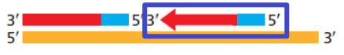
  - 會產生 3' overhang 的問題 (約 20~30 bp overhang)
    - Leading strand 的 3' 端結尾會多出來
  - 衍生出兩個重要考量 : DNA 會越來越短、DNA 會不會啟動修復機制
- 真核生物通過合成 Telomere 解決 End Replication Problem
  - 端粒會被反覆的複製磨損，因此需要 Telomerase 催化其延長
  - Telomerase 是**反轉錄酶**，延長 Leading strand 3' 端的 Telomere
    - 用 Telomerase RNA 作為模板，合成出 DNA
    - 酵素內部有 Telomerase RNA，為 ncRNAs 的一種
    - 注意**不是延長 Lagging strand**，因為 DNA 合成必由 5'→3'
  - Telomere 的合成步驟
    - Telomerase 先從 3' 端延長 Leading strand 的 Telomere
    - 接著便有足夠長度的 DNA 讓 DNA Pol 結合，合成出 Leading strand 的 Telomere
    - 合成後仍有 Leading strand 3' end overhang 的問題
    - 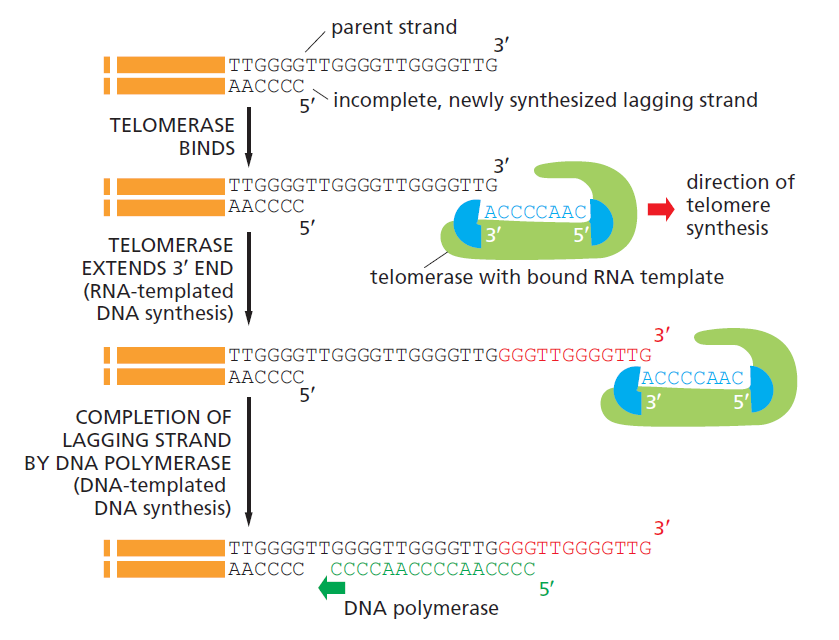
- Telomerase 的活性受到調控
  - Telomere 的磨損，讓細胞無法無限繁殖，並會隨著複製次數越多而老化
    - 每次細胞複製，約少 100~200 bp
    - Replicative Cell Senescence
  - 一般的細胞中 Telomerase 的活性很低
    - 然而在需要分化、再生的細胞中，Telomerase 的活性較高，端粒的長度得以保留
      - 例如幹細胞
