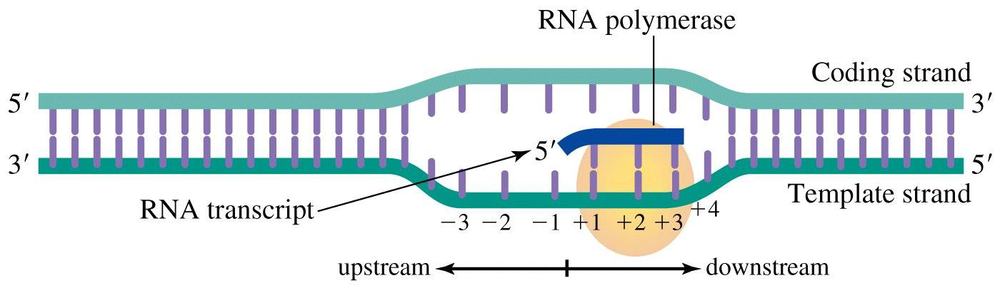
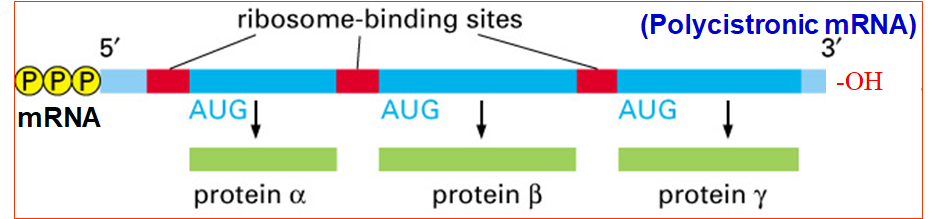
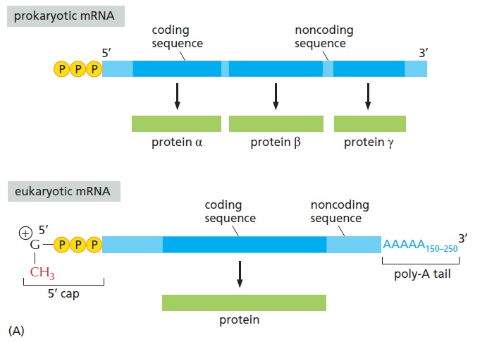

# 轉錄 Transcription

## Overview

### 1. RNA 轉錄特色

- 新的 RNA 股由 5'→3' 合成，因此模板為 3'→5' 的 Template strand
  - **Template strand** 和 RNA 互補 (又稱為 (-) strand)
  - 另一股 DNA 則與 RNA 序列相同，稱為 **Coding strand**, or (+) strand
    - (+) 代表與 mRNA 序列相同
    - 如 (+) ssRNA 病毒可直接用自身 RNA 作為 mRNA 指導轉譯
- 抑制基因表現**最重要**的方法是抑制或干擾轉錄
  - DNA-binding protein 為控制轉錄活性最重要的方式 (於基因表現調控介紹)
  - 抑制轉錄可作為抗生素的標靶
- RNA Polymerase 轉錄出多種 RNA 分子，而不僅僅只有 mRNA
  - tRNA, rRNA, Ribonuclease P, Telomerase RNA
  - snRNA (參與 mRNA splicing), snoRNA (參與 mRNA 以外的 RNA 分子修飾)
  - lncRNAs (於基因表現調控介紹)

### 2. RNA Polymerase 共通特色

- 定義實際上開始合成的起點為 +1
  - (第一個核苷酸合成的地方為 +1，前一個為 -1，沒有 0)
  - 
- 
- 要用哪一股合成由 Promoter 決定。Promoter 具有方向性
- RNA 的合成速率並非固定，常常會有 Pausing, Backtracking 的特性
  - 會因為 Tail 所 recruit 蛋白的不同而受到影響
  - 此特性可以控制合成速率、確保轉錄品質 (不失真)
- 有 Proofreading (?)
- 催化與反應機制特性
  - 不需要 primer
  - 消耗 NTP。由於 NTP 本身帶有兩個高能磷酸鍵，因此不需消耗額外能量
  - 需要 Mg2+ 的催化
  - 一個 Transcription bubble 約有 8bp RNA-DNA hybrid (*E. coli*)
  - 反應機制還要補

### 3. 原核與真核生物的轉錄差異整理

- RNA Polymerase 類別差異
  - 原核生物所有的 RNA 共用一種 RNA Pol
  - 真核生物至少有三種 RNA Pol
    - RNA Pol I 合成 5.8S, 18S, 28S rRNA
    - **RNA Pol II 合成所有 protein-coding genes 和其他**
    - RNA Pol III 合成 tRNA 和其他
- Transcription unit 組成不同
  - Transcription unit 由 promoter, terminator 界定
    - 一個 Transcription unit 只包含一個 promoter，一個 terminator
  - 基因數量的差異 (原核生物 : Polycistronic / 真核生物 : Monocistronic)
    - 注意，一個 promoter 只會轉錄出一個 RNA
    - **原核生物 : Polycistronic**
      - One mRNA, many proteins
      - 多個基因共用同一個 promoter
      - 一條 mRNA 上面有多個 translational start sites
    - **真核生物 : Monocistronic**
      - 一個基因有自己專屬的一個 promoter
      - 一條 mRNA 上面有只有一個 translational start sites
      - 可透過轉錄後修飾使相同的 mRNA 表現出不同的蛋白質
  - Promoter 的差異
    - 原核主要由 Fis site / UP element / Core promoter (-35, -10) 構成
  - Terminator 的差異
- 核糖體接合位置不同
  - 原核生物可從 mRNA 任意帶有 Shine-Dalgarno sequences 的地方和核糖體接合
  - 真核生物的核糖體認 5'-cap
  - 
- 轉錄參與的分子不同，會在下方詳述
- 轉錄後修飾的不同
  - 原核生物不需要 RNA splicing，因此沒有 introns
  - 除了 Splicing，mature mRNA 修飾也有所差異
    - [5' 端] 原核 : **三磷酸** / 真核 : **CH3-G-PPP-5'** (特別稱作 5'-cap)
    - [3' 端] 原核 : **OH 基修飾** / 真核 : Poly A tail (150~250)
    - 
  - 真核生物的 5'-UTR, 3'-UTR 具有調控表現的功能
