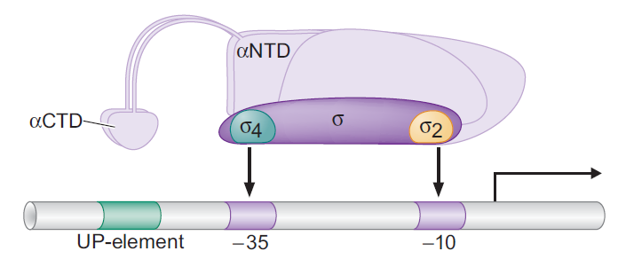
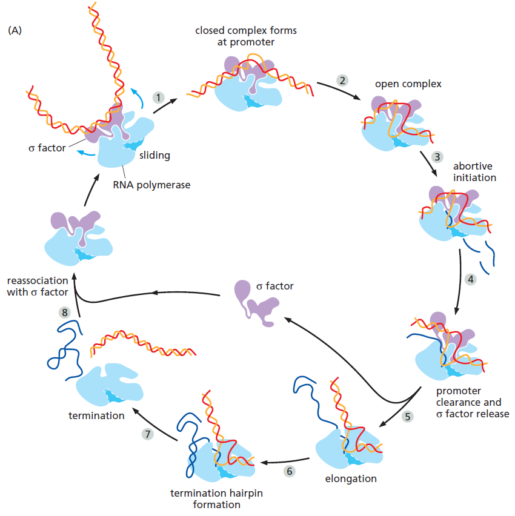

# 3-2. Prokaryotic Transcription

- 重點摘錄
  - 原核生物基因的結構
  - RNA Polymerase 結構
  - σ factor 與 Abortive Initiation
  - 終止的 Terminator
- *E. coli* 的 RNA Polymerase 結構
  - Holoenzyme of *E. coli* RNA polymerase 包含以下單元...
    - Holoenzyme = 完整而包含所有 subunit 的酵素
- 起始 : σ factor 與 Abortive Initiation
  - σ factor 是起始細菌轉錄的重要條件
    - σ factor 接合 Core promoter
      - 實際接合在 -10 bp, -35 bp
      - 在 -10 bp 開始 DNA melting
      - 
    - σ factor 不只一種，其辨識的 DNA 序列亦有差異
  - RNA Polymerase 需要「掙脫」σ factor 以進行 RNA 延長 (Scrunching model)
    - 此現象稱做 **Abortive initiation**
      - RNA Polymerse 因為 σ factor 黏太緊，被 Lock 在某一個位置，並不會滑動
      - RNA Polymerse 嘗試滑動，但是滑動距離不遠，做出約 10 bp 即釋放 RNA
      - 此過程會反覆多次，直到 RNA Pol 脫離 σ factor
    - 
    - 當 RNA Pol 被 arrested 而無法自行脫離時，會有 TRCF Protein 解開
- 終止 : 辨識 **Terminator**
  - Rho protein-dependent
    - ...!
  - Rho protein-independent (Intrinsic termination)
    - mRNA 形成 Hairpin，無法 pair template DNA