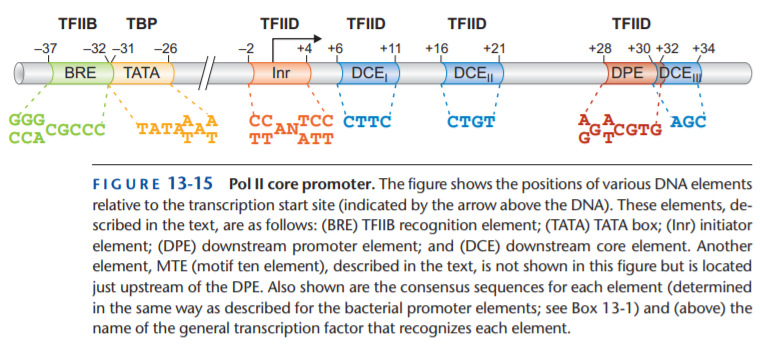
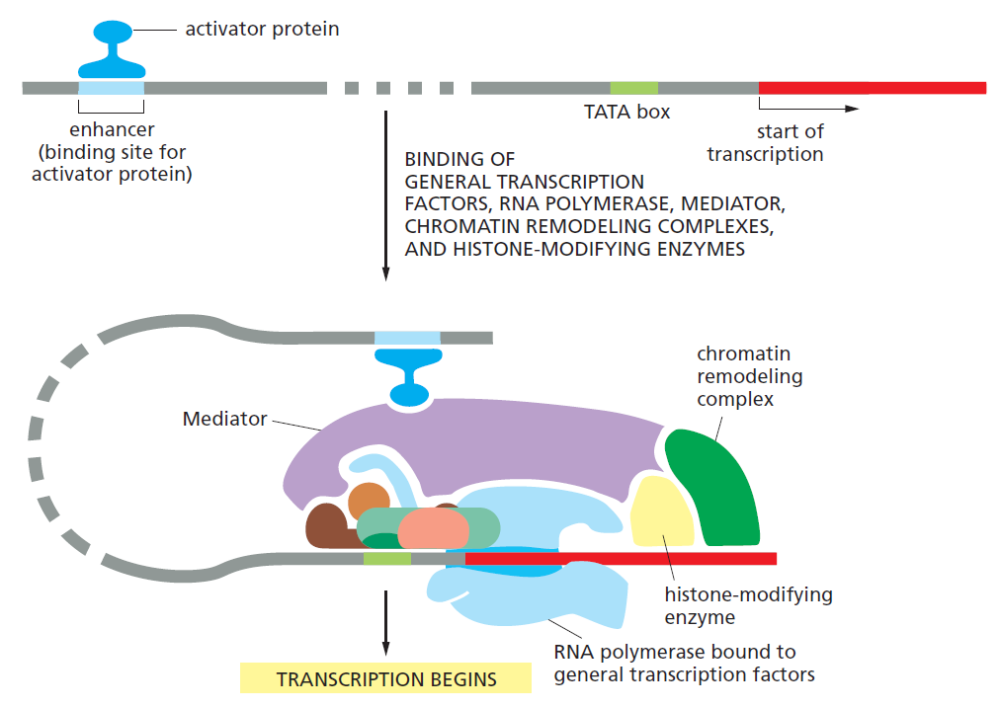
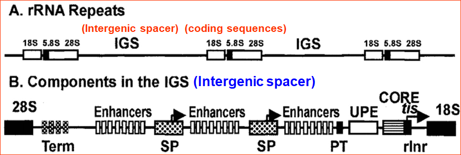

## 真核生物轉錄 Eukaryotic Transcription

### 1. 真核生物轉錄的起始

- **General Transcription Factors** 是 *in vitro* 轉錄大多數真核 RNA 的必要條件
  - 這些 Factors 相關的 DNA elements 被稱為 **Eukaryotic core promoters**
    - 並不包含 enhancer
  - TATA-box promoter 轉錄起始的 model
    - **TBP** (a subunit of **TFIID**) binds to **TATA box** (TATAAAA, TATATAT)
      - **同時 TBP 把 DNA 彎曲成 90 度 (老師很強調這件事)**
      - TBP 又吸引 TAF 過來，構成完整的 **TFIID (TBP + TAF)**
      - **TFIIA** 被吸引過來，穩定 **TFIID 與 TATA box** 的連結
    - **TBP + DNA** recruit **TFIIB, RNA Pol II**
      - **TFIIB** binds to **BRE** (TFIIB Recongintion Element)
      - TFIIB 具有 Helicase 活性，能夠協助 Pol II 解旋 DNA
    - **TFIIE 吸引 TFIIH** 過來
      - **TFIIH 將磷酸化 Pol II 的 CTD domain**，使 elongation 開始
  - 小小整理
    - TFIIA : 穩定 TFIID 與 TATA
    - TFIIB : 和 BRE 結合，並解旋 DNA
    - TFIID : 含有 TBP (結合 TATA box) 與 TAF
    - TFIIE : recruit TFIIH
    - TFIIH : 磷酸化 Pol II 的 CTD domain
  - TATA-less promoter 研究較少，也沒有完整 model，但一般認為 **TAF** 扮演重要角色
    - TATA-less promoter 多半調控 Housekeeping genes，這些基因的表現是連續性的
    - TATA box protein association factors : 可辨認 CAAT box、GC box 等
  - 一個典型的真核生物 Core promoter
    - 
  
  - 
  
- Other Factors *in vivo*

  - 由於 *in vivo* 中，染色體結構也會影響到轉錄，故需要其他 Factors，如
    - Mediator (可讓 Distal control element 和 Gene 形成 Loop，見下圖)
    - Chromatin remodeling complex
    - Histone-modifying enzyme
    - Activator
  - DNA element 與 protein
    - Enhancer 為 DNA，Activator 為蛋白質
      - Enhancer 通常位於 -200 甚至更上游，為 Distal control element
    - Silencer 為 DNA，Repressor 為蛋白質
  - 目前的 Model 顯示，在 *in vivo* 中，應該會形成類似下圖的 Complex 再進行轉錄
    - 

### 2. 真核生物轉錄的延長

- 「掙脫」General Transcription Factors
  - 真核生物沒有 σ factor
  - 真核生物的 General Transcription Factors 會產生類似 σ factor 的問題 (黏太緊)
  - 在轉錄**開始前**，General Transcription Factors 會被釋出
    - Pol 的 carboxyl-terminal domain (CTD) 會被 TFIIH 磷酸化修飾
      - 此磷酸化修飾也會 recruit elongation factors
    - 由於是在轉錄開始前釋出，因此不會發生 Abortive Initiation
- 真核生物的轉錄延長，必須要其他蛋白質的協助
  - Elongation factor
  - Chromatin remodeling complex
  - Histone chaperones
  - Topoisomerase
- 真核生物 RNA Pol 延長 RNA 的同時，也進行 RNA Processing
- RNA Pol 的 CTD Tail 可以 recruit 蛋白質，進行速率調控、RNA Processing

### 3. 真核生物轉錄的終止

- 辨識 Singal sequence **5'-AAUAAA-3**' (highly conserved)
- 此後仍會合成一小段序列，但最後被 endonuclease 切除
- Poly-A tail 在 5'-AAUAAA-3' 後約 11~30 nt 接上

### 4. 真核生物的 rRNA, tRNA 的合成

#### 4-1. rRNA

- rRNA 基因在人類基因組的位置
  - 位於 13, 14, 15, 21, 22 號染色體的 p arm (short arm)
  - 是不斷重複的序列 (100 ～ 2000 次)
  - 通常在被 organized 成 heterochromatin
  - 只有當進入核仁 的 NOR 後才會表現。
    - nucleolus organizer region
    - a.k.a nucleolus organizer sequence, or nucleolus organizer center
- rRNA repeat 的結構
  - 由 IGS + Coding seq. 構成，Coding seq. 又包含 18S, 5.8S, 28S 三種基因 
  - 
- rRNA 轉錄效率非常高，形成類似聖誕樹結構
- rRNA 合成後，需要被 splicing 以及進行其他修飾
  - 最初是一條 45S 的 pre-rRNA
  - 經過 processing 形成 41S pre-rRNA
  - 再經由 splicing 變成 28S、5.8S 複合和 18S 的 rRNA。
  - pre-rRNA 在成熟前需要經過 snoRNA 進行修飾
- rRNA 組裝
  - 核醣體小單元 (40S)
    - 18S 和其他蛋白質形成 40S
  - 核醣體大單元 (60S)
    - 28S、5.8S 複合體 rRNA
    - 核質的 5S rRNA (由 pol Ⅲ 合成)
    - 其他蛋白質

#### 4-2. tRNA