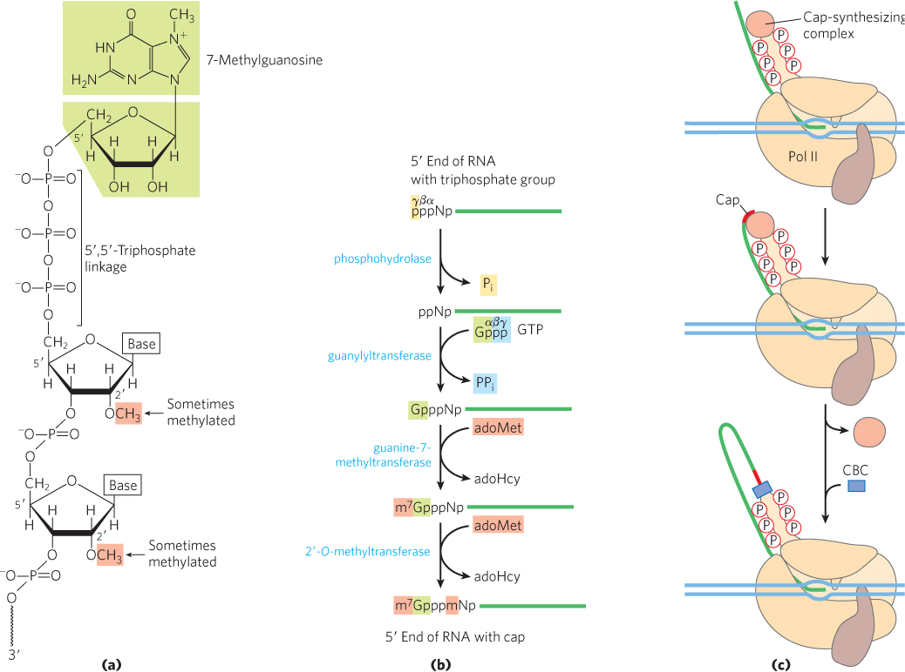
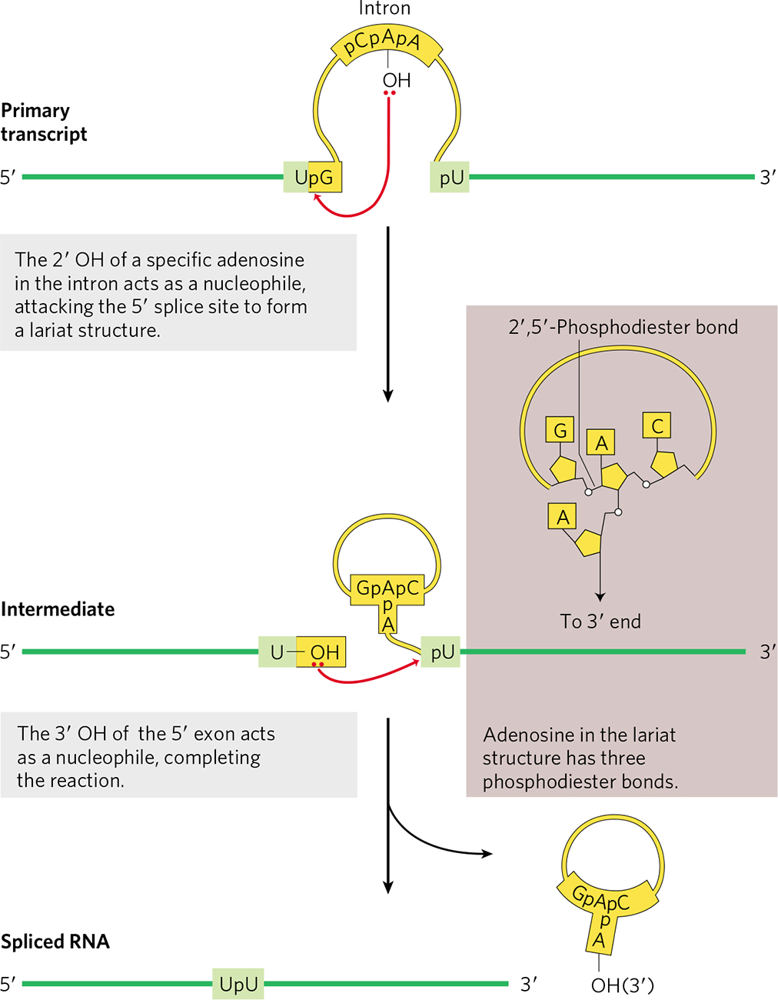

## 真核生物的 RNA Processing

#### 1. Capping

- Cap 的結構
  - 主要由 7-Meyhyl-guanosine 和 **5’→5’**-**Tri**phosphate linkage 所組成
    - 7-Methyl-G-ppp-RNA
    - 經由 5’→5’-Triphosphate linkage 連接至 mRNA 的第一個核苷酸
      - 特別！因為一般核苷酸都是 5’→3’ linkage
  - 其他核苷酸的甲基化
    - 所有動物及高等植物中，mRNA **第一個**核苷酸的 **2 號碳**會進行甲基化
    - 脊椎動物中，mRNA **第二個**核苷酸的 2 號碳也會進行甲基化。
    - 低等生物如酵母菌就缺乏此機制
- Cap 結構形成的酵素催化
  1. mRNA precursor 的 5’ end 由三個磷酸根 (triphosphate) 的組成，過程首先由phosphohydrolase 去掉尾端的 γ 磷酸根。
  2. **guanylyltransferase** 去除 GTP 的兩個磷酸根 (βγ) 後，將 GMP 接到 mRNA 的 5’ end (去掉 γ 磷酸根的位置)。
  3. guanine-7-methyltransferase 將 **adoMet** 上的甲基轉移到 GMP 的 7 號 N 上。
  4. 2’-O-methyltransferase 再將 adoMet 上的甲基轉移到核苷酸上的 2 號碳，完成 RNA 5’ end capping。
- 

### 2. Polyadenylation

- **CPSF** 會辨識 Poly-A signal 的序列並結合上去，並吸引其他 factos 協助
  - CPSF = cleavage and polyadenylation specificity factor
  - CPSF 有 RNA endonuclease 活性
    - 會在 AAUAAA 序列後約 11～30 nt 的位置進行 cleavage
- **Poly A polymerase (PAP)** 催化 3’ 端 的 Polyadenylation
  - 加上大約 150～250 個 A，形成 Poly A tail
  - 不需要模板
- 其他相關的 Factors
  - 協助 CPSF 辨認 Poly A signals 的分子
    - CstF (cleavage stimulatory factor)
    - CFI、CFII (cleavage factor I、II)
  - **PABII** : poly A-binding protein II
    - 可穩定 poly-A tail，一個 protein 大約可和 20 個A 結合
- 另一方面，RNA polymerase II 會繼續轉錄，但有機制終止其轉錄
  - 有 Torpeso model 和 Allosteric model 解釋

### 3. Splicing

- 四種 Intron 需要的 Splicing 機制不同
  - Group 1 : 利用外加的 GTP，G 攻擊 Exon 第一個 nt 的磷酸鍵
  - Group 2 : 利用自己的 Brancing point 上面的 A 之 OH 基攻擊 Exon 第一個 nt 的磷酸鍵
    -  
  - Group 3 : 類似 Group 2，但需要 Spliceosome 催化
  - Group 4 : tRNA 使用機制，作用機制複雜
- Exon definition : 判斷 exon 的邊界在哪裡
- Splicing happens just after **a SINGLE 3' splice site** has produced
  - in order to prevent missing splicing.
- Splicing enhancer helps mark splice site. (如 SR proteins 結合 exons)
- Nonsense-mediated mRNA decay (MBOC p. 351)
  - Exon junction complex (EJCs) 標示兩 Exon 去除中間 Intron 後接合的位置
    - 象徵 Splicing 的成功
  - Abnormal mRNA splicing 常導致包含 UAA codon (終止訊號) 的 Intron 未被切除
    - 此時 stop codon 會在 downstream 的最後一個 EJCs 之前就出現
      - stop codon = nonsense codon
  - mRNA 從核孔出來後，會先被特殊的核糖體 "test"
    - 此核糖體會辨識最後一個 EJCs 之前有沒有不正常的 stop codon 訊號
    - 若有，則 recruit Upf proteins，啟動降解路徑