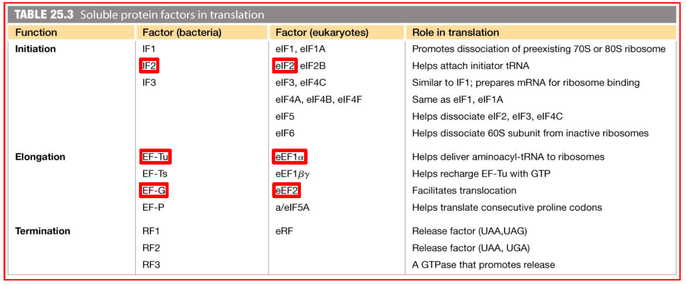

# 轉譯 Translation

## 包含內容

- tRNA & Amino acid activation
- 核糖體與 rRNA
- 原核生物的多肽合成
- 真核生物的多肽合成
- 蛋白質的命運、品管機制

## 1. 先備知識

- 核糖體讀取 mRNA 的方向為 5'→3'
  - 比較 : DNA Pol 和 RNA Pol 都是以 3'→5' 讀取 template strand，然後以 5'→3' 合成新股
- 蛋白質合成的方向為 N→C 端
  - 因此 AUG 對應的胺基酸會在 N 端
  - 核糖體從 **C-terminus** 延長多肽鏈
- Codon 與 Reading frame
  - Codon 與對應的胺基酸在所有生物都是一樣的 (支持共同祖先理論)
  - Codon (在 mRNA 上) & Anticodon (在 tRNA 上)
    - Codon 方向為 5'→3'
    - Anticodon 方向為 3'→5'
  - Reading frame shift 通常造成蛋白質無法合成
- 蛋白質的 fidelity 控制在兩個環節
  - aminoacyl-tRNA synthetase
  - 核糖體

## 2. 原核與真核多肽合成的異同

- 兩者的起始必由 Initiator tRNA 開始，其對應的密碼子 Codon 為 AUG
  - 只有 Initiator tRNA 才有的特性
    - 起初與核糖體的 P 位結合 (而不是 A 位) (藉由 IF-2 的協助)
    - 有足夠的親和力 bind to small subunit of ribosome
  - 辨識的 Codon
    - 原核除了辨認 AUG 外， UUG, GUG, AUA，但均對應 fMet-tRNA^fMet^
    - 真核只辨識 AUG
  - 原核生物與真核生物用的 Initiator tRNA 不同
    - 原核最主要為 fMet-tRNA^fMet^
    - 真核為 Met-tRNA~i~^Met^
  - **AUG 對應到兩種 tRNA**
    - 一種稱作 Initiator tRNA 只負責起始合成
    - 另一種 tRNA 負責合成 internal position 的 Met
- 啟動轉譯的機制的差異
  - 原核 : Shine-Dalgarrno sequence, others
  - 真核 : Cap-dependent, IRES-dependent (似原核之 SD seq.)
- 所有耗能的 Factors 均使用 GTP，具有 GTPase 活性，水解 GTP 獲得能量改變構型
  - eIF1A 例外
- 細菌與真核生物 Factors 比較 (必考)
  - 
- 抑制轉錄的抗生素作用機制 (必考)
  - 只抑制細菌
    - tetracycline 四環黴素
    - streptomycin 鏈黴素
    - chloramphenicol 氯黴素
    - erythromycin 紅黴素
    - rifamycin 立汎黴素
  - 同時抑制細菌和真核生物
    - puromycin 嘌呤黴素
    - actinomycin D 放線菌素
  - 只抑制真核生物
    - cycloheximide 環己亞醯胺
    - anisomycin 大茴香黴素
    - α-amanitin α-鵝膏蕈鹼
