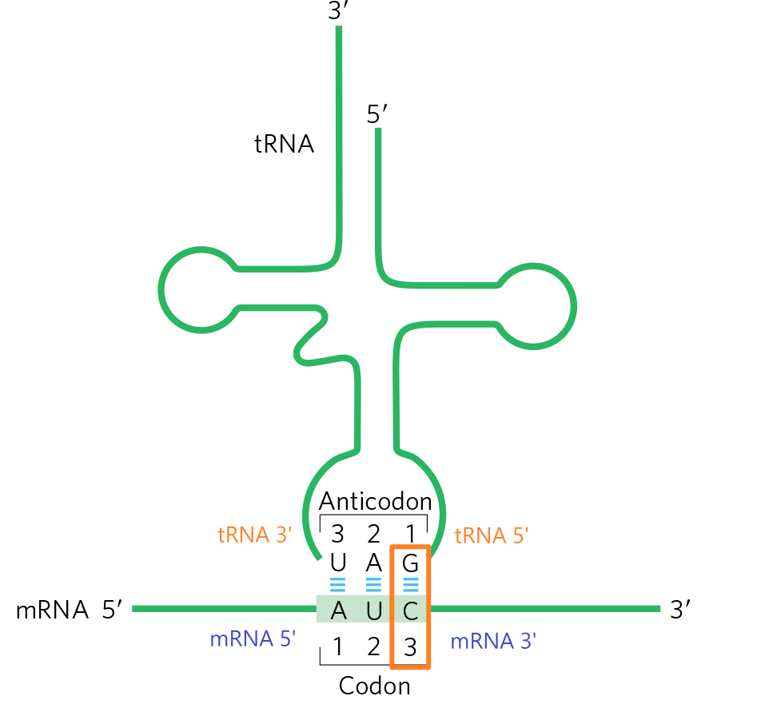
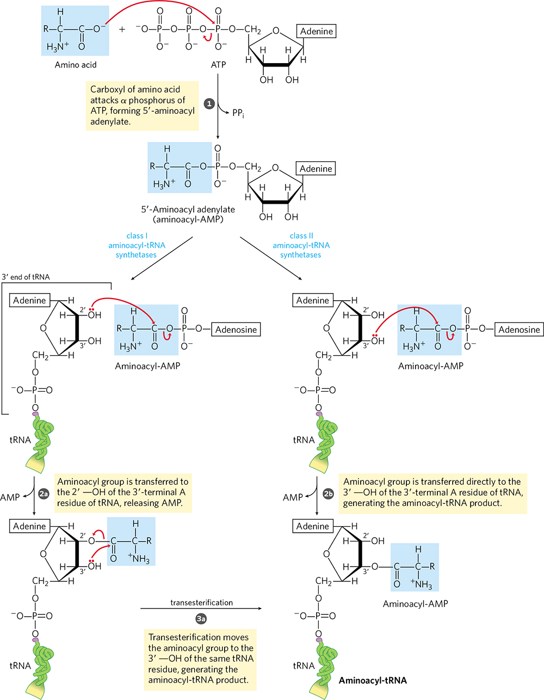

# tRNA & Ribosomes

## 1. tRNA & Amino acid activation

- tRNA 結構
- Base-pairing 與 Wobble 現象
  - tRNA Anticodon 的 5' 端，可識別不只一種核苷酸，稱為 Wobble 效應
    - Anticodon 的第一個核苷酸、Codon 的第三個核苷酸
  - 
- tRNA 的合成
  - 無論是真核或是**原核** tRNA，成熟前都必須經過 Splicing
    - 與 mRNA Splicing 機制**截然不同**，此為**第四類 intron**
  - tRNA 在離開細胞核之前，會經過**修飾、與胺基酸連結**
- tRNA 與胺基酸連結
  - 在和 tRNA 連結前，需要 **ATP activation**
  - **aminoacyl-tRNA synthetase** 負責 couple 胺基酸與 tRNA
    - aminoacyl-tRNA synthetase 的 editing pocket 可水解掉錯誤接上的胺基酸
      - 也就是具有 Proofreading 機制
    - 有兩種機制，分為 Class I, Class II
      - Class I 催化
        - tRNA 3' 端 Adenine 的 Ribose 上面的 2' OH 親核攻擊 aminoacyl-AMP
        - 胺基酸與 Ribose 2' OH 形成 ester bond
        - 胺基酸被 transfer 到 3' OH
      - Class II 催化
        - 相較於 Class I，胺基酸在 Class II 中直接被固定在 3' OH 上
        - tRNA 3' 端 Adenine 的 Ribose 上面的 3' OH 親核攻擊 aminoacyl-AMP
        - 胺基酸與 Ribose 3' OH 形成 ester bond
      - 兩種催化機制，最後都是在 3' OH 接上胺基酸
    - 

## 2. Ribosomes

- 核糖體組成 : 蛋白質 + 多肽
  - Large subunit
    - 包含最重要的部分 **Peptidyl transferase**，此催化中心**完全由 RNA 構成**
  - Small subunit
- 催化特色
  - 核糖體有三個 tRNA 接合位，分別為 E, P, A
  - 在 large subunit 的 **peptidyl transferase** 負責催化醯胺化反應
    - peptidyl transferase 為 Ribozyme
      - 反應中心為 rRNA，並非 Protein
  - 從 **C-terminus** 延長多肽鏈
- 原核生物與真核生物的核糖體差異
  - 原核 70S : 50S (large) + 30S (small)
    - 50S (large) 中包含 5S, 23S rRNA
  - 真核 80S : 60S (large) + 40S (small) (各加 10)
    - 60S (large) 中包含 5S, **28S** rRNA