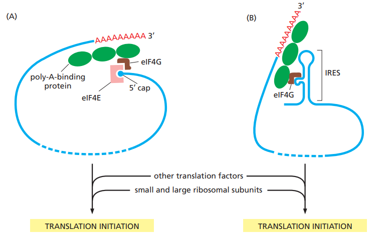
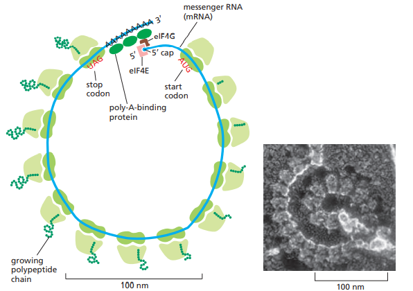
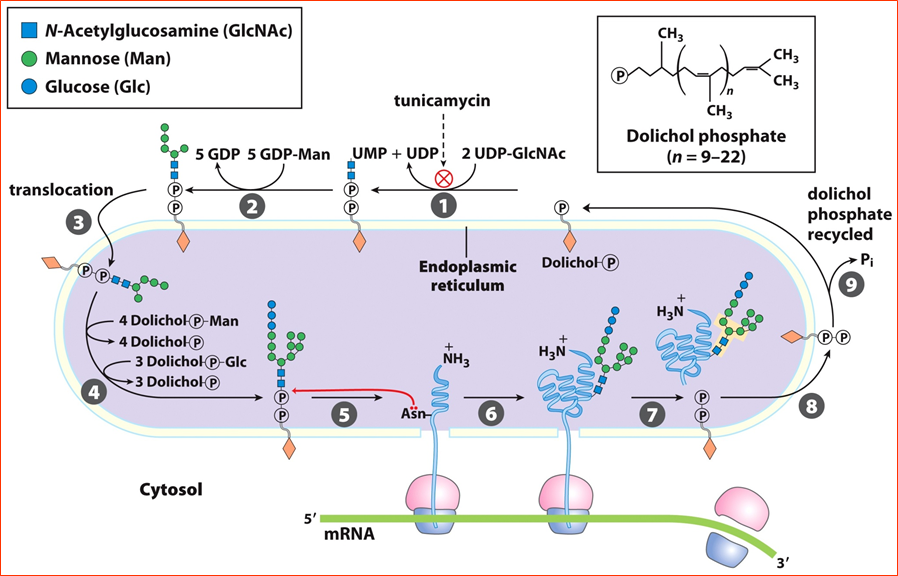

# 真核生物的轉譯

## 重點整理

- 真核生物的轉譯起始有兩種機制
  - Cap-dependent 機制 (絕大多數)
  - IRES-dependent 機制
- ER 的轉譯後修飾整理
  - Proteolytic cleavage (在 ER。如形成 Cross-linking)
  - 糖基修飾 (N-linked, O-linked)
  - 胺基酸修飾 (磷酸化、甲基化、羧化)
  - 形成雙硫鍵 (氧化還原)
  - 確保蛋白質正確折疊
  - 形成蛋白質四級結構

## 1. Initiation

兩種機制的比較

### 1-1. Cap-dependent 機制 (99%)

- mRNA 獨立準備階段
  - **eIF4E bind to 5'-cap**
  - PABP (poly A binding protein) bind to poly A tail
  - **eIF4G 作為 linker protein**，連結 eIF4E 和 PABP，使 mRNA 形成 Loop
  - **eIF4A 作為 RNA helicase**，與 eIF4B, eIF4G 結合形成 eIF4F
    - eIF4A 為 ATPase 很特別
- 核糖體獨立準備階段
  - eIF1, eIF3, eIF1A 結合在 40S 次單元，可確保核糖體不會提前組裝、Block A site
  - **eIF2** 接上 **GTP** 並攜帶 Met-tRNA~i~^Met^ 進入 40S 次單元的 **P** 位
    - **類似細菌的 IF-2**
  - eIF5B 與 eIF5 結合上述 Complex，形成 **43S preinitiation complex**
    - 40S + eIF1, eIF3, eIF1A, eIF2-GTP + Met-tRNA~i~^Met^ + eIF5, eIF5B
- 核糖體與 mRNA 結合，繼續下游步驟
  - **eIF4F 攜帶 mRNA** 進入 43S preinitiation complex，形成 **48S complex**
  - mRNA + 40S + eIFs 形成的 complex 開始 scan AUG codon
    - 此滑動、搜尋過程消耗 ATP，而第一個 AUG 可能距離 cap 非常遙遠
    - 在極少數情況下，第一個 AUG 會被跳過，此現象稱作 leaky scanning
      - 造成蛋白質 N 端不同
  - 遇到 AUG 之後，Complex 發生構型改變，使 60S 接合、eIFs 解離
    - **eIF5, eIF5B 會改變構型，水解 GTP**
    - eIF5, eIF5B 水解 GTP 過程中，也促進 eIF2 的 GTPase 活性
    - eIF2 水解 GTP 的過程中，將脫離 complex，P 位只剩下 Met-tRNA~i~^Met^
    - 這些 eIFs 水解完 GTP 後，將脫離 complex
    - eIF4F 將留在 mRNA 上面，此為 Elongation 過程中少數留下的 eIFs
    - 60S 核糖體結合 complex，完成 80S 的組裝

(補充 : 若第一個胺基酸不想要是 Met，細胞會透過特定的 Protease 切除)

### 1-2. IRES-dependent 機制

- 老師並無詳細描述，不過 eIF4G 扮演重要角色 (eIF4E 無法與 IRES 結合)
- IRES 其功能類似於細菌的 SD seq.
- 在病毒基因表現上扮演重要角色
- 一個 mRNA 上面可以同時有 Cap 和 IRES

## 2. Elongation

- **eEF1α-GTP** 攜帶 aminoacyl-tRNA 到 A 位
  - **eEF1α 類似於細菌的 EF-Tu**
  - eEF1α 隨後水解 GTP，脫離 complex
  - eEF1α-GTP 的再生，透過 eEF1βγ (類似細菌的 EF-Ts)
- **Peptidyl Transferase** 作用
  - Peptidyl Transferase 催化中心在 28S rRNA
  - 其他的回去看細菌那邊
- **eEF2-GTP** 催化 Translocation，將 A 點重新空出
  - **eEF2 類似於細菌的 EF-G**
  - 其他的回去看細菌那邊
- 真核生物的 Polyribosome
  - 不同於細菌，會形成 Loop
  - 

## 3. Termination

- eRF1 認 UAG, UAA，eRF2 認 UGA, UAA (同細菌 RF-1, RF-2)
- eRF3 透過**水解 GTP**，打斷 P 位的 tRNA 與多肽的連結，同細菌 RF-3

## 4. Post-translational Modification

- ER 的轉譯後修飾整理
  - Proteolytic cleavage (在 ER。如形成 Cross-linking)
  - 糖基修飾 (N-linked, O-linked)
  - 胺基酸修飾 (磷酸化、甲基化、羧化)
  - 形成雙硫鍵 (氧化還原)
  - 確保蛋白質正確折疊
  - 形成蛋白質四級結構
- 糖基修飾
  - O-linked : 糖基接在 **Ser** 或 **Thr** 的 O 上
  - N-linked : 糖基接在 **Asn** 的 N 上
  - 先在 cytosolic side 做多糖，接著翻到 luminal side
  - 