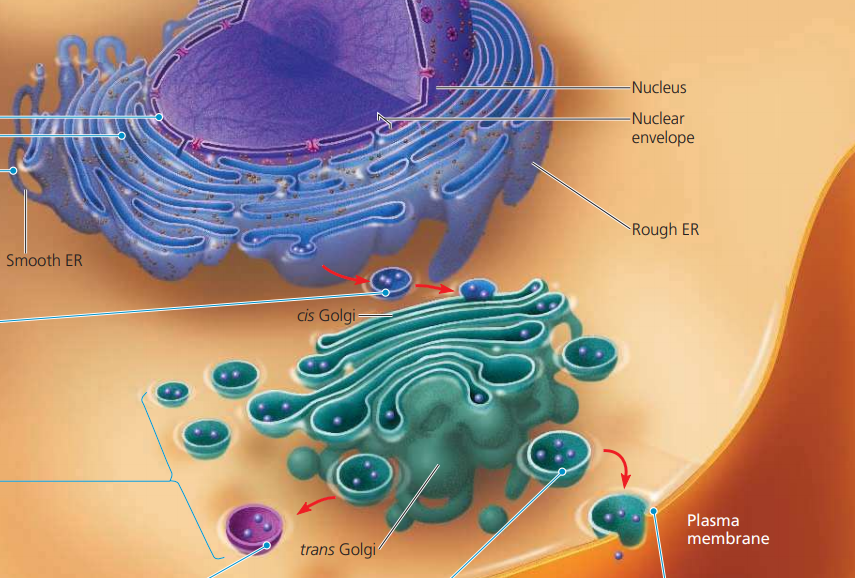
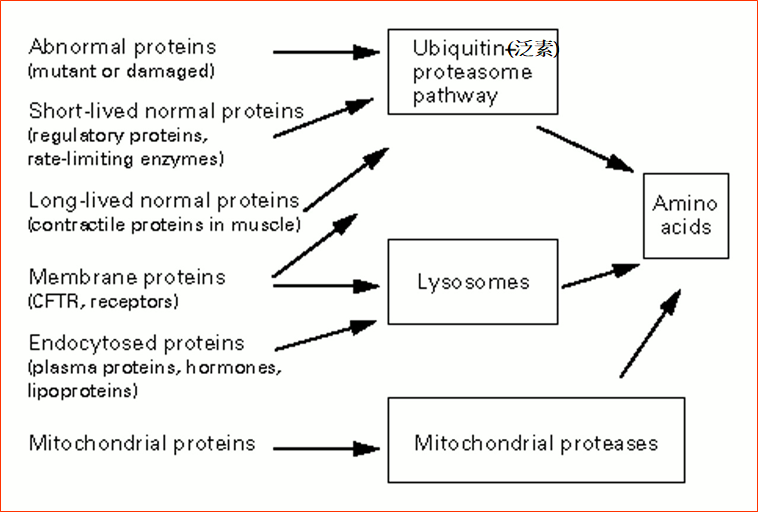
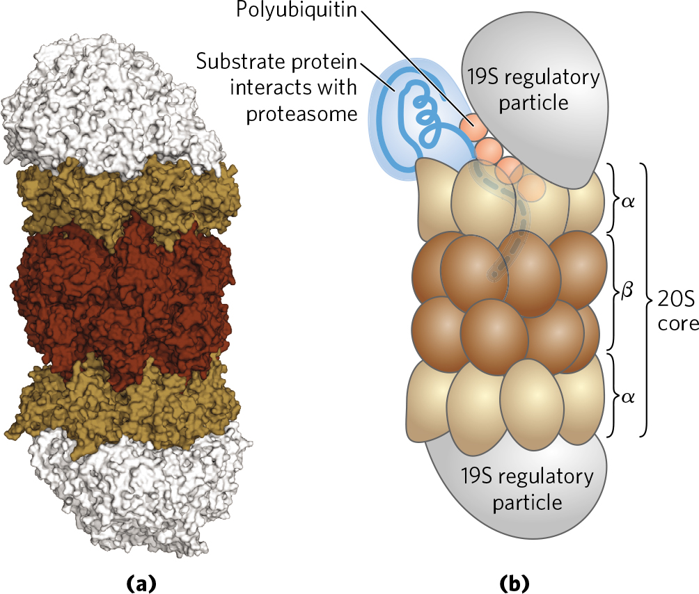

# 蛋白質的 Targeting 與降解

## 重點整理

- 真核生物有 Protein Targeting 的機制，主要是因為多肽上有 Signal seq.
  - Signal seq. 可能會被切除，也可能不會
- 錯誤合成或折疊的蛋白質，必須降解以避免對細胞造成傷害
- 蛋白質降解的方式
  - **泛素化-蛋白酶體路徑**
  - 溶體 (選擇性較低)
    - 主要負責膜蛋白、胞吞作用獲得的蛋白
  - 粒線體蛋白酶 (只有粒線體內的蛋白質會由此路徑分解)

## 1. Protein Targeting (以真核生物為主)

- 細胞內有三種蛋白質輸送型態
  - Gated transport (進出細胞核)
  - Transmembrane transport (進出胞器、ER)
  - Vesicular transport (ER→高基氏體、高基氏體路徑使用)
- 核糖體可以游離在細胞質，也可以結合在 ER 上
  - Free ribosomes 通常進行 Posttranslational import
    - 在轉譯完成後，才依據 Targeting sequence 將多肽移動至正確位置
  - ER-bound ribosomes 通常進行 Cotranslational import
- 剛合成出的多肽具有特定序列，使多肽移動至正確位置
  - 這樣的多肽稱為 Targeting sequence
  - 此假說稱為 Targeting hypothesis，目前以 ER 輸送的 Model 研究最為透徹

### Cotranslational import

- 步驟
  - **SRP54** 結合到 N 端 signal seq.
    - SRP 包含 7S RNA 與蛋白質
  - **SRP9 和 SRP14** 暫時阻斷轉譯 (elongation arrest)
  - SRP 與 SRP receptor 之間的結合與分離仰賴 GTP binding 和 GTP hydrolysis
    - 由 SRP54 和 SRP receptor 的 alpha、beta subunits 所主導
    -  SRP54 接上 SRP receptor 後，**水解 GTP**。構型改變，SRP 脫離
      - 而核糖體則一邊進行轉譯作用，一邊將 polypeptide 塞入 translocon
        - 需要 ATP 
  - 轉譯完成前，ER 中的 signal peptidase 會將 signal sequence 切斷，完成進入 ER。
- 常見的 Singal
  - 入核、過氧化體的 signal seq. 並不會切除
  - 入過氧化體的 signal seq. 在 C 端、入核的在 internal，其他都是在 N 端
- 高基氏體作為分泌、膜蛋白路徑的轉運站
  - cis face 較平整，朝向核、ER
  - trans face 較凹凸不平，因為上面有囊泡 budding
  - 

### 細菌也有 Protein Targeting Model

- 分泌型蛋白、膜蛋白在 N 端有 Leader seq. (rich in hydrophobic residues)
- 流程
  - SecB 作為 Chaperone，攜帶多肽，並維持其線性，避免蛋白質分泌前被摺疊
  - SecYEG (Translocon) 是 Heterotrimeric protein，協助線性多肽通過細胞膜
  - SecA 透過水解 ATP，協助蛋白質通過 SecYEG
  - 細胞膜外有 Peptidase，切掉 Leader seq. ，蛋白質得以正確折疊

## 2. Protein Degradation

### 2-1. Protein Quality Control

- 錯誤摺疊的蛋白質，會對細胞造成壓力
- 蛋白質有三種主要的降解機制
  - **泛素化-蛋白酶體路徑**
  - 溶體 (選擇性較低)
    - 主要負責膜蛋白、胞吞作用獲得的蛋白 (兩者均可形成囊泡凹陷進 cytosol)
      - 膜蛋白亦可由泛素化路徑降解
  - 粒線體蛋白酶 (只有粒線體內的蛋白質會由此路徑分解)
  - 
- 細菌的研究，顯示 N 端的胺基酸種類會影響蛋白質的穩定度
  - 此結論在真核生物亦成立
- 多種機制確保蛋白質能正確折疊
  - 有些蛋白質在轉譯完成之前，就開始摺疊 (MBOC p.353)
  - **Molecular Chaperones** 可以協助蛋白質正確摺疊 (MBOC p. 354~357)
    - 許多種不同的 Chaperones 幫助細胞正確摺疊蛋白質
    - Chaperones 辨識「正確摺疊蛋白質所沒有的特質」
      - 例如 exposed hydrophobic regions
- 為了確保胺基酸合成的精確度，合成蛋白質非常耗能 (MBOC p. 345)
  - Induced fit, Kinetic Proofreading 等機制確保 base-pairing 更精確 (MBOC p. 345)
  - 確保蛋白質正確折疊也需要額外能量

### 2-2. Ubiquitin Proteasome System

- Ubiquitin
  - 本身有 76 個胺基酸，利用其 C 端與目標蛋白質的 Lys 結合
- 蛋白質的泛素化由三個酵素催化
  - E1 : Ubiquitin-activating enzyme
    - 和泛素形成 Thiol ester bond，並轉移到 E2 上，需要耗 ATP
  - E2 : Ubiquitin-conjugating enzymes. The E3s are referred to as 
    - 攜帶 Ubiquitin，並和 E3 形成 E2-E3 Complex
  - E3 : Ubiquitin ligases
    - 具有辨識蛋白質異常訊號能力，不同的 E2-E3 Complex 辨識的訊號並不一樣
    - E2-E3 Complex 與目標蛋白質的異常訊號結合
    - E3 將 E2 的 Ubiquitin 轉移到目標蛋白的 **Lys** 上
- 泛素化後的蛋白質由特殊的蛋白酶體降解
  - 整個 Protease 為 26S
    - 20S core 為降解催化中心
    - 其上下通道各由一個 19S 控制，19S 會和 Ubiquitin 交互作用
  - 