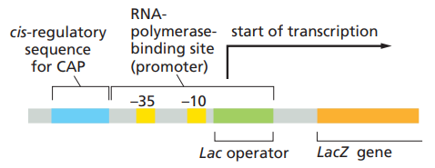

## 原核生物的基因表現調控

### 1. Overview

- 轉錄調控 : 
  - 絕大多數使用 Operon 調控，尤其是代謝酵素的調控
  - 原核g生物的 DNA Binding Protein
    - 多使用 Helix-turn-Helix motif (如 *Lac* repressor)
- 轉譯調控
  - Ribosome occlusion : mRNA 形成特殊結構，阻止核糖體移動
  - Translational repression : mRNA binding protein 結合 mRNA
  - Regulatory RNAs : 和 mRNA 形成 base pairing (RNA 干擾)
- 其他調控
  - RNA Stability & Decaying
    - CRISPR-Cas System
  - 蛋白質的運輸
  - 蛋白質的降解

### 2. Operon

- 原核生物 Operon 的結構
  - 
  - CAP = cAMP binding site
    - 類似 activator 作用點
  - (圖未顯示) 更上游還有 Regulatory gene，負責轉錄出 Repressor
- 原核生物 Operon 可分為兩種類型
  - 誘導型操縱組 Inducible operon (例如 *lac* operon)
    - Ligand 會誘導基因表現
      - 通常調控**非必須物質的 Catabolism**
      - Ligand 通常是**非必須物質，存在時才會被代謝**
    - 因此 Repressor 本身抑制活性較大，和 **Ligand 結合後抑制活性減弱**
  - 抑制型操縱組 Repressible operon (例如 *trp* operon)
    - Ligand 會抑制基因表現
      - 通常調控**必須物質的 Anabolism**
      - Ligand 通常是**必須物質，濃度過低就要趕快製造**
    - 因此 Repressor 本身抑制活性較小，和 **Ligand 結合後抑制活性增加**
- 原核生物的 DNA-Binding Protein 結構
- *trp* operon 的結構
  - terminator 是 Rho-independent
  - leader seq.
    - 注意，細菌轉錄轉譯同時進行
      - RNA 從 3' 往 5' 讀取，製造出 5'→3' mRNA
      - 轉譯從 5' 往 3' 讀取
    - 共有四個片段，片段 1 含有兩個 trp codon
    - Trp 不足的情況下，會造成核糖體卡在第一個片段 (需要 trp tRNA 配對 codon)
      - 2-3 片段形成 hairpin，不會阻止轉錄繼續
    - Trp 充足的情況下，核糖體不會卡在第一個片段，會走到第二個片段
      - 此時 RNA Pol 仍在 mRNA 3' 端加入核苷酸
      - 3-4 片段形成 hairpin，靠近 mRNA 3' 端於是出現了特殊三級結構
      - 3-4 片段形成 hairpin 類似 intrinsic termination 的結構，終止轉錄
        - Transcription attenuation

### 3. 原核生物的轉錄後調控

- Ribosome occlusion
  - mRNA 本身會形成特殊的 tertiary structure 阻止轉錄
  - 如 Riboswitch 是 mRNA 上面帶有特殊結構的調控區域
- Translational repression
  - 用特殊的 mRNA binding protein 阻止轉譯發生
- Regulatory RNAs
  - 和 mRNA 形成 base pairing

### 4. 探討 : 原核生物的 SOS response

### 5. 探討 : 原核生物的 *trp, lac* Operon

### 6. 探討 : Prophage 的基因表現調控

### 7. 探討 : CRISPR-Cas System
