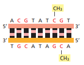
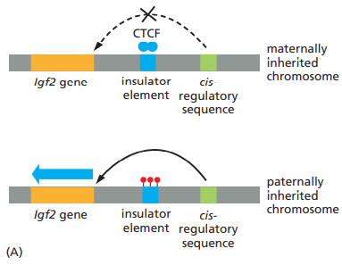

## Epigenetic Modification

### 1. Histone Modification

- Heterochromatin 上的 DNA 序列較難被存取，因此其基因表達會受限
- Histone 的 CTD domain 也許提供一些訊息給 RNA Pol II，控制轉錄
- Histone 上面的特殊 marker 可用於分析染色體是否被濃縮成 Heterochromatin
  - ==**H3K9** 甲基化 : Repressed State (**Heterochromatin**)==
  - ==**H3K4** 甲基化 : Active State (**Euchromatin**)==
  - 記憶法 : 數字越大越濃
- 一些參與 Heterochromatin 形成的關鍵分子已被找到
  - Histone 的 H3K9 甲基化
  - Heterochromatin protein 1 (HP1)
  - Polycomb repressive complex (PRC)
    - PRC recruit HDACs
  - HDACs 移除 Histone lysine 上的 acetyl group
    - 使 Histone 的 Lysine 恢復正電，結合 DNA 更緊密
  - 當 Histone modification 完成後，H1 Histone 協助形成更緊密的結構

### 2. X-chromosome inactivation

- 在哺乳動物體細胞中，有一個 X 染色體濃縮形成 Barr body
  - Xi : 被濃縮的 (inactive), Xa : 沒有被濃縮的 (active)
- 此現象發生在胚胎著床之後，由每個細胞獨立完成
  - 每個細胞隨機選擇一條染色體濃縮，形成 "mosaic" 的現象，例如貓咪的花色
  - 此後，此細胞的所有子代都濃縮同一個 X 染色體
- X-inactivation center 轉錄出 lncRNAs，稱作 Xist RNA，在性染色體濃縮上非常重要
  - X-inactivation center (XIC) locus 從某一端轉錄出 Xist, 從另一端轉錄出 Tsix
    - 我們稱 Xist, Tsix 互為 antisense transcription
    - 當 Tsix 不表現時，Xist 會表現；反之亦然
    - Xist 的 lncRNA 會使染色體濃縮
    - Tsix 則不會
  - 濃縮染色體的機制
    - Xist RNA 會從 XIC 開始 spread，直到整個染色體都被 Xist RNA 包圍
    - Xist RNA 會 recruit Histone-modifying enzymes
      - 修飾 H3K27me3
    - Xist RNA 會誘使 DNA Methylation

### 3. DNA Methylation

- DNA 和 Histone 的修飾、染色體的結構維持，可增強 Cell Memory
- DNA Methylation 通常造成 Gene Silence (但有例外，如小鼠 *Igf2*)
- 脊椎動物的 DNA Methylation 的特色
  - 只發生在 Cytosine 上，且通常只發生在 CpG 上
    - CpG 就是 5'-CG-3' 的意思，p 代表磷酯鍵。
    - 兩股的 CpG 會對稱進行甲基化修飾 (對面的 C 也會被修飾)
      - 
  - CpG Islands 雖然富含 CpG，但較少 DNA Methylation
    - CpG vs. CpG islands : 前者是兩個核苷酸，後者是很長一段富含 CG 的 seq.
    - 很多 Promoter 都在 CpG Islands 中
    - CpG islands 的甲基化、去甲基化，通常與胚胎發育、幹細胞、癌症形成有關
    - CpG 的分布不均勻，大多數都在 CpG Islands 中
      - 在演化過程中，CpG Islands 由於其在基因調控的重要性，因此被保留下來
      - 其他的 CpG 因為 C→T 的突變，通常損失在時間的洪流中
- DNA Methylation 的機制
  - maintenance methyl transferase
    - Dnmt 1
      - 加入 Azacytidine (cytosine analogue) 可抑制 Dnmt 1 活性
    - 在 DNA 複製完成時，對照模板股，使新股在對應的位置甲基化
    - 因此 DNA Methylation Patterns 可以傳給子細胞
  - *de novo* DNA methyl transferases
    - Dnmt 3a, 3b
    - 胚胎發育早期，多數甲基都會被擦除，因此必須要重新建立甲基化的 patterns
  - demethylating enzymes
    - 是氧化還原過程，需要 ROS 參與
- DNA Methylation 在生理上的重要性
  - 胚胎發育過程中的甲基化
    - 受精後早期，胚胎會將幾乎全部的甲基都擦除 (抑制 Dnmt 1，或直接去甲基)
    - 利用 *de novo* DNA methyl transferases 重新建立甲基化的 patterns
  - X-chromosome inactivation
  - Genomic Imprinting
- **Genomic Imprinting** 是 DNA 甲基化的結果
  - 不遵守孟德爾定律，只有父系或母系的等位基因才會表現
  - Imprinting 發生於生產配子的時候 (Gamete formation)
    - 子代的 Gamete-producing cells 會擦去 imprint，並重新 imprint
    - 同一個物種，特定基因的 imprinting，只會由特定的性別完成
      - 舉例而言，在小鼠的 *Igf2* 基因表現中
      - 必定只有父親的基因被 imprinted，母親的基因必定不會
  - DNA 甲基化控制基因表現調控的的機制有很多種
    - *Kcnq1* 的基因靜默機制
      - 只有 maternal *Kcnq1* gene 會表現
      - Antisense seq.
        - *Kcnq1* sequence 從某個方向，可以轉錄出 Kcnq1 protein
        - 從另外一個方向，則會轉錄出 lncRNA
          - lncRNA 誘使此段基因形成 Heterochromatin，靜默此段基因表現
      - maternal *Kcnq1* gene
        - 在 lncRNA 轉錄的起點甲基化，使得 lncRNA 不會被轉錄
        - *Kcnq1* gene 正常表現
      - paternal *Kcnq1* gene
        - 在 lncRNA 轉錄的起點沒有甲基化，因此 lncRNA 會被轉錄出來
        - 轉錄後的 lncRNA recruit Histone-modifying enzyme
        - Silence 這段基因的表現，因此 paternal *Kcnq1* gene 不會被表現
    - *Igf2* 的基因表現調控
      - 小鼠的 Igf2 基因附近，有 *cis*-regulatory seq.
        - 此段序列會轉錄出 CTCF 這個基因，抑制 *Igf2* 的基因表現
      - 父系的基因，在下圖的 insulator element 被甲基化
        - 甲基化將干擾 CTCF 和 *Igf2* 的 Interaction，因此 CTCF 無法抑制基因表現
      - 母系的基因，在下圖的 insulator element 並沒有被甲基化
        - 因此 CTCF 會抑制母系的基因表現
      - 在 *Igf2* 的例子中，甲基化是促進基因表現
      - 
  - 小鼠的 *Igf2* 基因實驗
    - mutated paternal *Igf2* 才會造成異常
    - mutated maternal *IgF2* 不會造成影響