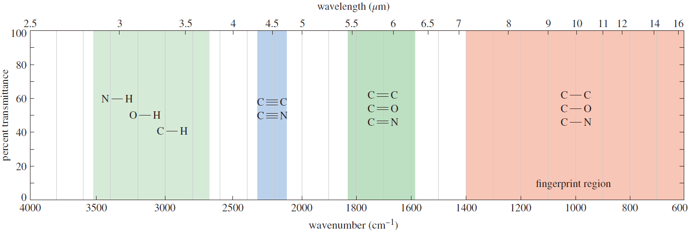
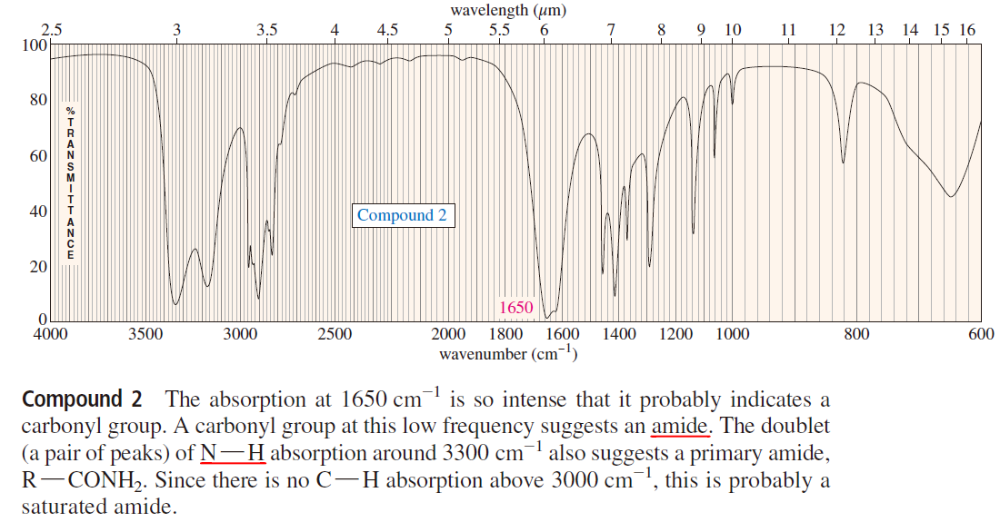
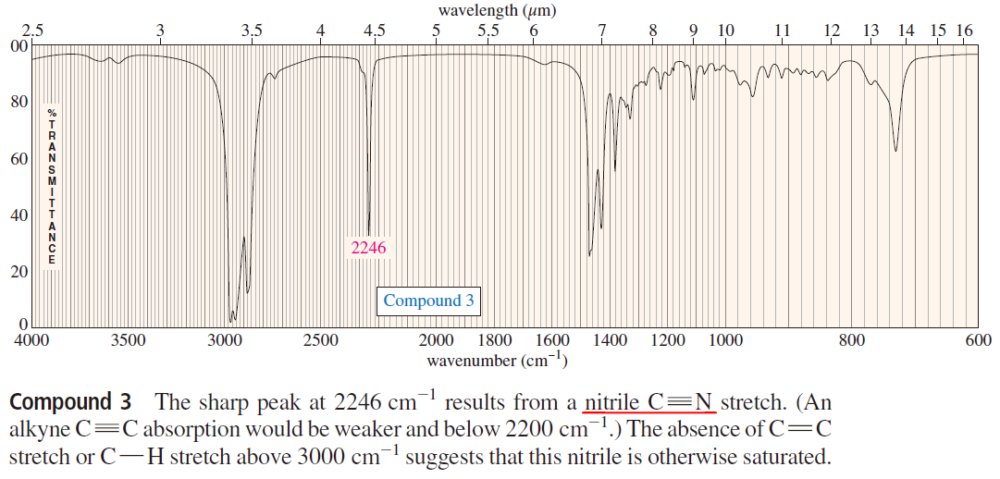

# IR 光譜

## 整理
- 整理
    - 3500~2650 極性單鍵區
    - 2400~2100 三鍵區
    - 1850~1600 雙鍵區
    - 
    - 
- 碳碳鍵
    - 
    - 單鍵並不是非常可靠
    - 雙鍵大約落在 1600 附近，但是若有共振，會較低
        - 
- 碳氫鍵
    - 
    - 由於可能受到對稱影響，雙鍵或三鍵的吸收度可能不如單鍵
- 烯類
    - 
    - C-H 吸收在 > 3000 的位置，代表 sp2 混成
        - sp3 會在 < 3000 的位置，sp 會在 3300 左右
    - 在 1640~1680 有強的 C＝C 雙鍵吸收，代表著 isolated double bond
- 炔類
    - 
    - 只適用於 terminal alkyne
    - C-H 吸收在 3300 的位置，代表 sp 混成 (另外 sp 的氫 peak 很尖)
        - sp2 會在 > 3000 的位置，sp3 會在 < 3000 的位置
    - C≡C 三鍵吸收在約 2200 的位置
- 醇、胺、酸
    - 
    - 醇類
        - 
    - 胺類
        - 
    - 酸類
        - 
- 醛酮
    - 

## 要多看的地方

- OH 和 NH 雖然都在 3300，但是只有 OH 會這麼平滑
    - 
- Mass Spectrometry
    - M+ 通常是 m/z 最高的 peak

## 錯的題目

- 
    - C=O: 1700
- 
    - amide: 強吸收，1650
    - N-H: 3300 (same as alcohols，但只有醇類是平滑的曲線), broad with sharp
- 
    - C≡N: >2200，比較強
    - C≡C: < 2200，比較弱
- 

- 
- 
- ****