CH 13. NMR H1 譜

# H1 譜

- broad 的部分一定要先看
    - 1.5~4: Amine
    - 2~5:    alcohol
    - 4~7:    Ar-OH
- 普通的 CH_n 會落在 1.5 以內
- 如果你考慮遠方有拉電子基或推電子基，其實誤差一定在 1 以內
- 1.5~2
    - allylic
- 2.1~2.5
    - carbonyl (ketone), next to aromatic ring
    - 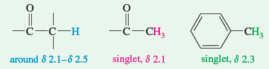
    - terminal alkyne
    - 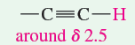
- 3~4
    - next to electronegative atom
    - 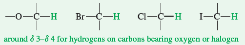
- 5~6
    - vinyl: 另外判斷 cis (10 Hz), trans (15 Hz)
    - 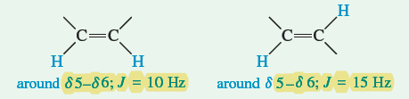
- 7~8
    - aromatic hydrogen: > 7.2 可能代表有拉電子基
    - 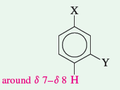
- 9~10
    - aldehyde
    - 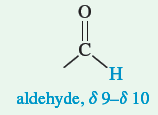

***

**統整**

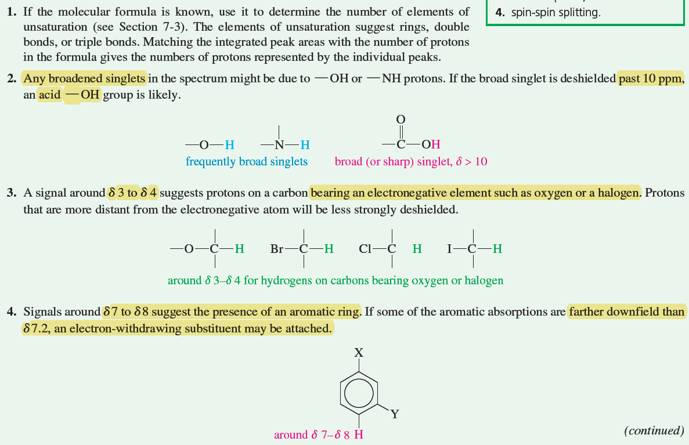
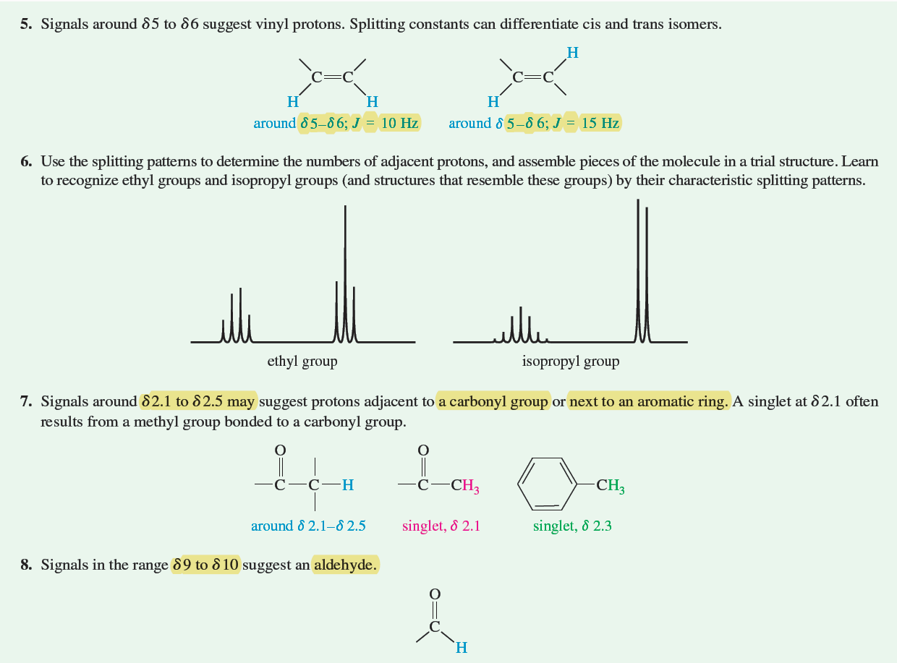

***

**要多看的地方 (黃色標籤)**

- 往左是 downfield (deshielded)，往右是 upfield (shielded)
    - 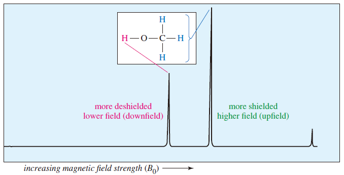
- 常用表格 (大概記得相對關係)
    - 鹵烷
        - 鹵素接的碳 (alpha) 大概位移 3~4
        - 下一個碳 (beta) 大概位移 1~2
        - 再下一個就不受到鹵素影響
    - 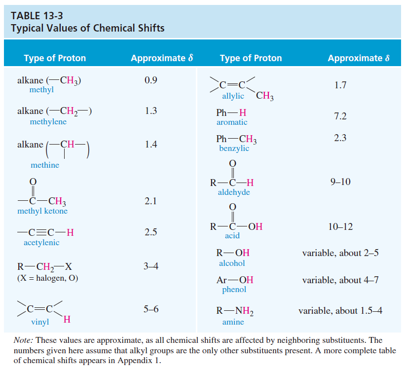

***

細節

- Geminal 中，若 a≠b，才會讓紅色的兩個 H 有 spin-spin spliting
    - 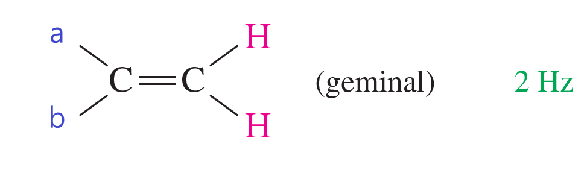
- conjugated + carbonyl 會造成非常 low field 的 吸收
    - 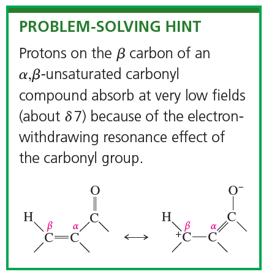