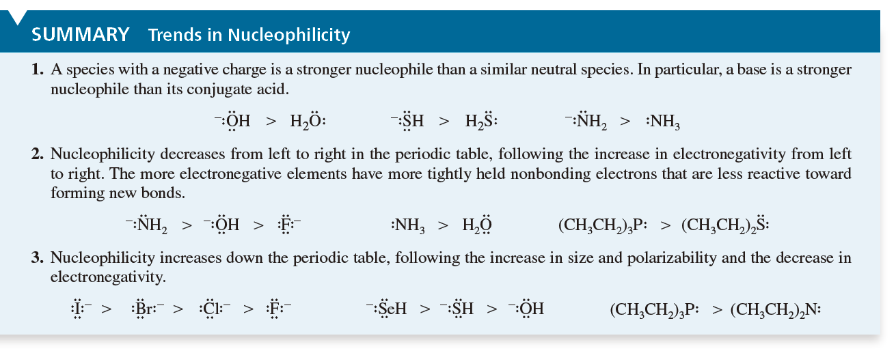
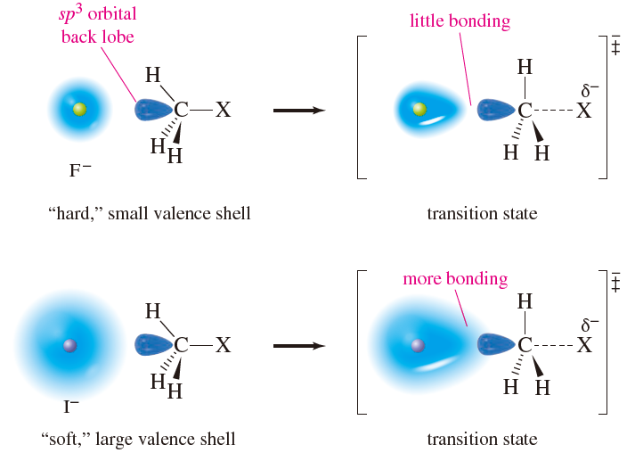
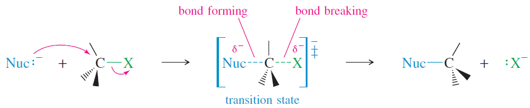
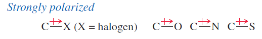
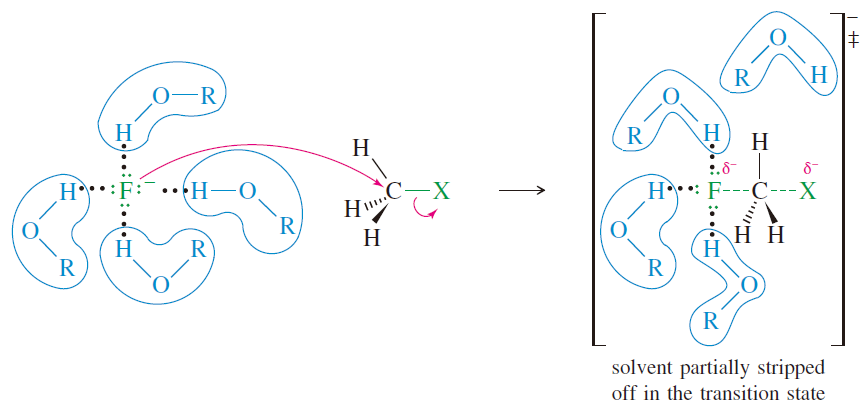
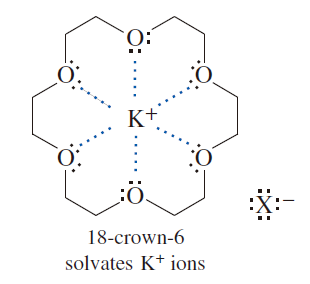

CH 06 複習: 決定 SN2 的因素

# 決定 SN2 的因素

- Nucleophile: Nucleophilicity
  - 

    1. 帶負電的一定比中性的類似分子更容易攻擊

       - 共軛鹼必 > 酸

    2. EN 太大，會不想把電子給出去，電子自然就不會攻擊別人
    3. 週期表越下方，Nucleophilicity 一定越大

       - Why I- is better than F-
       - 
       - The third trend (size and polarizability) reflects an atom's ability to engage in partial bonding as it begins to attack an electrophilic carbon atom.
  - As we go down a column in the periodic table,
    - the atoms become larger,
    - with more electrons at a greater distance from the nucleus.
    - The electrons are more loosely held,
    - and the atom is more **polarizable:**
    - Its electrons can move more freely toward a positive charge,
    - resulting in stronger onding in the transition state.
    - The increased mobility of its electrons enhances the atom's ability to begin to form a bond at a relatively long distance.
- Substrate: The Goodness of the Leaving Group
  - A leaving group serves two purposes in the SN2 reaction:
    - It polarizes the C-X bond, making the carbon atom electrophilic.
    - It leaves with the pair of electrons that once bonded it to the electrophilic carbon atom.
  - To fill these roles, a good leaving group should be
    - **1.**  electron-withdrawing, to polarize the carbon atom,
    - **2.**  stable (not a strong base) once it has left, and
    - **3.**  polarizable, to stabilize the transition state.
  - 因此我們會希望
    - The leaving group must be electron-withdrawing to create a partial positive charge on the carbon atom,
      - making the carbon electrophilic.
    - An electron-withdrawing leaving group also stabilizes the negatively charged transition state.
    - 
  - 常見的 substrate
    - Halogen atoms are strongly electronegative, so alkyl halides are common substrates for SN2 reactions.
    - Oxygen, nitrogen, and sulfur also form strongly polarized bonds with carbon;
    - 
- Protic solvent
  - 
  - In contrast with protic solvents,  **aprotic solvents**  (solvents without O¬H or N¬H
  - groups) enhance the nucleophilicity of anions. An anion is more reactive in an aprotic
  - solvent because it is not so strongly solvated.
  - **Polar aprotic solvents**  have strong dipole moments to enhance solubility, yet they have no O¬H or N¬H groups to form hydrogen bonds with anions.
    - 