0905 物理化學 Preview

- 熱力學第一定律
    - 內能定義
        - 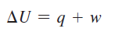
    - Enthalpy 定義
        - 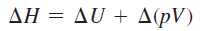
    - 這個就是 ms∆T
        - 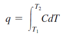
    - 體積變化作功
        - 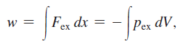
        - 外界對系統作功的時候，容器會縮小
            - dx = x-x0 >0 (施力後位置 - 平衡位置)
            - dV=V-V0 <0
            - 故要加負號
    - Enthalpy
        - 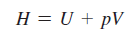
        - 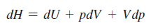
            - 因為變數有兩個，所以微分是分別對兩個偏微分
        - reversible process : p = p_ex (這個我不懂)
        - 巧合 (在等壓情況下，enthalpy 可以用熱量算，這個我不懂...)
            - ![]0905/c1f1aec14ceaae8b144a18fd8bf23655.png)
    - 普化教過的 Enthalpy 要用 5/2R 算的那個
        - 理想氣體除動能外，並無其他內能，因此改變內能只能靠溫度
        - 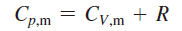 (單原子理想氣體 C_{v,m} = 3/2R)
        - 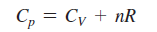(for ideal gas)
        - 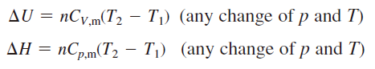
        - 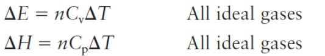
        - solid and liquid V 變化不大，真正需要關心 V 變化的是 gas
    - Reversible Process
        - 以前物理有教過，如果緩慢壓縮或膨脹氣體、裡外壓力差沒有很大，平衡後裡外壓力最後會相同
        - 否則，就會產生摩擦力
        - 題目應該都是 Reversible
    - Heat effects of chemical reactions
        - 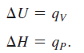 (我不懂)
    - 赫斯定律
- 熱力學第二定律
    - 自由能
        - 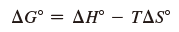
        - 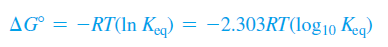
    - Entropy
        - 粒子越多，越混亂
        - 實驗室當中，通常不需考慮 entropy 對化學反應的影響，因此假設 ∆G=∆H
        - 宇宙的亂度不停增加
- 自由能與平衡
    - 非理想溶液不遵守拉午耳定律，也就是蒸汽壓並不等於飽和蒸汽壓 * 莫爾分率
    - Chemical Potential (沒學過！)
    - Activity Coefficient
        - 有點類似凡特荷夫因子的概念，就是壓力、莫耳分率、濃度、重量莫耳濃度要用某個常數修正
            - 重量莫耳濃度是 molality，不是 molarity
- (第二次期中考開始) 統計熱力學與化學
    - 應該就是馬克示威分布那個東西
- 物理平衡
    - 基本上就是高中選修化學溶液公式的推導
        - 針對有解離的溶質，可用凡特荷夫因子修正公式
    - 拉午耳定律
        - 蒸汽壓 = 飽和蒸汽壓 * 莫爾分率
    - 所有溶質均會使凝固點下降 (因為降低晶格排列整齊程度)
        - 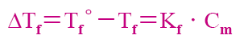
    - 非揮發性溶質會使沸點上升 (因為提升分子間作用力)
        - 
    - 滲透壓公式
        - 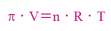
    - 亨利定律 (溶解質量（m）與該氣體的分壓（P）成正比)
        - 
        - 條件
            - 難溶的氣體
            - 定溫
            - 定量
- 氧化還原
    - 能斯特方程式
        - 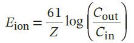 (生理學使用公式，看到正妹 (符號是正的)，下面硬了)
        - 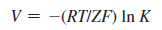
- 分子間的碰撞
    - 做到這邊，好像是速動、分子軌跡之類的東東......
        - 在普化 CH5
    - 碰撞
        - 碰撞頻率
            - 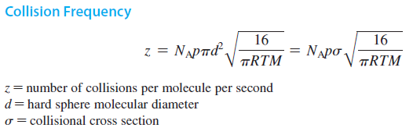
        - Mean Free Path
            - 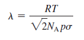
            - The average distance a particle travels between collisions in a  particle gas samples
            - 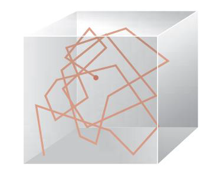
    - 擴散
        - Fick's Law (沒有教過)
            - 1. 利用濃度預測「單位面積、單位時間通過的物質量」
            - 2. 預測擴散經過一段時間後，濃度的變化
    - ... 剩下的應該沒上課都不知道在幹嘛
- (期末考開始) 反應速率
    - 由反應機構推求速率定律式：瓶頸反應
    - 速率定律
        - 0 級反應
            - R=k，速率為定值，與濃度無關
            - 濃度變化為線性
            - 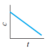
            - 時間等差，濃度亦等差
            - 半生期：與初始濃度成正比
        - 1 級反應
            - R 與濃度成正比
            - 濃度變化可積分得到
                - 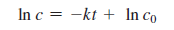
            - 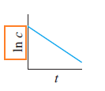
            - 時間等差，濃度等比
            - 半生期：為定值，與濃度無關
        - 2 級反應
            - R 與濃度平方成正比
            - 濃度變化可積分得到
                - 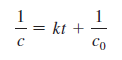
            - 時間等差，濃度成調和數列 (1, ½, ⅓, ¼...)
            - 半生期：與濃度成反比（原料越多，半生期越短）
    - 速率常數、活化能由溫度決定
        - 速率常數：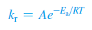
        - 活化能　：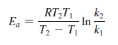
- 分子結構

    -

- 分子作用力
    - 分散力、偶極偶極力：終於可以量化計算了
- 量子力學
    - 量子力學基礎
        - 黑體輻射
        - 光電效應（需克服功函數）
            - 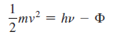
        - 波粒二像性、物質波
            - 光的粒子性：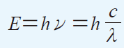
            - 物質波　　：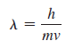
        - 測不準原理
            - 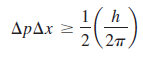
    - 薛丁格方程式
        - 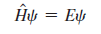
        - Ψ 是波函數，\hat{H} 是運算子。
            - Ψ 經過 \hat{H} 之後，要變回自己再乘上一個倍數
        - 波函數本身沒有意義，平方後與機率成正比
            - 4πr^2 * (Ψ)^2
    - 薛丁格方程式的解
        - Particle in a Box
            - 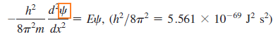
                - 前面的 H_hat 怎麼來的不要問我
            - Boundry conditions
                - 兩個邊界機率值必須為 0，函數的值在邊界為 0
                - 在箱子裡面出現的機率總和必須為 1
                - 波函數必須是連續的
            - 於是求出來變成：
                - 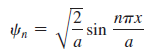
                - 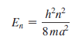